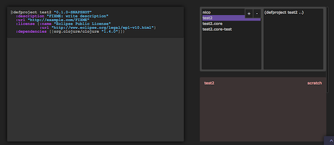
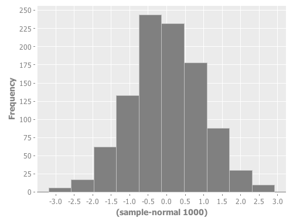
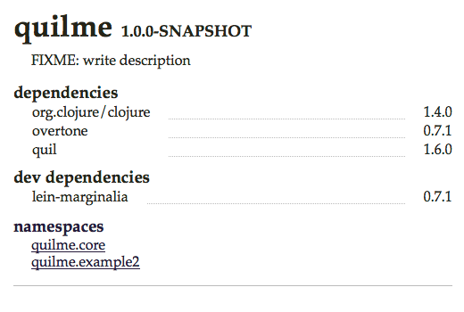
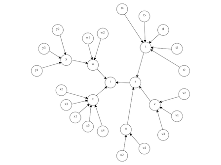
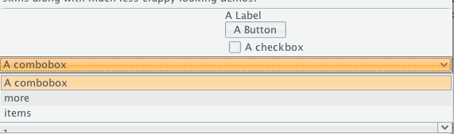

Libraries
---------

Now that we are ready for some hacking, here are sites, that refer interesting Clojure libraries:

* [clojure-libraries on appspot.com/](http://clojure-libraries.appspot.com/)
* [clojurewerkz](http://clojurewerkz.org/)
* [Clojure on github](http://clojure.github.com/)
* [http://programmers.stackexchange.com/questions/125107/what-are-the-essential-clojure-libraries-to-learn-beyond-the-basics-of-core](http://programmers.stackexchange.com/questions/125107/what-are-the-essential-clojure-libraries-to-learn-beyond-the-basics-of-core)
* [http://www.clojure-toolbox.com/](http://www.clojure-toolbox.com/)
* [http://twitch.nervestaple.com/2012/01/12/clojure-hbase/](http://twitch.nervestaple.com/2012/01/12/clojure-hbase/)

### Noir

[https://github.com/ibdknox/noir](https://github.com/ibdknox/noir) 
[http://www.webnoir.org/](http://www.webnoir.org/)

It's dark in here ! Noir is probably *the* simplest way to write a functional web application in clojure.

This is how it looks like in Clojure code

@@@ ruby 08_noir.clj @@@

and/or this is how you would have it started in a few seconds with the leiningen command we installed earlier on

@@@ ruby 09_noir.sh @@@

Now the guy from Noir has also started a very cute project named [Playground](http://app.kodowa.com/playground) where you can do live execution of your code with a nice UI.

### Incanter

[Download](http://incanter.org/downloads/) and [Get started](https://github.com/liebke/incanter/wiki#getstarted)

From the Clojure REPL, load the Incanter libraries: 
<pre><code>user=> (use '(incanter core stats charts))</code></pre>

Try an example: sample 1,000 values from a standard-normal distribution and view a histogram: 
<pre><code>user=> (view (histogram (sample-normal 1000)))</code></pre>

### Marginalia 
[https://github.com/fogus/marginalia](https://github.com/fogus/marginalia)

Marginalia is your best literate programming tool for clojure.  

Install it as a dependency in your project.clj file:

<code>
	:dev-dependencies [lein-marginalia "0.7.1"]
</code>

Then, just use it:
<code>
	lein marg
</code>

And dependending on the amount of comments you wrote in the code, you will get something similar to this:

### Lacij 
[https://github.com/pallix/lacij](https://github.com/pallix/lacij)

A library that can quickly create SVG diagram with automatic layout, like this one:

Then, a graph can be drawn like this:

@@@ ruby 13_lacij.clj @@@

The advantage is that you can add and remove nodes dynamically, thus giving a dynamic view about live typologies.

### Seesaw
[https://github.com/daveray/seesaw](https://github.com/daveray/seesaw)

Make cool UIs in no time.

The best tutorial I have found so far is [here](https://gist.github.com/1441520)

And by trying the example, here is a style you can get after a few lines:

### clj-xpath
[https://github.com/kyleburton/clj-xpath](https://github.com/kyleburton/clj-xpath)

Now you been looking on how to process those xml files as fast as possible, here is a super way to do it, clj-xpath.

@@@ ruby 17_clj_xpath.clj @@@

### clojure-soup
[https://github.com/mfornos/clojure-soup](https://github.com/mfornos/clojure-soup)

This is a wrapper to provide awesome parsing of html files, whether local or remote. Once you have added the library, check out the following example:

@@@ ruby 18_clojure_soup.clj @@@

### Enlive
[https://github.com/cgrand/enlive](https://github.com/cgrand/enlive)

HTML parser, and Templating framework at the same time, Enlive does a super job of making HTML fun. (yes you read me.)

This is an example taken from a [slick tutorial](https://github.com/swannodette/enlive-tutorial/) by David Nolen.

@@@ ruby 16_enlive.clj @@@

You declare templates in a regular html files, thus your designer can do his Dreamweaver work the way he/she usually does it. 
Then as a developper you just come and stick content at the location that has been decided. Slick uh ?

### Docjure
[https://github.com/ative/docjure](https://github.com/ative/docjure)

The best way to have fun with spreadsheet in clojure. Relies on the [Apache POI](http://poi.apache.org/) library but with some clojure sauce so it can actually be eaten.

This is how you write a simple spreadsheet.

@@@ ruby 21_docjure.clj @@@

For more examples, I suggest you look at the ["horrible" documentation](http://poi.apache.org/spreadsheet/how-to.html#sxssf) :)

### Postal
[https://github.com/drewr/postal](https://github.com/drewr/postal)

I am pretty sure you knew how to send a mail before, but look at the awesome way of doing this in Clojure.

@@@ ruby 22_postal.clj @@@

This is including attachment and Japanese encoding. yey

### Lobos
[http://budu.github.com/lobos/](http://budu.github.com/lobos/)

Here is comes Lobos, or how to manage your database directly from a Clojure REPL.

@@@ ruby 20_lobos.clj @@@

You define your database connection, and just go and create, drop delete, what every you need.
This is also very useful for testing.

### Korma
[http://sqlkorma.com/docs](http://sqlkorma.com/docs)

Korma makes actually enjoyable to write SQL queries.

### clj-dns
[https://github.com/brweber2/clj-dns](https://github.com/brweber2/clj-dns)

> DNS Querying in Clojure. 

<code>
[com.brweber2/clj-dns "0.0.2"]
</code>

How easy it is to do lookup and reverse lookup. Need anything else ? 

@@@ ruby 29_dns.clj @@@

### Vaadin
[http://dev.vaadin.com/wiki/Articles/ClojureScripting](http://dev.vaadin.com/wiki/Articles/ClojureScripting)

This is not so much a library than a way to develop slick web application using Vaadin, but without the java boiler plate code. 

### clj-opennlp
[https://github.com/dakrone/clojure-opennlp](https://github.com/dakrone/clojure-opennlp)
Natural Language Processing in Clojure.

[Tokenizer](https://github.com/eandrejko/clj-tokenizer) for text analysis.

### clj-http
[https://github.com/dakrone/clj-http](https://github.com/dakrone/clj-http)
Http Slurping

### Cascalog
[https://github.com/nathanmarz/cascalog/wiki](https://github.com/nathanmarz/cascalog/wiki)
Hadoop Query from Clojure

### Aleph
[https://github.com/ztellman/aleph](https://github.com/ztellman/aleph)
Websockets

### Lamina
[https://github.com/ztellman/lamina](https://github.com/ztellman/lamina)
Event workflow for clojure

### Conduit
[http://www.intensivesystems.net/tutorials/stream_proc.html](http://www.intensivesystems.net/tutorials/stream_proc.html)
Stream processing in Clojure
