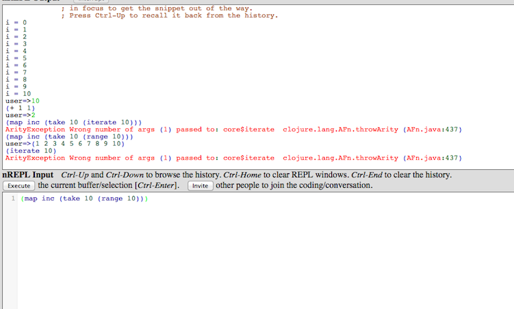

## Your own two hands and Clojure. 

###### Vin: Wine 
When the order has been made, the wine waiter comes and present the selection.

This book is about sharing love for Clojure, why it is used now, and it will be used for quite some time. You don't need to be a great IT geek, you just have to start using Clojure. 

So prepare your favorite text editor, and .... Here we go!

### Clojure References and links when you get lost

There are tutorials to learn the basic baby steps of Clojure around the web. This book do not want to reinvent the wheel so if you need you should have a look at some of them.

One of the most up-to-date could be:

[http://learn-clojure.com/clojure_tutorials.html](http://learn-clojure.com/clojure_tutorials.html)

I will not go too much into the first steps details, since this is not the aim of this book. There is a completely new online book written by [John](http://www.unexpected-vortices.com/clojure/brief-beginners-guide/index.html) that should get all the attention it deserves.

You could also do a few [clojure koans](https://github.com/functional-koans/clojure-koans) to make sure the basic are solid and fun for you.

Last one, if you get lost on your journey, be sure to refer to the [cheatsheet](http://clojuredocs.org/quickref/Clojure%20Core).

### Leiningen, your tool to run and distribute clojure code

#### Do you have your REPL with you ? 

Basically to run whatever Clojure code you want, we are going to use a Read-Eval-Print-Loop interactive environment. 

With a REPL, you first type a command, then the interpreter reads it, print the release even if there is none, then go and wait for your next command.

All commands stays in memory and you can refer to old processed commands and use their result, refactor and so on.

To start using clojure, we actually do not install it. We are going to install a tool named Leiningen, so most of the dependencies and environment problems will be solved and you can simply enjoy the core of the meal.

The home page for Leiningen and its related command line, *lein* can be found at the following location:

[https://github.com/technomancy/leiningen#installation](https://github.com/technomancy/leiningen#installation)

To install on unix like machines: 

* Download the [script](https://raw.github.com/technomancy/leiningen/preview/bin/lein)
* Place it on your $PATH.
* Set it to be executable. _(chmod 755 lein)_

To install on windows:

Most users can get the [batch](https://raw.github.com/technomancy/leiningen/preview/bin/lein.bat) file. 
If you have wget.exe or curl.exe already installed and in PATH, you can just run lein self-install, otherwise get the standalone jar from the downloads page. 

If you have Cygwin you should be able to use the shell script above rather than the batch file.

Once you have it installed, you can chek lein's version using the following command:

    lein version 

Which should output something similar to:

    [~/projects/niclojure/] % lein version 
    Leiningen 2.0.0-preview10 on Java 1.7.0_10 Java HotSpot(TM) 64-Bit Server VM

If things do not work load as expected, please refer to the leiningen documentation, check your internet connection, reboot and if all else fail ask the waiter.

Now that we are sure lein is properly installed, let's start having fun, let's run our Read-Eval-Print-Loop on our own machine:

    lein repl

This will print some stuff:

    [niko@Modrzyks-MacBook-Pro-2][11:42][~/projects/mascarpone/chapter01/] % lein repl
    nREPL server started on port 54311
    REPL-y 0.1.0-beta10
    Clojure 1.4.0
        Exit: Control+D or (exit) or (quit)
    Commands: (user/help)
        Docs: (doc function-name-here)
              (find-doc "part-of-name-here")
      Source: (source function-name-here)
              (user/sourcery function-name-here)
     Javadoc: (javadoc java-object-or-class-here)
    Examples from clojuredocs.org: [clojuredocs or cdoc]
              (user/clojuredocs name-here)
              (user/clojuredocs "ns-here" "name-here")
    user=> 

Voila ! Time for a glass of wine to congratulate ourself.

You are ready to try your first useful tricks in Clojure.

Now is the time to jump to the first samples in the Appendix A, go along and try it by yourself.

I insist. Try it by yourself *NOW* before the eggs are fried and the vinegar turns sour. 

#### Do you have a friend with a REPL ? 

This little trick has been made very easy with Leiningen 2, so I will briefly talk about it here.
You can start a REPL and get different users to connect to it. That REPL can be local or remote, and only one port has to be opened to allow it to run. 

For example, start a REPL with:

    lein repl :headless 

It will output something like:

    nREPL server started on port 53337

Then you can connect to it from a different terminal with:

    lein repl :connect 53337

Which will connect to the REPL that was created in the first place. 
You can do could thing such as delegating computation to a better faster computer, getting some data from services running only on that computer or so on.

Sweet.

#### Workflow

Most LISP-ified users have their own workflow while using the REPL. The workflow we expose in this section is only a proposition. Do what works best for you. 

What I find out works is

* Type in the REPL a few things to get variables and the result you want. 
* Save results one after the other in variables to go through them later
* Bit by bit, make funcions you can reuse, little block of code that makes your iteration easier and faster 
* Build on each of those function, each function should make something precise, with no side-effect
* Finish your one file/namespace just like an API, by exposing methods that can be used by regular users
* Finish with some documentation so it is easy to grasp what each function does, and what are the side effect.

#### You need to depend on someone

You knew it. As soon as your ordered the fois-gras, you knew you wanted some of that salmon salad with trout eggs on top.

In the Clojure world, to get code that other people have been writing you just write them to a file named _project.clj_ that lein is creating for you, then let leiningen do the rest.

To see what this file look like, we use the command:

    lein new <appname>

For example:

    lein new sample00

    [~/projects/mascarpone/] % lein new sample
    Generating a project called sample based on the 'default' template.
    To see other templates (app, lein plugin, etc), try `lein help new`.

Lein has generated a set of directories and files:

    .
    ├── README.md
    ├── doc
    │   └── intro.md
    ├── project.clj
    ├── src
    │   └── sample
    │       └── core.clj
    └── test
        └── sample
            └── core_test.clj
    5 directories, 5 files

We have a few markdown files for writing your own documentation, the clojure files where we will write code, and then the one we are interested in right now is _project.clj_

    (defproject sample "0.1.0-SNAPSHOT"
      :description "FIXME: write description"
      :url "http://example.com/FIXME"
      :license {:name "Eclipse Public License"
                :url "http://www.eclipse.org/legal/epl-v10.html"}
      :dependencies [[org.clojure/clojure "1.4.0"]])

This is pure clojure code, so no need to learn a new weird syntax.I am sure you remember the Apache Ant days, or those more recent Apache Maven 10.0 awesome builds. If not, do not try to remember, read more of this book instead. ;)

So back to the code above, we have a _project_ with some metadata. All the metadata can be read in the [sample file](https://github.com/technomancy/leiningen/blob/master/sample.project.clj) provided on the Leiningen website.

For now, we just want to have a look on how to add a dependency　for your need. We will find out how to find the pattern for it in the next section, for now, we want to add a json parsing named cheshire library to our code:

    [cheshire "5.0.1"]

The project.clj file will now look like this:

    (defproject sample "0.1.0-SNAPSHOT"
      :description "FIXME: write description"
      :url "http://example.com/FIXME"
      :license {:name "Eclipse Public License"
                :url "http://www.eclipse.org/legal/epl-v10.html"}
      :dependencies [
        [org.clojure/clojure "1.4.0"]
        [cheshire "5.0.1"]
        ])

The next time we start the REPL, lein will output, only once, so more messages:

    Could not find artifact cheshire:cheshire:pom:5.0.1 in central (http://repo1.maven.org/maven2)
    Retrieving cheshire/cheshire/5.0.1/cheshire-5.0.1.pom (3k)
        from https://clojars.org/repo/
    Retrieving com/fasterxml/jackson/core/jackson-core/2.1.1/jackson-core-2.1.1.pom (6k)
        from http://repo1.maven.org/maven2/
        ...
        ...
    Retrieving cheshire/cheshire/5.0.1/cheshire-5.0.1.jar (12k)
        from https://clojars.org/repo/

Should be pretty fast, unless you are on a modem connection in a hotel in country side California waiting in the lobby for your glass of wine to be served.

Now straight to our new downloaded library. Let's generate some JSON code with:

    (use 'cheshire.core)

As you remember from the Appendix samples, we can get the documentation for a function using _doc_:

    user=> (doc generate-string)
    -------------------------
    cheshire.core/generate-string
    ([obj] [obj opt-map])
      Returns a JSON-encoding String for the given Clojure object. Takes an
      optional date format string that Date objects will be encoded with.
      The default date format (in UTC) is: yyyy-MM-dd'T'HH:mm:ss'Z'
    nil

And from a regular Clojure sequence, we can create some valid json:

    user=> (generate-string '(1 2 3))
    "[1,2,3]"
    user=> (generate-string '{:name (1 2 3)})
    "{\"name\":[1,2,3]}"

And we can of course, do the opposite, parse some string and turn it into a valid Clojure sequence with:

    user=> (parse-string "{\"foo\":\"bar\"}")
    {"foo" "bar"}

Unlimited power. Time for a second sip of that easy to drink South of France Chardonnay 2010.

### Ibiblio, Java libraries at your fingertips

You might be wondering where the cheshire dependency has been pulled from.
In the Java world, Maven, however good or bad, has managed to impose a clean way of storing and retrieving Java code packaged as Java archives onto something named ibiblio.

[http://mirrors.ibiblio.org/maven2/](http://mirrors.ibiblio.org/maven2/)

In most cases pure Java libraries, of which Clojure can make use straight away (yey!), will be retrieved from there. 

For example, you may remember the famous Apache library named common-io.
There is a [descriptor](http://mirrors.ibiblio.org/maven2/commons-io/commons-io/2.4/commons-io-2.4.pom) for it that can be found in something called a pom file. 

The file is a terrible amount of xml, of which we will only read the following section:

    <groupId>commons-io</groupId>
    <artifactId>commons-io</artifactId>
    <version>2.4</version>

In our all easy Clojure world, this will translate to:

    [commons-io/commons-io "2.4"]

Now, without much more trouble, we interface to the java world with:

    user=> (org.apache.commons.io.FileUtils/readLines (java.io.File. "README.md") "UTF-8")
    #<ArrayList [# sample, , A Clojure library designed to ... well, that part is up to you., , ## Usage, , FIXME, , ## License, , Copyright © 2013 FIXME, , Distributed under the Eclipse Public License, the same as Clojure.]>

We will see more Java interop code along this book, for now you can refer to the [Clojure interop page](http://clojure.org/java_interop).

### Clojars, or your Clojure libraries at your fingertips

A more Clojure specific place to find your libraries is named [Clojar](https://clojars.org/).

To find the Cheshire library we used earlier on, we would access:

    https://clojars.org/search?q=cheshire

And have our search returning the following:

Most if not everyone in the Clojure community have given up and is only ordering from the Clojar infrastructure. All of the latest reliable code should be on it.

So now you have two places to find all the bricks, bread, peaches and libraries you may need to make a perfect meal. 

One more sip of wine ?

### Search Clojars with Leiningen

To search for a library on Clojars with Leiningen, be ready, it will take some explanation.

  lein search "postal"

That command takes some regular expression and can actually be used to do some complex things. Try a few libraries first and see what happens.
The call above would return something like this:

  Searching over Artifact ID...
   == Showing page 1 / 1
  [paddleguru/postal "1.7-SNAPSHOT"] 
  [org.jmatt/postal "1.6-SNAPSHOT"] 
  [org.clojars.sethtrain/postal "0.2.0"] Clojure email support
  [org.clojars.sethtrain/postal "0.1.0-SNAPSHOT"] Clojure email support
  [org.clojars.maxweber/postal "1.6-SNAPSHOT"] 
  [org.clojars.doo/postal "1.8-SNAPSHOT"] 
  [org.clojars.danlarkin/postal "1.3.2-SNAPSHOT"] 
  [org.clojars.btw0/postal "1.4.0-SNAPSHOT"] 
  [org.clojars.blucas/postal "1.8-SNAPSHOT"] 
  [com.draines/postal "1.7.1"] 
  ...
  [com.draines/postal "1.9.1"] 
  [com.draines/postal "1.9.2"] 

Note: if your internet connection got bad at the wrong moment, the local search index may get corrupted, so you can delete the following folder:

  ~/.lein/indices

The next call to _lein search_ will regenerate the indexes and all will be back to normal.

### Bread and butter, installing and using some Leiningen plugins 

Leiningen has a _new_ way of defining plugins. Ages ago (2010?) plugins were installed per project, so you were soon finding out that each time you were starting a new project, you were installing the same plugins over and over again. Waste of time, and time is good wine.

Now, we define profiles that we write using Clojure syntax in a file named 

    ~/.lein/profiles.clj

One very simple but useful plugin is named _lein-pprint_, itself hosted on Clojar.

The content of the file above is going to be:

    {:user {:plugins [[lein-pprint "1.1.1"]]}}

Now, lein will resolve the plugin, download it if needed, and make it accessible so that a call to _lein help_ will show:

    Several tasks are available:
    check               Check syntax and warn on reflection.
    ...
    pprint              Pretty-print a representation of the project map.
    repl                Start a repl session either
    test                Run the project's tests.
    ...

And now you can use this plugin with any of your project using:

    lein pprint

Which will output all the metadata related to your Clojure project.

### Create code, and share it through clojars

For interfacing with Clojar, leiningen2 actually does not use a plug-in anymore. 

    lein deploy clojars

That's it. 

In the back scene, your code will be turned into a Java archive, _jar_ file and then pushed to Clojar along with some metadata. 

Other developers can then use your code using the dependency syntax with have seen.

Also, not that you should have a look at the output of:

    lein help deploying

To see how to deploy to other repositories, especially private ones. 

### (I can) see your dependencies

As a quick refresher, remember you can always see your dependencies with Leiningen using the following command:

    lein deps :tree

Which will output with the project we have had so far:

     [cheshire "5.0.1"]
       [com.fasterxml.jackson.core/jackson-core "2.1.1"]
       [com.fasterxml.jackson.dataformat/jackson-dataformat-smile "2.1.1"]
     [commons-io "2.4"]
     [org.clojure/clojure "1.4.0"]

### Sunny work with Eclipse

Probably the best IDE environment for Clojure will be Eclipse that you can download at the usual location:

    http://www.eclipse.org/downloads/index-developer.php

The Eclipse plugin CounterClockWise is a very up to date, and slick integrated development environment for Clojure from within Eclipse.

[http://code.google.com/p/counterclockwise/](http://code.google.com/p/counterclockwise/)

The plug-in Counterclockwise install without glitches on modern Eclipse environment. 

Add the update site from the following menu:

And the following URL:

    http://ccw.cgrand.net/updatesite/

The plugin is installed and we can now import the project we created here. 

We import the project as a regular java project:

Then update the settings to reflect the fact we are using Leiningen:

We can start a REPL straight from eclipse !

The real reason you want to have eclipse running is for its awesome auto completion and integrated documentation. Start typing and see it in action:

We have started a REPL, we can just add the new code we have been writing with _Command-Enter_

And the completion will be present straight from the REPL:

Wow. Let's eclipse some more of that very tasty wine !

### Dynamically add libraries to your current Clojure session

Back from Eclipse to the command line, I do not know if you have noticed, but every time you order something from Clojar, you need to restart the REPL session so the new dependency is resolved.

_Chas Emerick_ decided that was taking too much of his time and put together in a clean library called pomegranate some magic so you can add more dependencies at runtime.

Note that in this case, we do not want the library to be included as a straight dependency of our project, but more of something like a tool or a development dependency.

This is the way to declare it in the _project.clj_:

    :profiles {:dev {:dependencies [
        [com.cemerick/pomegranate "0.0.13"]]}}

Now after running our REPL with

    lein repl

Let's import that new namespace where we need it with:

    (use '[cemerick.pomegranate :only (add-dependencies)])

And now we can import a fuzzy xml library with

    (add-dependencies 
        :coordinates '[[antler/xyzzy "0.1.0"]] 
        :repositories {"clojars" "http://clojars.org/repo"})

This will output the dependencies that were added to the classpath:

    {[org.clojure/data.zip "0.1.0"] nil, [org.clojure/clojure "1.3.0"] nil, [antler/xyzzy "0.1.0"] #{[org.clojure/clojure "1.3.0"] [org.clojure/data.zip "0.1.0"]}}

And we can call our new downloaded dependency straight away:

    (require '[xyzzy.core :as xyzzy])

    (xyzzy/parse-xml "<html><body><h1>It works</h1></body></html>")

Which will return a lazy sequence, that prints out at the REPL:

    [{:tag :html, :attrs nil, :content [{:tag :body, :attrs nil, :content [{:tag :h1, :attrs nil, :content ["It works"]}]}]} nil]

Of course, you will eventually want to add that dependency in your _project.clj_ file.

### Don't tell anyone you run Scala code from Clojure

Since every source file in a lein project can be integrated, you can use the [scalac-plugin](https://github.com/technomancy/lein-scalac)

The way to install the plugin is straight forward:

* Add [lein-scalac "0.1.0"] to :plugins project.clj. 
* Set :scala-source-path in project.clj, usually to "src/scala", and place your .scala source files in there.
* To compile them to .class files:

    lein scalac

* If you want scalac to run automatically, add :prep-tasks ["scalac"] to project.clj
* In most cases you will also need to declare a dependency on scala-library like so:

    :dependencies [org.scala-lang/scala-library "2.9.1"]

Now let's write some scala code:

@@@ ruby chapter01/src/scala/sample.scala @@@

and here is how you call it from Clojure:

@@@ ruby chapter01/src/sample/scala.clj @@@

And here is the expected output

    sample.core=> (import HelloWorld)
    HelloWorld
    sample.core=> (.sayHelloToClojure (HelloWorld.) "Hi there")
    "Here's the second echo message from Scala: Hi there"

Now you can tell your friend you know more than one language on the JVM. :)

Or you can also tell the waiter you can drink more than one type of wine.

### Don't tell anyone you run Java code from Clojure

Note that the scala integration right above is also supported for old fashioned java. This is actually built-in in leiningen. Here is how you put it together just in case.

We first take a regular java class:

@@@ ruby chapter01/src/java/HelloWorldJava.java @@@

Let's tell leiningen some useful metadata in _project.clj_:

    ; where to find the java classes
    :java-source-paths ["src/java"]
    ; some compilation option. those are passed to javac
    :javac-opts ["-target" "1.6" "-source" "1.6" "-Xlint:-options"]

One more line in the same file, so lein does things for us:

    :prep-tasks ["scalac" "javac"]

This will ask lein to run scalac from our previous example, and then javac.
Now we can simply start the RPEL again, and type some Clojure:

    sample.core=> (.sayHello (HelloWorldJava.) "World")
    "This is a warm welcome from old Java to World"

### Wrap any clojure method with hooke

While searching for an example on the javac plugin above, I stumbled on a super example on how to add hooks on any function. 
Awesome.

Let's add a dependency to our _project.clj_ file again:

    [robert/hooke "1.3.0"]

And then, we can go through the sample code together:

@@@ ruby chapter01/src/sample/hooke.clj @@@

This is like adding aspects to your clojure functions ! With no pointcuts  ?? :)

### One more ruby: Jruby 

Just for the sake of it, if you need to run a some Ruby code but do not want to go through the pain of the set up, you can just ask Leiningen.

Add 

    [lein-jruby "0.1.0"] 

to the _:plugins_ section of your settings file _profile.clj_.

Then, you can could scripts this way:

    lein jruby -S src/ruby/fibonacci.rb 1000

fibonacci.rb is a matrix way of computing fibonacci numbers in Ruby. See:

@@@ ruby chapter01/src/ruby/fibonacci.rb @@@

Again, you do not need to have ruby install to get this running. 
The first example was without any dependencies, but if you need jruby to install a ruby gem for you, here is how you do it:

    lein jruby -S gem install json-jruby

Then you can can call the ruby example that can be found in the chapter01:

@@@ ruby chapter01/src/ruby/json.rb @@@

with 
    
    lein jruby -S src/ruby/json.rb 

Voila. Ruby wine. But do not forget to keep reading this book and learn Clojure. 

### The delicious Leiningen Plugins soup

This is not the end, Leiningen provides plugins for all your needs. Groovy, Hadoop, ... you name it. It should be in the Leiningen plugins list:

    https://github.com/technomancy/leiningen/wiki/Plugins

I have found that I am using those ones the most:

Leiningen Plugin| What does it do | What's useful |
| |
lein-midje | It runs test | Not only useful, you have to install it. We will cover that later | 
lein-noir | To easily create webapps | We will cover that later | 
lein-deps | This shows all your project transitive dependencies. | Try _lein deps :tree_ 
lein-git-version | Use the git tag to store the version in a version.clj file. | Keeps dry. |
lein-webrepl | This starts a REPL as a web server, so you can edit code straigth into your browser | 

Take some time to browse what's already existing and see how it can helps you writing code more easily. Lein has plenty of ingredients, so be sure to make a great meal.

### Writing your own plugin for Leiningen

Now at this stage, it is time to contribute back something to the community and start writing our own plugin.

We are going to write a short plugin that retrieve some data online and prints the result on the command line.

Let's add a:

    :eval-in-leiningen true

To the project.clj so we can write the plugin straight from our current project.

The task  name will be named _stock_ and we willc all it this way:

    lein stock YHOO

With the last parameter the stock name.
We will put the source code for the new task in _src/leiningen_ and will name the file _stock.clj_.
Also the namespace will be _leiningen.stock_.

Inside the source file, we will name the method _stock_.

The rest of the code goes like this:

@@@ ruby chapter01/src/leiningen/stock.clj @@@

And then, we can get a bunch of results like:

Company name | Command line | Result
| | 
Apple | lein stock AAPL | 520.00
Microsoft | lein stock MSFT | 26.83
Yahoo | lein stock YHOO | 19.29
Google | lein stock GOOG | 520.30

### Save time, do not reload the JVM with Jark
Jark is a tool to run Clojure code on the JVM, interactively and remotely.

You have notice that every time you launch a Clojure program in the JVM, and the JVM takes a long time to start. For overcoming this when developing, you use a REPL, but sometimes it is just better altogether without that extra time, and this is when Jark jumps in.

You can find it at the following location:

    http://icylisper.github.com/jark/

Once you have the binary and put it into your shell path, make sure you run:

    jark server install 

To get the depedencies and then, once, start a Jark server with:

    jark server start

Once you have this, you have  a set of ways to execute code with the jark client:

    jark -e "(+ 2 2)"
    echo "(+ 2 2)" | jark -e 
    jark -e < file.clj
    cat file.clj | jark -e

The code will be send to the jark server for execution. 

@@@ ruby chapter01/src/jark/factorial @@@

Lastly, jark also has a REPL, and you can start it with the expected command:

    jark repl

One of the feature I like, is that you can also embed the server in your own project with:

    ;At time of writing
    ; Add [jark "0.4.3-clojure-1.5.0-alpha5" :exclusions [org.clojure]] to project.clj 
    (require 'clojure.tools.jark.server)
    (clojure.tools.jark.server/start PORT)

Anyway, no less waiting, more wine.

### If you ever see something called, clojure-contrib, run away.

In the early days, there used to be clojure-core, and clojure-contrib.
Clojure core would be a small minimum of code, and clojure-contrib would contains all that was not part of the core but was decided to _almost_ in the core.

The contrib library growed so big, every project was using it and it was spreading like some bad red grapes.
It is not that the code was bad, far away from it. It is the way it was packaged at first that brought problems overtime. 

Clojure Contrib is still somehow in the official Clojure documentation.

    http://dev.clojure.org/display/doc/Clojure+Contrib

But people are managing to gradually go away from it and separate each small contribution into a regular dependency.

To make things in perspective, it is like getting to chef to bring all the food in the kitchen to the table in front of you, so then you can decide what to pick up.
You would eventually get great food, but it is going to take a lot of time for you to get anything to eat, plus there will be a lot of dishes to wash aftewards.

This is the current list of Modular contrib projects: 

    * algo.generic - formerly clojure.contrib.generic
    * algo.monads - formerly clojure.contrib.monads
    * build.poms - example pom.xml file for new contrib libraries
    * core.cache
    * core.contracts
    * core.incubator - some of clojure.contrib.def moved here, along with all of clojure.contrib.strint
    * core.logic
    * core.match
    * core.memoize
    * core.unify
    * data.codec - replaces clojure.contrib.base64
    * data.csv
    * data.finger-tree
    * data.generators - extracted from test.generative to provide the data generators separately
    * data.json - formerly clojure.contrib.json
    * data.priority-map - formerly clojure.contrib.priority-map
    * data.xml - formerly clojure.contrib.lazy-xml
    * data.zip - formerly clojure.contrib.zip-filter
    * java.classpath - formerly clojure.contrib.classpath
    * java.data
    * java.jdbc - formerly clojure.contrib.sql
    * java.jmx - formerly clojure.contrib.jmx
    * math.combinatorics - formerly clojure.contrib.combinatorics
    * math.numeric-tower - formerly clojure.contrib.math
    * test.benchmark
    * test.generative - testing library based on data generators (above).
    * tools.cli - replaces clojure.contrib.command-line
    * tools.logging - formerly clojure.contrib.logging
    * tools.macro - formerly clojure.contrib.macro-utils, clojure.contrib.macros
    * tools.namespace - formerly clojure.contrib.find-namespaces
    * tools.nrepl
    * tools.trace - formerly clojure.contrib.trace

Make sure you take some time to have a look quickly at the list. You probably will need some code from those project and no need to re-write from scratch what has already spent time in other people production code.

### Samples and Conclusion 

Voila, this is it for our first chapter. We have seen:

* start a project quickly with leiningen
* manage our dependencies
* start a REPL
* how to write code in a text editor, a REPL, elipse and a web repl
* how to integrate other languages into a clojure project
* avoid restarting the Java Machine

Now take some time to go through the sample found in the Appendix, learn some tricks, and let's move on to Chapter 02 which will teach us a bunch of useful code for different programming situation.

But for now, a glass of wine ? 