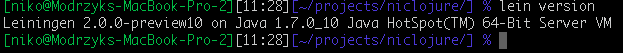

## Your own two hands and Clojure. 

###### Vin: Wine 
When the order has been made, the wine waiter comes and present the selection.

This book is about sharing love for Clojure, why it is used now, and it will be used for quite some time. You don't need to be a great IT geek, you just have to start using Clojure. 

So prepare your favorite text editor, and .... Here we go!

### Clojure References and links when you get lost

There are tutorials to learn the basic baby steps of Clojure around the web. This book do not want to reinvent the wheel so if you need you should have a look at some of them.
One of the most up-to-date could be 

[http://learn-clojure.com/clojure_tutorials.html](http://learn-clojure.com/clojure_tutorials.html)

I will not go too much into the first steps details, since this is not the aim of this book. There is a completely new online book written by [John](http://www.unexpected-vortices.com/clojure/brief-beginners-guide/index.html) that should get all the attention it deserves.

You could also do a few [clojure koans](https://github.com/functional-koans/clojure-koans) to make sure the basic are solid and fun for you.

I have added a few trips and ticks in the 00_zero.clj file (in the samples), so feel free to go along and try it by yourself, once you have read the next section about how to get started with clojure.

Last one, if you get lost on your journey, be sure to refer to the [cheatsheet](http://clojuredocs.org/quickref/Clojure%20Core).

### Leiningen, your tool to run and distribute clojure code

#### Do you have your REPL with you ? 

Basically to run whatever Clojure code you want, we are going to use a Read-Eval-Print-Loop interactive environment. 

With a REPL, you first type a command, then the interpreter reads it, print the release even if there is none, then go and wait for your next command.

All commands stays in memory and you can refer to old processed commands and use their result, refactor and so on.

To start using clojure, we actually do not install it. We are going to install that tool named Leiningen, so most of the dependencies and environment problems will be solved.

The home page for Leiningen and its related command line, *lein* can be found at the following location:

[https://github.com/technomancy/leiningen#installation](https://github.com/technomancy/leiningen#installation)

To install on unix like machines: 

* Download the [script](https://raw.github.com/technomancy/leiningen/preview/bin/lein)
* Place it on your $PATH.
* Set it to be executable. _(chmod 755 lein)_

To install on windows:

Most users can get the [batch](https://raw.github.com/technomancy/leiningen/preview/bin/lein.bat) file. 
If you have wget.exe or curl.exe already installed and in PATH, you can just run lein self-install, otherwise get the standalone jar from the downloads page. 

If you have Cygwin you should be able to use the shell script above rather than the batch file.

Once you have it installed, you can chek lein's version using the following command:

    lein version 

Which should output something similar to:

#### 誰かを頼りにしよう
### ClojarとClojureライブラリ
### 書いたコードをClojarでシェア
### Eclipseで一仕事
### JarkでJVMをリロード知らず
### Jarkで激しくClojureスクリプティング
### 止めずにライブラリを追加する
### 内緒でScalaのコードを走らせる
### Javaのコードを走らせるっていうのは、ここだけの話
### Clojureのメソッドをhookeでラップする
### おいしいプラグインのスープLeiningen仕立て
### Rubyをもう一つ： Jruby 
### Leiningen用のプラグインを書いてみる
### clojure-contribって知ってる？ ヤバいよ、それ。
### サンプル 
### 自分専用のWebベース Clojureインタープリタを作る