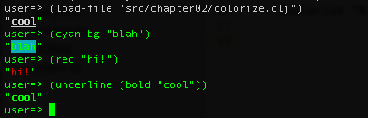
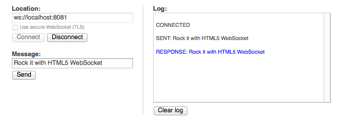
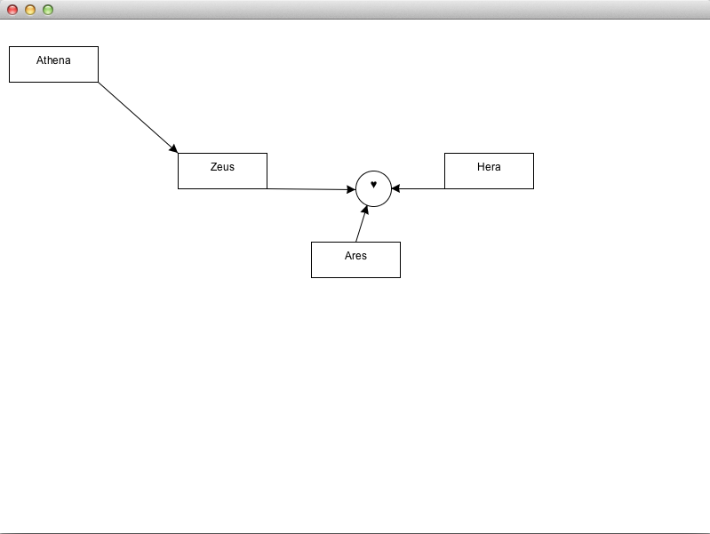
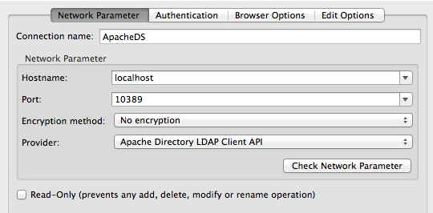
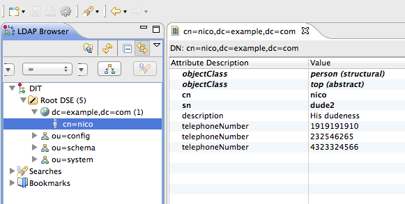

## Clojure recipes of the day: Finish your work in a few lines

###### Avant amuse: Something you eat before the amuse.

In Chapter 02, we will go through a number of libraries and techniques.
Since this is a menu, there is no specific order for you to read. Jump back and forth, come back when you need to be sure of something, and on top of it, try the short bits of code.  

To run any of the samples in this chapter, go to the directory _chapter02_ of the downloaded code, start a REPL with:
	
	lein repl

then load a file with a command of the like:

	(load-file "src/incanter.clj")

### I'll have the usual

####  Give some colors to your REPL

I am not sure if you noticed, but a menu always get better when you put some colors in it. There is a little gem there to do that in the name of colorize. 

	https://github.com/ibdknox/colorize

Include it in your project.clj with:

	[colorize "0.1.1"]

Here are some ways to use it:

@@@ ruby chapter02/src/colorize.clj @@@

And some graphic results:

####  Asynchronous http server and ... client. 

In the same time, you can turn yourself asynchronous with http-kit. 

	https://github.com/shenfeng/http-kit

This is what needs to be added to your project.clj file:

	[me.shenfeng/http-kit "2.0-SNAPSHOT"]

This would be how you set up a server that responds to web requests:

@@@ ruby chapter02/src/http_kit_01.clj @@@

The server will be started, and will delay answer to the client. No dependency so kind of very lightweight and wicked.
It also incorporate a kinda cool http client, again with no dependencies. Give a try.

@@@ ruby chapter02/src/http_kit_03.clj @@@

And it even includes a way to handle web sockets. Start the server with:

@@@ ruby chapter02/src/http_kit_02.clj @@@

And then head on line to a generic websocket testing site:

[http://www.websocket.org/echo.html](http://www.websocket.org/echo.html)

Power of websockets right at hand !

####  (Too?) Easy statistics with Incanter.

Download a full Incanter distribution from [http://incanter.org/downloads/] and Get started [https://github.com/liebke/incanter/wiki#getstarted](https://github.com/liebke/incanter/wiki#getstarted)

The download above includes a bunch of stuff you may not need. A faster way to get started is to go the usual route with Leiningen.

	[incanter "1.3.0"]

Then you can play around:

@@@ ruby chapter02/src/incanter.clj @@@

The image below has been generated from the script above ! 

Whats your next diagram ? 

Incanter has become a full package to perform efficient stats just like the *R* language. It can also export to PDF and Excel files, generates images, and perform stats in full time. 

There are also plenty of examples on the author website, relevant to Clojure in general so definitely worth having a look.

####  Where the doc ? It's literate. 

[https://github.com/fogus/marginalia](https://github.com/fogus/marginalia)

Marginalia is your best literate programming tool for Clojure. Which means, if you write the necessary comments within your code, marginalia will generate the best documentation for your project. Then you just have to publish it online. 

Install it as a dependency in your *~/.lein/profiles.clj* file:

	{:user {:plugins [
                  [lein-marginalia "0.7.1"] ; <- add this
                  [lein-pprint "1.1.1"]]}}

Then, just use it:

	lein marg

And depending on the amount of comments you wrote in the code, you will get something similar to this:

It will show your dependencies, and comments inline with the code.

####  Easy and beautiful graphs

[https://github.com/pallix/lacij](https://github.com/pallix/lacij)

Now you have all that data computed in Clojure, and you are in need of a great one liner library to turn this into a graph. Lacij is a library that can quickly create SVG diagram with automatic layout, like this one:

Then, a graph can be drawn like this:

@@@ ruby chapter02/src/lacij.clj @@@

The advantage is that you can add and remove nodes dynamically, thus giving a dynamic view about live typologies.

Try some other examples, to generate great graphs. Also, see how it is easy to open a Desktop window and embed the content of the graph within it:

####  Easy User Interface Applications with Seesaw

Make cool Application UIs in no time. Like really no time.

[https://github.com/daveray/seesaw](https://github.com/daveray/seesaw)

Everything is about the web these days. But there are some customers that do not even want to hear about using their web browser for application. You can talk them into using a Web browser for a week, or you can make a cool UI in a day. Here comes Seesaw. 

The best tutorial I have found so far is [here](https://gist.github.com/1441520)

Seesaw was born out of the frustration on how to make useful UIs in whatever language on the JVM, or for that purpose any other environment. Here you can get user input, feedback, implement a controller as you wish.

This is the simplest you can ever make with Seesaw:

@@@ ruby chapter02/src/seesaw.clj @@@

And by trying the examples on their website, here is a style you can get after a few lines:

@@@ ruby chapter02/src/seesaw_02.clj @@@

Impressed? 

####  Xpath queries

[https://github.com/kyleburton/clj-xpath](https://github.com/kyleburton/clj-xpath)

Now you been looking on how to process those large xml files as fast as possible, here is a super way to do it, clj-xpath.

You start by adding the dependencies for lein:

	[org.clojars.kyleburton/clj-xpath "1.4.0"]

The following code retrieves all the developpers, dependencies for a given online Maven pom.xml file:

@@@ ruby chapter02/src/clj_xpath.clj @@@

	There are two forms of many of the functions, with one set ending with a star ‘*’. The non-suffixed forms will perform their operation on a single result node, raising an exception if there is not exactly one result from applying the xpath expression to the XML document. The ‘*’ suffixed forms return all of the matched nodes for further processing.

####  html parsing with delicious jsoup

While we are doing a bit of XML, let's dive a bit into Jsoup is one of the most famous library in the java world to slurp some html across the web.

[https://github.com/mfornos/clojure-soup](https://github.com/mfornos/clojure-soup)

This is a wrapper to provide awesome parsing of html files, whether local or remote. Once you have added the library, check out the following example:

The following example shows you how to retrieve some emoticons on the web:

@@@ ruby chapter02/src/clojure_soup.clj @@@

####  Templating the clojure way with Enlive

This is one of my favorite feature in Clojure. Enlive. Enlive presents a different approach from your usual templating solution. 

* Code and markup are completely separate.
* You get to use CSS like syntax to manipulate HTML.
* Template inheritance is not some fancy trick, it is just function composition.

HTML parser, and templating framework at the same time, Enlive does a super job of integrating HTML fun. (yes you read me.)

This is an example taken from the [best enlive tutorial](https://github.com/swannodette/enlive-tutorial/).

This is how you use enlive to for website scraping. Fetch the content of a URL then select the html tag you need:

@@@ ruby chapter02/enlive.clj @@@

Reversly, you declare templates in regular html files, and apply some logic in Clojure. See how:

@@@ ruby chapter02/enlive_02.clj @@@

Your great designer can do his Dreamweaver work the way he or she usually does it and you can plug in your own logic without stepping on each other's foot. Sweet. Slick.

####  Easy Spreadsheet with docjure

[https://github.com/ative/docjure](https://github.com/ative/docjure)

The best way to have fun with spreadsheet in clojure. Relies of course on the [Apache POI](http://poi.apache.org/) library but with some clojure sauce so it can actually be eaten.

This is how you write a simple spreadsheet.

@@@ ruby chapter02/src/docjure.clj @@@

For more examples, I suggest you look at the ["horrible" documentationn](http://poi.apache.org/spreadsheet/how-to.html#sxssf) :)

This horrible soup is disgusting, but it will help you help some big financial company from bankruptcy one day.

####  Spam master with postal

[https://github.com/drewr/postal](https://github.com/drewr/postal)

Now you are on your way to reform, the whole Japanese Post faster than politician will do. Here you will get the power of postal.

You may have known how to send an automated mail before, but taste this by yourself and look at the awesome way of doing this in Clojure. For this example to work, do not forget to set a valid gmail user and the password.

@@@ ruby chapter02/src/postal.clj @@@

This is of course including attachments handling and full Japanese encoding support. yey

####  How's the DNS going ? 

If you need to do some look up or reverse lookup for IPs or hostname. here are a few lines for you:

@@@ ruby src/dns.clj @@@

No need to leave the REPL, type this in anytime. This also does not depend on any external library.

####  Don't touch my clostache: more on templating 

[https://github.com/fhd/clostache](https://github.com/fhd/clostache)

We have seen Enlive earlier on, but sometimes you just need some easy file based, or even in-line based templating.
This is where clostache comes:

	[de.ubercode.clostache/clostache "1.3.1"] 

Once this is in your project, you can perform some very simple but sexy templating magic.

@@@ ruby src/clostache.clj @@@

For the story, the { and } are called moustache, make sure they do not get into your food tasting today. 

####  When you need some CSV magic to generate Apple VCard.

Now that we have mustache, we will see a longer example showing how to convert a csv files containing people addresses, to a vcard vcf file format.

[https://github.com/davidsantiago/clojure-csv](https://github.com/davidsantiago/clojure-csv)

Let's start by adding this to our project file:

	[clojure-csv "2.0.0-alpha2"]

Then see what we can do with it.

@@@ ruby chapter02/src/csv.clj @@@

This is greatly inspired by a web based address book application available on [github](https://github.com/KushalP/addressbook/blob/master/src/addressbook/format.clj).

####  When google reader is not enough, some RSS magic.

[https://github.com/yogthos/clj-rss](https://github.com/yogthos/clj-rss)

	[clj-rss "0.1.2"]

Could hardly be easier. We return a set of entries with :title, :link, :description and the RSS library does the rest for us. See in live here:

@@@ ruby chapter02/src/rss.clj @@@

This is taken from [here](http://yogthos.net/blog/17).

####  You need to grrrowl to make great notifications
[https://github.com/franks42/clj-growlnotify](https://github.com/franks42/clj-growlnotify)

Growl is a famous notification application, that you can use to let you know something happened through a visual effect on the screen.
You can get it from this place for Apple OSX:

	http://growl.info/

Or for Windows users:

	http://www.growlforwindows.com/gfw/

You can build it from source, using the information available on the following link:

	http://growl.info/documentation/developer/growl-source-install.php

And it will be free, or you can actually help the developpers and contribute a few yens for them and purchased the compiled version. Once Growl is in your system, check it is properly installed with the following code on the command line:

	growlnotify -m hello

Which should display the following on the screen:

Now, let's use it from our Clojure code. Install it in your project with:

	[clj-growlnotify "0.1.1"]

Then:

@@@ ruby chapter02/src/growl.clj @@@

When you run the script above, you will get a nice message like the one below:

####  All about JSON with Cheshire.
[https://github.com/dakrone/cheshire](https://github.com/dakrone/cheshire)

Or how to do proper json fun in the Clojure style. Cheshire is there for good. 
	
	Cheshire is fast JSON encoding, based off of clj-json and clojure-json, with additional features like Date/UUID/Set/Symbol encoding and SMILE support.

Add it to your project with:

	[cheshire "4.0.2"]

Now we can turn pure Clojure structure into JSON, and parse string in one go. Very useful for exchanging data with other system.

@@@ ruby chapter02/src/cheshire.clj @@@

Note how you can get keywords back, or do some extra mapping on dates. No more JSON problems.♫

####  Compute digest for just about everything.

[https://github.com/tebeka/clj-digest](https://github.com/tebeka/clj-digest)

Digesting ! Digest is the easiest way to have a signature of a document, and to make sure that 

What we have for you in this recipie is your everyday tool to compute digest on just about everything. It comes from clojars with:

	[digest "1.3.0"]

And voila. A few lines to compute digest from files, strings bytes etc ...

@@@ ruby chapter02/src/digests.clj @@@

####  Terminal and user interfaction, with lanterna.
[https://github.com/sjl/clojure-lanterna/](https://github.com/sjl/clojure-lanterna/)

Fun with the terminal. 

	[clojure-lanterna "0.9.2"]

This simple script:

@@@ ruby chapter02/src/lanterna.clj @@@

will spawn a terminal, display some text, and finally wait for some input key.

It is also easy to wait for keys, and other terminal things fun.
Have a look at the extensive [documentation](http://sjl.bitbucket.org/clojure-lanterna/screens/) to get you excited.

####  What time is it ? It's clj time

Every good language should have access to some clean way to play with dates. Here is one with _clj-time_:

[https://github.com/seancorfield/clj-time](https://github.com/seancorfield/clj-time)

This is mostly a wrapper around jodatime to do dates times and everything time related the clojure way.

Add this to your project.clj

	[clj-time "0.4.5-SNAPSHOT"]

@@@ ruby chapter02/src/time.clj @@@

Will make your life with timezones definitely better :) You will always be on the right time. 

####  SSH shortcuts

Sometimes you just wished you had that piece of data avaiable on a remote computer straigth here in your REPL.
This is where clj-ssh comes in. 

[https://github.com/hugoduncan/clj-ssh](https://github.com/hugoduncan/clj-ssh)

	[clj-ssh "0.4.3"]

A wrapper to automate ssh commands, using the default ssh agent on the local machine.
There is probably more to read if you are on windows. 

@@@ ruby chapter02/src/ssh.clj @@@

####  Master of them all HTTP client
[https://github.com/dakrone/clj-http](https://github.com/dakrone/clj-http)

clj-http is your clojure wrapper around the java [apache http client](http://hc.apache.org/). That http client has been around for quite a few years, and propose a very robust api. Now with clojure, we can even have it short.

	[clj-http "0.3.6"]

The following example show how to send a post request to ask for some image processing to be done in the cloud through the [blitline API](http://www.blitline.com/docs/quickstart).
The function applied is a blur, and the rest is just passing arond JSON parameters.

@@@ ruby chapter02/src/http.clj @@@

####  How's your serial port doing  ?

[https://github.com/samaaron/serial-port/blob/master/src/serial_port.clj](https://github.com/samaaron/serial-port/blob/master/src/serial_port.clj)

This recipie is about easy access to the USB port of your machine. This is going deep down the roots of the computer and may not work. Some other libraries like calx and penumbra that we will see later may have this embedded already. 

@@@ ruby chapter02/src/serial.clj @@@

Since this is going at the bit level and provide little bit abstraction, this is mostly for reference. 
But hey, all you need to start your own driver for your custom USB device is here.

####  No memory, but I know how to stream extra large XML files

This is based on a special XML parsing library, called xml-picker-seq that has been specially written to handle extra big xml files. 
[https://github.com/marktriggs/xml-picker-seq](https://github.com/marktriggs/xml-picker-seq)

This is what to use when you have to deal with pretty big xml files. This library supports over 1Gb heavy files, more XML than you should eat on average.
Here is how to grab it:

	[xml-picker-seq "0.0.2"]

@@@ ruby chapter02/src/large_xml.clj @@@

[https://github.com/dakrone/clojure-opennlp](https://github.com/dakrone/clojure-opennlp)
Natural Language Processing in Clojure.

This is has to be one of the most technical subject available to be used just as is in this book.  OpenNLP allows you to parse text into something meaninful so you can reuse it in your application.

	[clojure-opennlp "0.2.0"]

This would be some simple examples on how to parse text with OpenNLP:

@@@ ruby chapter02/src/opennlp.clj @@@

Note that this is only the most basic use of the OpenNLP library.
You can see a vast list of direct examples in the [README](https://github.com/dakrone/clojure-opennlp/blob/master/README.markdown) and a full section has been written on how to [train](https://github.com/dakrone/clojure-opennlp/blob/master/TRAINING.markdown) new models to use in your application.

Here is a more extensive way to tokenize a web page entirely

@@@ ruby chapter02/src/opennlp2.clj @@@

####  Full Clojure stream ahead ! Use conduit.

You may need to go and look at the following stream processing page to learn more about stream processing:
[http://www.intensivesystems.net/tutorials/stream_proc.html](http://www.intensivesystems.net/tutorials/stream_proc.html)

This is one of my favorite quick to explain but sweet to use recipie in Clojure.

At the core of conduit are ways to get things in, and then pull things out, applying different transformation along defined steps in the conduit.

	[net.intensivesystems/conduit "0.9.0"]

In idea, this is also similar to Apache Camel, where you get messages from different messaging systems (RabbitMQ, IRC etc ..) and then apply your processing. 

@@@ ruby chapter02/src/conduit.clj @@@

####  Event workflow and stream processing in Clojure

[https://github.com/ztellman/lamina](https://github.com/ztellman/lamina)
Event workflow for clojure, stream processing in Clojure.

Lamina defines the very awesome concept of queues to receive events or values and then process them as they are coming. Lamina makes it very easily to play and visualize what is happening troughout the different queues waiting for values.

Import it in your project with:

	[lamina "0.5.0-beta9"]

You would need [Graphiz](http://www.graphviz.org/Download..php) installed on your machine to display how the channels are handling data. On OSX, here is the way to do it simply with brew:

	brew install graphviz

@@@ ruby chapter02/src/lamina.clj @@@

@@@ ruby chapter02/src/lamina2.clj @@@

#### Everyday cryptography with Alice, but where is bob ? 
[Cryptography for Clojure](https://github.com/laczoka/clj-crypto)

This library is based on the efficient bounty castle library for Java. Basically, everything has been made so it's easy to generate key pairs and integrate proven security in your application.

	[laczoka/clj-crypto "1.0.2-SNAPSHOT"]

@@@ ruby chapter02/src/alice.clj @@@

#### Unit of measures calculator in Clojure

Here comes a very cute but powerful library to convert between units.

The long version on how to use this can be found here: 
[Unit of Measure Calculator](https://github.com/martintrojer/frinj) and [samples](https://github.com/martintrojer/frinj/blob/master/src/frinj/examples.clj)

But let's got through a quick example of liquids and rooms.

	[frinj "0.1.3"]

This example shows how to convert the size of your room, in the required amount of water needed to fill the room completely.

@@@ ruby chapter02/src/frinj.clj @@@

Take the time to go through the other samples, the style of writing and the taste of the example is just fabulous.

#### When you are in need of querying Json
[JsonPath](https://github.com/gga/json-path)

We have seen how to query xml over and over again, but these days, it's really more about query JSON data structure. Here comes, json-path. 
The code has not been updated for a bit of time, but it works like a charm. 

	[json-path "0.2.0"]

The following example takes us through querying regular json-like structure, and then goes along with an example after parsing with Cheshire:

@@@ ruby chapter02/src/jsonpath.clj @@@

####  Clojure on your nerves ? Use Netz for your neural network things

	Netz is a Clojure implementation of a multilayer perceptron (MLP), a type of feedforward artificial neural network. Netz provides functions for training and running MLPs. Training is accomplished via gradient descent batch Rprop or standard backpropagation.
	Netz implements Rprop as described by Riedmiller in Rprop - Description and Implementation Details. 

[Netz, Clojure Neural Network Library](https://github.com/nickewing/netz)

Here is a very short example, showing how to train and run a Neural Network:

@@@ ruby chapter02/src/netz.clj @@@

In the example, we see we train the network with some hidden values. The options you are most likely to find interesting are:

	:hidden-neurons - A vector containing the number of neurons in each hidden layer. Set to [2 2] for two hidden layers with two neurons each, or [] for no hidden layers. Setting this option is recommended. Default: One hidden layer with the same number of hidden neurons as inputs.

and to change the learning algorithm:
	
	:learning-algorithm - The algorithm to use while training. Choose either :rprop for the Rprop algorithm or :bprop for standard back propagation. Default: :rprop.

Also, each training variant has some specific options.

As a reminder modern Neural Networks can be applied to a variety of useful tasks such as:

* Function approximation, or regression analysis, including time series prediction and modeling.
* Classification, including pattern and sequence recognition, novelty detection and sequential decision making.
* Data processing, including filtering, clustering, blind signal separation and compression.

#### Shake, or every shell program is now a clojure function

This is an easy and crazy one. What about every single command of your shell could be accessible to your REPL ? 

Here comes [Shake](http://sunng.info/blog/2012/09/shake-every-program-can-be-a-clojure-function/)

Shake is very useful to keep your original script with some structure and integrate them with Clojure logic and programming.

Here's how to add it to your project.clj file:

	[shake "0.2.1"]

Then enjoy some instant gratification:

@@@ ruby src/shake.clj @@@

#### Timely, or your super easy scheduling in Clojure
[Scheduler](https://github.com/Factual/timely)

Timely takes the cron approach to easily schedule tasks for your script or for your application. It is very lightweight, has no dependency and can be integrated before the waiter comes in.

Include, version 0.0.3, but it works like a charm:

	[factual/timely "0.0.3"]

@@@ ruby chapter02/src/timely.clj @@@

#### Generate, string clean HTML in a clojure way without hiccups

This is one of the most famous Clojure library and is in used in about half of the menus and samples you will find around the web. 

	[hiccup](https://github.com/weavejester/hiccup)

	Hiccup is a library for representing HTML in Clojure. It uses vectors to represent elements, and maps to represent an element's attributes.

	[hiccup "1.0.2"]

To explain what hiccup can do could not be easier, you just create some data structure with tags and some CSS patterns to make it easy to generate HTML.

See for yourself:

@@@ ruby chapter02/src/hiccup.clj @@@

In a later chapter, we will also see how to integrate hiccup with some web framework, but for now, you can generate quite a bit with it already.

#### Ahead of time scheduler at

Can also be found on github:
[Ahead of time scheduler](https://github.com/overtone/at-at)

at-at has been extracted from another great project called Overtone used for music generation, so pretty accurate timing is needed ! 

The following code will show you how to prepare your pool of scheduled items, and how to start and stop at different timing from now. 

@@@ ruby chapter02/src/at_at_clj @@@

#### On parsing ANTLR grammars with Clojure

ANTLR stands for _ANother Tool for Language Recognition_ and is a lexer and parser for grammars, that has enjoyed popularity in the Java ecosystem.

ANTLR has just turned to version 4, [https://github.com/antlr/antlr4](https://github.com/antlr/antlr4) and is the fruit of about 15 years of continuous efforts and is used throughout tons of projects.

lein-antlr is a Leiningen 2 plugin for generating source code from one or more ANTLR grammars in a Leiningen project. It has roughly the same functionality as the Maven ANTLR plugin, and is intended to allow developers to integrate ANTLR-generated source code into a Clojure project without resorting to Maven or some other manual process.

[AntLR via Clojure](http://briancarper.net/blog/554/antlr-via-clojure) and [lein-antlr](http://github.com/alexhall/lein-antlr)

Lein antlr has just been upgraded to Lein2, and so we can just add it as plugin in our project.clj file:

	:plugins [[lein-antlr "0.2.0"]]

Also, we need a bit of extra configuration to find the grammar files, and a place to put the generated files:

	:antlr-src-dir "antlr"
	:antlr-dest-dir "gen-src"

Once this is done, you can run

	lein antlr

To generate the java parser and lexer files from the grammar. Now your grammar can be used from clojure, using the usual java interop calls:

@@@ ruby chapter02/src/antlr.clj @@@

If you modify the input file with some random characters, you will see the parsing failing.

#### How to grep and glob files

You could write a glob library in no time with Clojure, but fortunately someone already did that for you:
[glob files](https://github.com/neatonk/clj-glob)

@@@ ruby chapter02/src/glob.clj @@@

And since we are into manipulating files, here is a quick example on how to implement a grep method.

@@@ ruby chapter02/src/grep.clj @@@

Note especially the coolness of the _indexed_ method:

	(defn indexed [coll]
  		(map vector (iterate inc 1) coll))

This is where the number of the line that matched the pattern search in grep will be computed.

#### Idiomatic pattern matching in Clojure

To expand from greps and globs, we are going to look at [Matchure](https://github.com/dcolthorp/matchure). 

Matchure is pattern matching for clojure that can be used in quite a number of situation:

* sequence destructuring
* map destructuring
* equality checks
* regexp matches
* variable binding
* instance checking
* arbitrary boolean expressions
* boolean operators (and, or, not)
* if, when, cond, fn, and defn variants

A few sample usages are defined below:

@@@ ruby chapter02/src/matchure.clj @@@

Also note that you can do a bit of the core matching with the core Clojure library:

@@@ ruby chapter02/src/match.clj @@@

The advantage of the second version is that you can reuse the same code on Clojurescript, which we will go in more details in a later chapter.

#### Google protobuffer for Clojure

	clojure-protobuf provides a Clojure interface to Google's protocol buffers. Protocol buffers can be used to communicate with other languages over the network, and they are WAY faster to serialize and deserialize than standard Clojure objects.

Here is the project page: [https://github.com/flatland/clojure-protobuf](https://github.com/flatland/clojure-protobuf)

We are including here the Person protobuffer:

	message Person {
		required int32  id    = 1;
		required string name  = 2;
		optional string email = 3;
		repeated string likes = 4;
	}

You need to add two things to your Leiningen project file. First the leiningen plugin in the plugins section:

	[lein-protobuf "0.1.1"]

Then the library itself

	[org.flatland/protobuf "0.7.2"]

Those dependencies include some native compilation that is part of the reason it is so blazing fast.

The Person model being defined, and all our dependencies in place, we can play around our Protobuffer object:

@@@ ruby chapter02/src/protobuffer.clj @@@

Note that import and dump go through bytes so you loose in visibility what you gain in speed.

#### Clojure interface to superb search engine Lucene

This is for searching and indexing data easily. [Clucy](https://github.com/weavejester/clucy) builds on top of the famous Lucene search engine, used by thousands of companies, but also add an incredible amount of ... simplicity.

The example below walks you through creating a memory index or a file based index, store some values and send some search queries.

@@@ ruby chapter02/src/clucy.clj @@@

Pretty fast uh ? Now there is no excuse not to propose some search feature into your application.

#### Interface with your own Solr based search engine

Now building on our previous example, we are going to install Solr, which is a full distribution of Lucene packaged and ready to be used.

	Solr major features include powerful full-text search, hit highlighting, faceted search, near real-time indexing, dynamic clustering, database integration, rich document (e.g., Word, PDF) handling, and geospatial search. 

Let's start by downloading Solr onto our machine

	http://lucene.apache.org/solr/

Now navigate to the _example_ folder, then type

	java -jar start.jar

in this example directory, and when Solr is started connect to 

  http://localhost:8983/solr/

If Solr started properly, you should see the following screen:

Now we can use some clojure code to play with it, just like we did for the Clucy example.

@@@ ruby chapter02/src/solr.clj @@@

Note, you can also retrieve the data through JSON with

	http://localhost:8983/solr/collection1/select?q=*%3A*&wt=json&indent=true

Short and sweet isn't ? 

#### When in need of some pdf magic

We have seen incanter in an earlier recipie, and to generate a PDF from the generated graph, we can almost reuse the same code we have seen before (taken from [here](http://data-sorcery.org/2010/02/05/pdf-charts/)):

@@@ ruby chapter02/src/incanter_pdf.clj @@@

Now for something more organized, we have a clojure version of itext, which can generate just about any kind of PDF you would want.

Here's what to add to your _project.clj_

	    [com.lowagie/itext "4.2.0"] ; use a more recent itext library
    	[clj-pdf "1.0.5-SNAPSHOT" :exclusions [itext-min "0.2"]] 

This time, we are taking a slightly new version of itext, that does not clash with some of our previous imports.

In our example, we simply add a few document elements (essentially an array of pdf items) to the pdf, and at the same time ask for the pdf file to be generated.

@@@ ruby chapter02/src/pdf.clj @@@

Available document elements are described in detail on the [github page](https://github.com/yogthos/clj-pdf#document-elements).

Here is the list for reference:

Anchor, Chapter, Chart, Chunk, Heading, Image, Line, List, Pagebreak, Paragraph, Phrase, Section, Spacer, String, Subscript, Superscript, Table, Table Cell

#### Clojure wrapper for complex event processing

This recipie is based on Esper, which is a super reliable message processing middleware.
Esper itself can be found at: [http://esper.codehaus.org/tutorials/tutorial/quickstart.html](http://esper.codehaus.org/tutorials/tutorial/quickstart.html)

	Esper and NEsper enable rapid development of applications that process large volumes of incoming messages or events. Esper and NEsper filter and analyze events in various ways, and respond to conditions of interest in real-time.

	It provides a SQL-like language across a stream of data.

Basically you can create your own event service bus with Esper. The integration in clojure is quite basic still, but you could very well enhance it, by increasing the api coverage.

Anyway, for now, we are going to see how to create a local event bus, and how to add events to it, along with defined callbacks.

@@@ ruby chapter02/src/esper.clj @@@

On the performance side, the esper team has reported handling about 200.000 events per seconds on a regular laptop, so quite something to be proud of, and definitely some scaling at work.

#### When your friends are in LDAP

When you need to manage a directory running in LDAP, this is also very easy to do in Clojure.
To run this example, you will need to get and install [Apache DS](http://directory.apache.org/apacheds/downloads.html). 

Download the Zip version and start the LDAP server with:

	./bin/apacheds.sh 

or on Windows

	apacheds.bat

Now we can our Clojure wrapper for LDAP named [clj-ldap](https://github.com/pauldorman/clj-ldap)

And then go on adding and deleting entries in our local server:

@@@ ruby chapter02/src/ldap.clj @@@

Now you can go and compare the code we have above, to what some IBM people have been writing a few years back. See by yourself !

	http://www.ibm.com/developerworks/jp/java/library/j-apacheds2/

If you use ApacheDS Studio, with the following settings:

And the following (default) authentication:

The default ApacheDS password is:

	secret

You can graphically validate when the users are created:

#### A few words on the new reducers sauce

Rich Hickey has explained in a long post what 
[Reducers](http://clojure.com/blog/2012/05/08/reducers-a-library-and-model-for-collection-processing.html) are.

First time I saw his post I thought wow. I actually thought wow a few times while reading Rich presentations or some code he presents from time to time.

This one was pure simplicity. Once you get it, you cannot stop from ordering more. 

More simplicity.

Here are examples taken from Rich's post, enhanced with some comments.

@@@ ruby chapter02/src/reducers.clj @@@

### Domain Specific Language

#### How to create your own parser

We are only going to scratch the surface of that one, but here we present [Parsley](https://github.com/cgrand/parsley) generates total and _truly_ incremental parsers.

	Truly incremental: a Parsley parser can operate as a text buffer, in best cases recomputing the parse-tree after a sequence of edits happens in logarithmic time (worst case: it behaves like a restartable parser).

This is the grammar we are going to see:

	:expr #{"x" ["(" :expr* ")"]}

Which supports input like:

	x () (xxx) ((x)(xxx))

This is how we define our grammar, and apply some input to it:

@@@ ruby chapter02/src/parsley_1.clj @@@

Now we see that invalid input generates some _unexpected_ element in the tree.

Now where Parsley really shines, is when using in incremental mode. What that means is that Parsley will modify the tree at the proper place instead of a reparsing everything. This brings some important performance gains.

See by yourself in:

@@@ ruby chapter02/src/parsley_2.clj @@@

A grammar production right-hand side consists of a combination of:
* vectors (sequence)
* sets (alternatives)
* keywords (non-terminal or operators: :*, :+, :?)
* antything else is considered as a literal (a "matcher")

Now, this is a great way to finish this chapter with some Domain Specific Brewage. ;)
