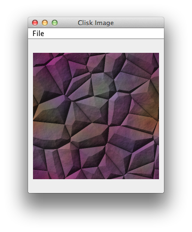
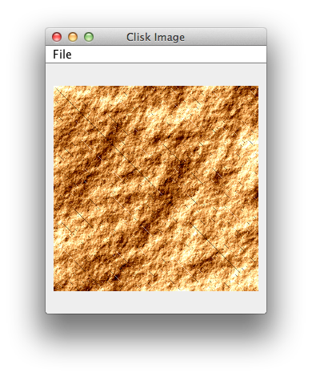
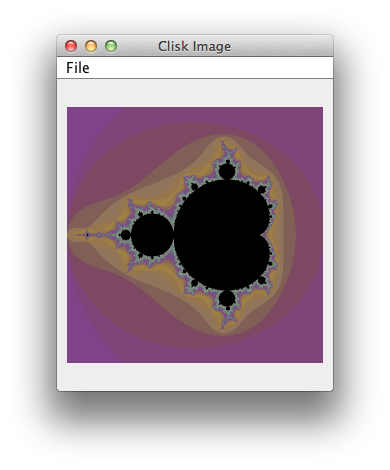
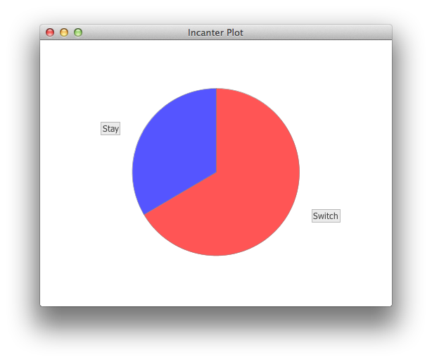

### It's only logical

#### Fractals

Clisk is a Clojure based DSL/library for procedural image generation.
    You can use it for:

    Creating 2D material textures for games
    Building fractal images / artwork
    Generating 3D or 4D textures for raytracing (e.g. in Enlight: https://github.com/mikera/enlight)
    Creating patterns (e.g. randomly generated maps)

This is how to find it in Clojars:

    [net.mikera/clisk "0.7.0"]

I arrived to clisk through this [blog entry](http://clojurefun.wordpress.com/2012/08/30/mandelbrot-fractals/) and got totally in love with its ease of use for creating mathematical graphics. 

Example 1 shows how to start with clisk and some voronoi map mathematical function. 

@@@ ruby chapter03/src/clisk1.clj @@@

Then how to play along with checker patterns:

@@@ ruby chapter03/src/clisk2.clj @@@

Next example on how to play with plasma-like gradient:

@@@ ruby chapter03/src/clisk3.clj @@@

And last one, with the famous mandelbrot fractal.

@@@ ruby chapter03/src/clisk4.clj @@@

#### your dose of genetic algorithm in Clojure

##### Gajure
Gajure is not really a full on project, but more hints at how you can use and have fun with genetic programming.

Suppose we have to find out a somewhat secret value, with the only source of information being a method that tells us some information about that value.
This is where genetic algorithm comes handy. We generate random sets of values, and try to find out their fitness through the provided method.
Then each round, we keep some results, and remove other ones. We also need to be sure to have a big enough pool at each generation to prevent locking ourselves down with the wrong information.

This is what the gajure example is about. Let's go along this together:

@@@ ruby chapter03/src/gajure.clj @@@

Now, once you have run the example, you should try to change the input value, and the different settings for running the genetic algorithm.
Now this tool can be very useful for:
- computer gaming ;)
- network routing
- time tables and scheduling

#### Monty Hall Problem seen with Incanter
[Monty Hall with Incanter](http://data-sorcery.org/category/monte-carlo-simulation/)

This is a short analysis of the Monty Hall problem. The problem is a famous problem exposed by the following:

    Suppose you're on a game show, and you're given the choice of three doors. Behind one door is a car, behind the others, goats. You pick a door, say number 1, and the host, who knows what's behind the doors, opens another door, say number 3, which has a goat. He says to you, "Do you want to pick door number 2?" Is it to your advantage to switch your choice of doors?

The solution has also been explained, notably on [YouTube](http://www.youtube.com/watch?v=mhlc7peGlGg), but we will go through a Clojure version this time, using yet again our favorite Incanter library.

@@@ ruby chapter03/src/monty_hall.clj @@@ 

And the result displayed in a nice graphical frame:

#### A few logical words: where is prolog ? 

According to a few sources, logic programming is one of the 4 main pillar of programming, along with imperative, object oriented and functional.
[Core Logic](https://github.com/clojure/core.logic/wiki/Examples) came a little bit later in the Clojure game but now offers Prolog-like relational programming, constraint logic programming, and nominal logic programming straight form within Clojure. 

The first samples are very easy to go through:

@@@ ruby chapter03/src/logic0.clj @@@

And then you can see the program, just like genetic programming earlier is looking for something where there are just too many possibilities to try by yourself.

Now, logic programming fits perfectly the case of Game AI. See how core.logic will help you to find the path to get the object on the box and then get out. This is superb:

@@@ ruby chapter03/src/logic1.clj @@@

#### It's hot: Rule engine in your hands 

According to Wikipedia, The Rete Algorithm is an efficient pattern matching algorithm for implementing production rule systems.

Buuilding upon our previous odyssey in the world of logic programming, here we go with [mimir](https://github.com/hraberg/mimir) which is an efficient rule engine built natively in Clojure.

The rules are slightly easier to write in mimir than in core.logic that is the reason I have decided to show some examples on it.

@@@ ruby chapter03/src/mimir.clj @@@

    This example uses basic triplets, where each value in a fact is a Clojure atom, and in a rule a condition an atom or a var, prefixed with ?.

### NoSQL

In the recent days, years it's been mostly about NoSQL or how to get tastier data persistence without all the fuss. 
I am particularly a fervent supporter of MongoDB, and put it on the table of discussions numerous times, but what is most important is how *you* are going to store and use all this data.

#### Clojure Monger, your Mongo client in a civilized age
MongoDB is probably the easiest way to store data somewhere and play with it. As you may know, MongoDB handles data in a JSON kind of way, which is really intuitive and really fits well in the Clojure world.
MongoDB is used at MTV Networks, and some other data intensive 

To install a Mongo Server on your machine, go to the following URL and unzip to a favorite place:

    http://www.mongodb.org/downloads

Then to start the server, run the following command:

    mongod --rest --dbpath data

You do not really need the parameters, but the --rest flag will enable direct store and return of data through a REST interface, so you will have convenience to access this data straight from your browser if you need it. 

Lastly, the dbpath is where the data is stored, which means it shows as a nice folder on your computer explorer.

Now on the Clojure side of things, to access Mongo we are going to use [Monger](http://clojuremongodb.info/) a sweet little driver that is going to prepare the plates for you.
Let's put it in our project.clj with:

    [com.novemberain/monger "1.4.2"]

And now we can go along some short examples.

@@@ ruby chapter02/src/mongo.clj @@@

At any point in time, you can also view the content of your mongo database by accessing:

    http://localhost:28017/monger/documents/

This is the reason we have enabled the --rest flag earlier on. More details can be found on the mongodb web site, so please go and have a look:

    http://docs.mongodb.org/ecosystem/tools/http-interfaces/

Now, that was mostly easy, but not much more is needed is it ? 

#### No joke, this may be your best client redis library

Redis is an advanced and fast key-value store. It is similar to memcached but the dataset is not volatile, and values can be strings, exactly like in memcached, but also lists, sets, and ordered sets.
Redis offers some really impressive performance when used in a in-memory style.

On OSX, you can use _brew_ to install Redis in no time:

    brew install redis

You can use your own package manager or go to the redis download page at:

    http://redis.io/download

Then start the server with:

    redis-server

or 

    redis-server <path_to_configuration_file> 

Now on to Clojure land, there is a nice driver that are going to expose all the great features of Redis. Welcome to [Carmine](https://github.com/ptaoussanis/carmine) to the table! 

Here is you invite Carmine for dinner:

    [com.taoensso/carmine "1.5.0"]

And on we go with the basics of connecting to the server:

@@@ ruby src/chapter03/carmine.clj @@@

In a second section, we see in details how to use the publish/subscribe mechanismn that is so very impressive to redis:

@@@ ruby src/chapter03/carmine2.clj @@@

Lastly, the all new feature of Redis is to act as a persistent messaging queue. Here is how you would go to use it:

@@@ ruby src/chapter03/carmine3.clj @@@

So, we have seen that Redis is great as :

- a key/value store
- a reliable publish subscribe environment
- a persistent keystore

Now that is quite a lot of possibilities for only one recipie ! 
More wine needed I guess.

#### Well maintained Clojure client for RabbitMQ

RabbitMQ prides itself with "Messaging that just works". It is a very reliable and fast messaging environment. 
And since we are having French dinner, it's all so natural that we should have some rabbit. 

To install on OSX:

    brew install rabbitmq

And on other plateforms:

    http://www.rabbitmq.com/download.html

To start once this is installed:

     rabbitmq-server

And now we are ready to go with some Clojure excercises with some one called [langohr](https://github.com/michaelklishin/langohr). 

Langohr compared to other Clojure drivers may seems slightly *raw* but it does it so as to avoid a complete introduction of a new DSL.

We will go through a basic but extensive messaging example:  

@@@ ruby chapter03/src/rabbitmq.clj @@@

Now, RabbitMQ also has work queues, publish/subscribe, Routing, Topics and full on RPC in its feature lists and the Clojure driver we have seen supports pretty much all of it.

#### Time to open the cupboard and find the cakes of an easy in memory storage

Our new customer [cupoard](https://github.com/gcv/cupboard) is a fantastic embedded database when you need to run on minimum resources and dependencies. 

The way to add it, is as usual pretty simple:

    [cupboard "1.0beta1"]

And the examples to connect, insert and query are pretty much as simple as you would expect.

@@@ ruby chapter03/src/cupboard.clj @@@

At its lowest level, Cupboard uses Berkeley DB JE so you can be sure it is reliable and has been properly tested.

#### FleetDB:your all clojure schema-free database 

Now to close your section on NoSQL, we will look at an all Clojure database called [fleetdb](http://fleetdb.org/docs/introduction.html).

It is packaged as a very convenient jar file, so you can download  it with:

     wget http://fleetdb.s3.amazonaws.com/fleetdb-standalone.jar

And start it with:

     java -cp fleetdb-standalone.jar fleetdb.server -f mydatabase.fdb

I really like the fact that you can telnet into it

    telnet 127.0.0.1 3400

And just send command through it like this directly.

For example, after connecting type:

    ["ping"]

And you will get a message back directly:

    [0, "pong"]

The rest of the recipie follow the usual steps of database examples. Let's enjoy it:

@@@ ruby chapter03/src/fleet.clj @@@

### SQL

Now we are back to the old-fashioned but proven SQL world. Clojure has at its hand a lot to offer when querying relational database.

For this section we are going to rely on a famous embedded database named H2. We will integrate it in our project the way we do for regular Clojure dependencies, 

    [com.h2database/h2 "1.3.154"]

####  Manage your databases schema with lobos

Here is comes [Lobos), or how to manage your database directly from a Clojure REPL.
To include it in your project:

    [lobos "1.0.0-beta1"]

And the example below walks you through:
- opening a connection
- create a table
- query the schema
- drop the table
- close the connection

@@@ ruby chapter03/src/lobos.clj @@@

Lobos is very useful for testing, but Lobos has a special key feature where you can implement migrations of your schema. We do prefer liquidbase for this, we will see that in a few pages.

####  Write beautiful SQL queries with Korma

Now that we have a beautiful database schema, 
[http://sqlkorma.com/docs](http://sqlkorma.com/docs)

Korma makes actually enjoyable to write SQL queries.

    [korma "0.3.0-beta7"]

Have a look at the following code:

@@@ ruby chapter03/src/korma.clj @@@

Portable, compatible queries against a SQL database, with the feel of a no-sql one. When you have to insert or recover data, what else would you use ? 

#### It's good when it is raw
The liquidbase example we are going to see soon is using the very useful [clj-dbcp](https://github.com/kumarshantanu/clj-dbcp) to pool database connection, with a very large support of database backend out of the box coming from [oss-jdbc](https://github.com/kumarshantanu/oss-jdbc), which is a project gathering all those database drivers for you.

Once you have added the the following two dependencies:

    [clj-dbcp      "0.8.0"]  ; to create connection-pooling DataSource
    [oss-jdbc      "0.8.0"]  ; for Open Source JDBC drivers

to your project you should be setup for a bit of database work.

We have found adapted a very easy CRUD sample so you can see how 

* remember those database calls made with Clojure
* you see how to create pooled connections at will.

Here is how it goes:

@@@ ruby chapter03/src/dbcp.clj @@@

How we are ready for some database migrations. See you in a few lines.

#### You are in control of your database migrations

[Clj-Liquibase](https://github.com/kumarshantanu/clj-liquibase) is a Clojure wrapper for Liquibase for database change management and migration.

We already have the datasource and the drivers from the last meal, so let us see how to smoothly migrate schemas in a chaotic world, but in controlled way:

@@@ ruby chapter03/src/liquidbase.clj @@@

Now that was not so hard was it ?

That closes it for the SQL section, we have seen how to:

* handle SQL schema with lobos, 
* insert queries in a nice cool way with korma
* create pooled database source with dbcp
* handle migrations gracefully with the clojure liquidbase wrapper.

Now, let's move on to some fun into the world of the web.

