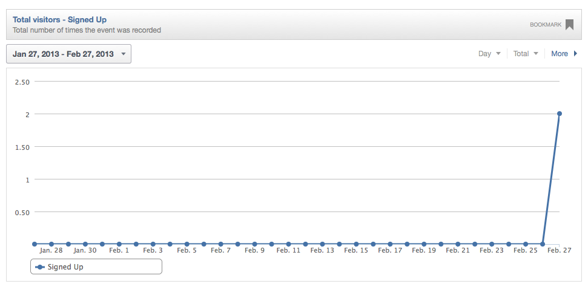

### Remote Libs

###### オードブル（Hors d'oeuvre）:前菜

This section will briefly explores a few but fun APIs that are available online, as part of the programmable web.
You can see how easy it is to tackle data coming from remote APIs but also, 

#### FactQL, for when you want to use the world's most powerful programming language to query the world's most powerful open data platform.

If you have not heard of [Factual](http://www.factual.com/) yet, it is a way to change the world. ;)

    Factual Places combines data on 64 million local businesses and points of interest with rich APIs to bring context to every point worldwide.

Or basically get impressive access to an impressive amount of impressive data in an impressive short time.

To get yourself an account you can visit the create an account page. 

Then we have this straight from Clojure with [FactQL](https://github.com/dirtyvagabond/factql) that is going to give you amazing access to all this amazingness.

Here are a few examples:

@@@ ruby chapter03/src/factql.clj @@@

But be sure to go online and check more data by yourself ! So, for this reciepe, I suspect a glass of beer would be appropriate.

#### Zencoder API in a few steps

I am using Zencoder from time to time, when I cannot read some videos on the device I want at some urgent time.

The original [Zen Client](https://github.com/rcampbell/zenclient) for Clojure was a bit old, but the code was pretty inspiring and, more than that, it still works 3 years later. This is probably what I like the most with Clojure. Once things work, they do work. And then you just need to bring some love to add more features when needed.

Anyway, on to a sweet easy example, but before let's add a dependency to our project.clj

    [hellonico/zenclient "1.2"]

And then, on to the 30 seconds tutorial !

@@@ ruby chapter03/src/zenclient.clj @@@

Pretty sweet uh ? 
Whenever you can look at how the code for the API has been written, it is pretty inspiring on how easy it is to write a Clojure wrapper for any kind of API. 

#### Mixpanel, or how to track millions of user events from within your application

[Mixpanel](https://mixpanel.com/about/) claims itself to have "built the most advanced analytics platform for mobile & web."

Without commenting on the claim, it sures can get your started with collecting actions and gathering data from users in a no brainer no timer way.

We are going to use a minimalist wrapper around the api named [clj-mixpanel](https://github.com/pingles/clj-mixpanel) and add it to our project:

    [clj-mixpanel "0.0.1-SNAPSHOT"]

The code to generate some data is ridiculously simple:

@@@ ruby chapter03/src/mixpanel.clj @@@

But with those few lines, you can gather who's using your code and how:

And instantly gets some analytics:

If you need to gather user related data, this is probably the easiest way to get this done. Try it !

#### Todoist, your todo list from Clojure

We are going to finish this quick web interaction tour with [clj-todoist](https://github.com/hellonico/clj-todoist), a simple wrapper around the [todoist.com](mv ~/Desktop/Screen\ Shot\ 2013-02-27\ at\ 8.50.31\ PM.png) API.

Todoist is a Todo list, online, accessible from anywhere, and has been helping me to get the job done for the last few years. I am a full supporter of that team work. 

Now I realize that I can use the API for tracking things I want to work on straight from the REPL without going all the way to open the browser.

Let's add it:
        
    [clj-todoist "1.0.0"]

And let's go through a few examples:

@@@ ruby chapter03/src/todoist.clj @@@

The complete Todoist API is [here](http://todoist.com/API/), and look at how short the code is to write a wrapper around the online API:

@@@ ruby chapter03/doc/clj-todoist.clj @@@

We mostly made use of cheshire inside http client, and then went on defining all the different endpoints as methods on the fly.
Sweet sweet !