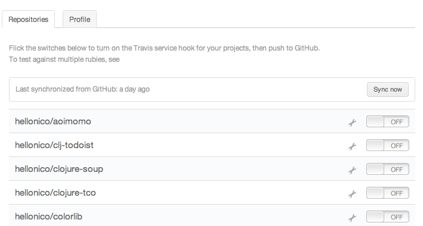
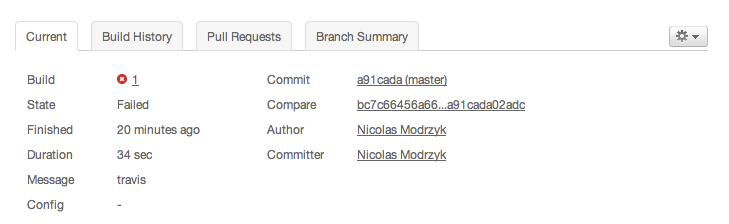

### I will test some of that

###### ポタージュ（Les potage）:スープ

Now on our way to do proper engineering and test everything 

#### Remember the basics

A long time ago we spoke about how to use lein and the REPL to speed up a lot of your programming workflow.
Now I am a fervent supporter of TDD, Test Driven Development, meaning writing what needs to be tested first.

For example, say we want to test a function say-hello. Let's write what is needed to test it:

@@@ ruby chapter03/src/test.clj @@@

You will notice, we can run the tests by calling them directly:

	(a-test)

Or, running all the them with:

	(run-tests)

At this stage, the result shows like this:

	user=> (run-tests)

	Testing user

	Ran 1 tests containing 1 assertions.
	0 failures, 0 errors.
	{:type :summary, :pass 1, :test 1, :error 0, :fail 0}

So we need to fix the test.

	(defn say-hello[name]
	   (str "hello " name))

That is all there is. The whole idea of having test taking time to write is busted.

Now the rest of the clojure.test details are [online](http://richhickey.github.com/clojure/clojure.test-api.html), but there is not much more you need to know to be efficient.

Also, you will notice there is not much more to run the tests if they are found in a test folder. So suppose we have the following:

@@@ ruby chapter03/test/chapter03/core_test.clj @@@

Then running
	
	lein test

Will run the test for you. At this stage, this will return something like this

	lein test chapter03.core-test

	Testing chapter03.core-test

	FAIL in (a-test) (core_test.clj:6)
	FIXME, I fail.
	expected: (= 0 1)
	  actual: (not (= 0 1))

	Ran 1 tests containing 1 assertions.
	1 failures, 0 errors.
	Tests failed.

####  You are not a lazy midjet, so you use midje to test 

[Midje](https://github.com/marick/Midje) is a fantastic move in the world of Test Driven Development. Midge not only makes testing your code fun, it gives you the right mindset to do experiment and testing in your own project. 

To install Midge, there are two steps. 

One for Leinging, you will need to add the dependency to your ~/.lein/profile.clj file with:

	[lein-midje "3.0-RC1"]

And then add a new development dependency to project.clj with

	:profiles {:dev {:dependencies 
		[[midje "1.5-RC1"]]
	}}

Now, we are going to write a few simple tests with the midje syntax like these:

@@@ ruby chapter03/test/chapter03/midje.clj @@@

And here the magic happens, let's start a lein process that is going to test this for us:

	 lein midje --lazytest

The first run will output test that were executed as well as failures:

	[Niko@air][13:46][~/projects/mascarpone/chapter03/] % lein midje --lazytest
	#<ScheduledThreadPoolExecutor java.util.concurrent.ScheduledThreadPoolExecutor@4ede45aa[Running, pool size = 1, active threads = 1, queued tasks = 0, completed tasks = 0]>

	======================================================================
	At  #inst "2013-02-28T04:47:09.477-00:00"
	Reloading chapter03.core-test, chapter03.midje, logic1

	FAIL at (midje.clj:25)
	Actual result did not agree with the checking function.
	        Actual result: [4]
	    Checking function: (contains 5)
	    The checker said this about the reason:
	        Best match found: []

After each change in our source files, the tests will be run again without the need to type any command to rerun the tests.    

As of recently, there is a sweet new way to use midje through the REPL. You just need to import the package:

	(use 'midje.repl)

Midje will import the namespaces you need to get you started for testing, so you can execute everything from your usual REPL session. 

We are leaving this out as an exercice that you will finish while we are testing some tasty wine.

####  Web sites easy testing with selenium

[clj-webdriver](https://github.com/semperos/clj-webdriver/wiki) is a "library leverages the Selenium-WebDriver Java library to drive real GUI browsers like Firefox, Chrome, Safari and Internet Explorer, providing both a thin wrapper over the WebDriver API as well as higher-level Clojure functions to make interacting with the browser easier."

	[clj-webdriver "0.6.0-beta2"]

When in need for some integrated testing using clojure, especially on website that do not have a public API.  Here is an example showing I forgot my github password. :)

@@@ ruby chapter03/src/taxi.clj @@@

There is a very nice [blog post](http://corfield.org/blog/post.cfm/automated-browser-based-testing-with-clojure) entry that shows how to use the API in more details. 

One more usage that I frequently use it for is to take screenshots of websites! This is detailed in a second example:

@@@ ruby chapter03/src/taxi2.clj @@@

Now you can go and use timers, or take screenshots depending on incoming emails or rest requests. Up to your imagination.

#### Behavior Driven Development (BDD) with cucumber in Clojure
[BDD with Cucumber and Lein](https://github.com/nilswloka/lein-cucumber) & [Cucumber](http://www.matthewtodd.info/?p=112)

I hope you have heard of [Cucumber](http://cukes.info) before. 
It simply makes your testing life easier to read, with some great behavioral testing convention.

I had an awesome time a few months ago putting together a test suite to validate an dodgy API for a customer using something similar to what we are going to see here.

So first we start by adding the lein plugin for cucumber in profiles.clj:

	[lein-cucumber "1.0.2"]

We can specifiy where to find cucumber features with the following key in our project.clj:

	:cucumber-feature-paths ["test/features/"]

Then on to a bit of code that we want to test. This will be in:

@@@ ruby chapter03/src/clojure_cukes/core.clj @@@

Now on we go forward and straight and start peeling vegetables.
In Cucumber we start by writing text that looks like it could be read by normal people, almost.

@@@ ruby chapter03/test/features/cukes.feature @@@

Then we write some support code so the actual "means" something to our vegetables. This file will be in a folder named _step_definitions_ in our test folder.

@@@ ruby chapter03/test/features/step_definitions/cuke_steps.clj @@@

Cucumber steps are defined by regular expression and string matching so once you have your regexp written properly, you can write more feature and test extreme cases.

With all this setup, we can run our tests with:

	lein cucumber 

And then see together that the results are ...

	Running cucumber...
	Looking for features in:  [/Users/Niko/projects/mascarpone/chapter03/test/features]
	Looking for glue in:  [/Users/Niko/projects/mascarpone/chapter03/test/features/step_definitions]
	.......F

	java.lang.AssertionError: Assert failed: (= (name (mood)) mood-name)

Almost there ! Now for you to take over, and get the test suite to pass properly. Only one word to change so sure you can do it ... now. 

#### Benchmark your clojure code, with criterium

[Criterium](https://github.com/neatonk/criterium) measures the computation time of an expression. It is designed to address some of the pitfalls of benchmarking, and benchmarking on the JVM in particular.

There is not much to talk about on Criterium, it does the job of running your critical code like crazy for a period of time, and show you the average mean time, the lowest time, and the longest time it took to run the code.
It gives a very detailed report after the run. It is very useful to have this for code that is going to be core to your application, so to make sure it is not going over some imposed time constraints.

Adding it to your project is as usual:

	[criterium "0.3.1"]

And some samples on how to test the (rand) function with different parameters:

@@@ ruby chapter03/src/criterium.clj @@@

Now you have no excuse to make your code slow. 

#### Load testing and performance with perforate

[Perforate](https://github.com/davidsantiago/perforate) buils on the library we have just seen, criterium, and allow you to run your benchmarks through lein, with profiles.

We install it by adding it as a plugin to our lein profiles.clj file:

	[perforate "0.3.0"]

And then for example, with a benchmark like this:

@@@ ruby chapter03/benchmarks/simple.clj @@@

We can run perforate through line with the not so much surprising command:
	
	lein perforate 

And get some impressive results:

	======================
	Goal:  A simple benchmark.
	-----
	Case:  :slightly-less-simple
	Evaluation count : 13225789740 in 60 samples of 220429829 calls.
	             Execution time mean : 4.490337 ns
	    Execution time std-deviation : 0.032741 ns
	   Execution time lower quantile : 4.474494 ns ( 2.5%)
	   Execution time upper quantile : 4.580807 ns (97.5%)

	Found 12 outliers in 60 samples (20.0000 %)
		low-severe	 2 (3.3333 %)
		low-mild	 10 (16.6667 %)
	 Variance from outliers : 1.6389 % Variance is slightly inflated by outliers

	Case:  :really-simple
	Evaluation count : 9048943620 in 60 samples of 150815727 calls.
	             Execution time mean : 6.971874 ns
	    Execution time std-deviation : 0.781822 ns
	   Execution time lower quantile : 6.622552 ns ( 2.5%)
	   Execution time upper quantile : 7.857313 ns (97.5%)

	Found 6 outliers in 60 samples (10.0000 %)
		low-severe	 2 (3.3333 %)
		low-mild	 4 (6.6667 %)
	 Variance from outliers : 73.8351 % Variance is severely inflated by outliers

By default, perforate runs all your benchmarks found in the benchmarks folder, but there are tons of customizations and profiles properties available to run only the ones you want.

Now time to perform a benchmark on the following method:

	(defn drink-glass-wine[]
		(slurp "wine"))

And hopefully it will not fail fast.

#### BDD and Rspec the clojure way

[speclj](https://github.com/slagyr/speclj) is a Behavior Driven Development Framework.
We have seen how to drive our development test first, now we would like to *describe* how the code should behave, hence Behavior Driven. 

The base for running this example needs an update to project.clj:

	[speclj "2.5.0"]

And some quick mathematics check:

@@@ ruby chapter03/src/speclj.clj @@@

Hopefully you have passed ? 

After a run, speclj outputs some useful info:

	..

	Finished in 0.00013 seconds
	2 examples, 0 failures

In case of failure, say we modify the first test to fail, we would get a message that tells us exactly where our test has failed:

	F.

	Failures:

	  1) Mathematics 1 plus 1 equals 2
	     Expected truthy but was: <false>
	     user.clj:7

	Finished in 0.00034 seconds
	2 examples, 1 failures

You can also get some *Behavior* bonus points, if you add a Leiningen plugin to your profiles.clj file:

	[speclj "2.5.0"]

Then, specs that will be in the *spec* folder in your project could be run simply with:

	lein spec

The output would be the same. Or even better, watching for file resources to be changed and then run the suite again, you can just add a switch:

	lein spec -a

Now we can at last behave properly. My parents have been waiting for this good news since the day I was born.

#### Travis: Open Source hosted continuous integration service for Clojure

[Travis](http://about.travis-ci.org/docs/user/languages/clojure/) is your favorite hosted integration service. If it is not yet, read this, and see by yourself why.

You first start to follow some easy to follow sign up instructions on the Travis page:

	https://travis-ci.org

It will ask you to sign up with your usual github account.	Happy be the power of Single Sign-On these days. 

Once you are logged in, you can see a list of your projects:

To prepare one of your clojure project to be worked out and hammered by Travis, you need a configuration file named .travis.yml at the root folder of your project. Content would be around those lines:

	language: clojure
	lein: lein2

That's it. We ready to take the cork out of the bottle.

Switch the button in the web interface:

And then see it ... in action:

Note that travis is far from limited to [just Clojure](http://about.travis-ci.org/pt-BR/docs/user/languages/clojure/). 

C, Haskell, Java, Ruby etc... [have a look](http://about.travis-ci.org/docs/user/getting-started/) and try it by yourself !

See, now this is your favorite hosted integration service.

#### Final Test

So this is it for this section, we have seen how to run the simple tests in Clojure, then moved on to the core of automated testing with TDD and BDD frameworks. 
Lastly, we have seen how to package all this into some sweet online testing for validation of hard work.

Now, up to you to get this running now on your machine and put out together some cool Open Source projects. In Clojure of course.
