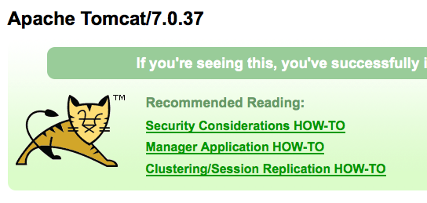
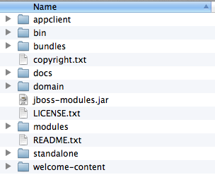
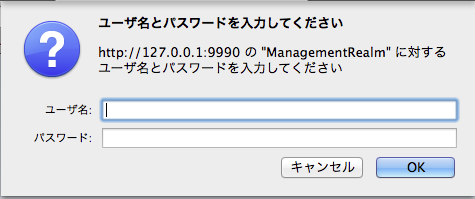
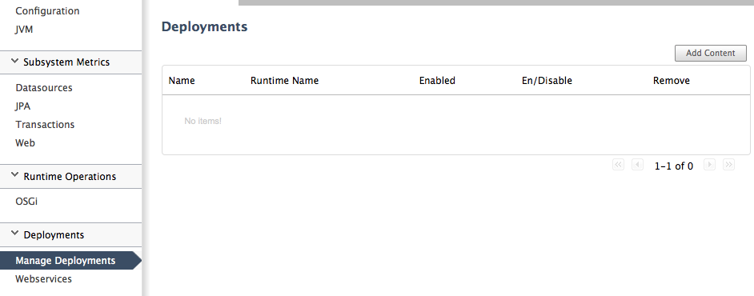
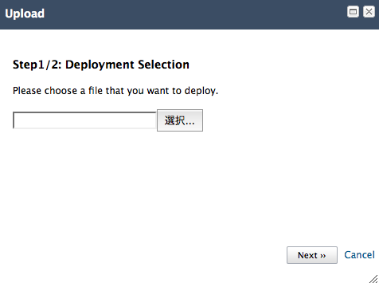
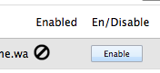
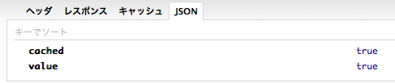
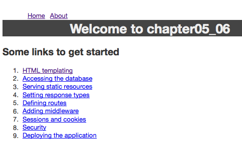
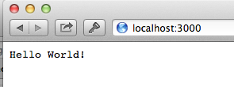

## Rapid And Fun Web Development in Clojure

###### プラ（Plat） ポワソン:メインのお魚料理

### Lord of the Ring: your best ally for Clojure web development

[Ring](https://github.com/ring-clojure/ring) is a library, or more precisely a set of libraries inspired like Ruby's Rack.

Ring is a low level framework, meaning you import and use only what you want, but it also means you have to graps a somewhat good understanding of the different concepts.

#### Concepts
The core components of a Ring application are:

##### Handler

A ring handler is a Clojure function that receive a request map in input and should return a response map. For a simple example:

    (defn what-is-my-ip [request]
      {:status 200
       :headers {"Content-Type" "text/plain"}
       :body (:remote-addr request)})

##### Request

A ring request, is simply a map. The different keys of that map would be:

* :server-port The port on which the request is being handled.
* :server-name The resolved server name, or the server IP address.
* :remote-addr The IP address of the client or the last proxy that sent the request.
* :uri The request URI (the full path after the domain name).
* :query-string The query string, if present.
* :scheme The transport protocol, either :http or :https.
* :request-method The HTTP request method, which is one of :get, :head, :options, :put, :post, or :delete.
* :content-type The MIME type of the request body, if known.
* :content-length The number of bytes in the request body, if known.
* :character-encoding The name of the character encoding used in the request body, if known.
* :headers A Clojure map of lowercase header name strings to corresponding header value strings.
* :body An InputStream for the request body, if present.

##### Response

A Ring response is a map with three parameters:

* :status The HTTP status code, such as 200, 302, 404 etc.
* :headers A Clojure map of HTTP header names to header values. 
* :body The content of the response body. It can be of type:
** String
** ISeq
** File
** InputStream

##### Middleware

A middleware is a high level function that takes a handler (at least) as parameter and returns a function that acts as a handler.
For example, Parameters, sessions, and file uploading are handled by middlewares in Ring.

#### Ring the world

For a HelloWorld state of the art example, we will add ring to our project with:

    [ring "1.1.8"]

And we are ready for a quick session at the REPL. As we have seen before, we will need a Ring handler to handle the request. 

@@@ ruby chapter04/src/chapter04/core.clj @@@

Now we need something to do all the HTTP layer. In this example we are using Jetty, which is the most reliable thin web server on the JVM. It is already included in the parent package *ring* so we do not need more dependencies. 

Here is how we start the server:

@@@ ruby chapter04/src/chapter04/jetty.clj @@@

Now we can head to [http://localhost:3000](http://localhost:3000) and Ring the world !

#### Ring the world 2: Using leiningen

Now bootstrapping your web application form the REPL can be slightly overcooked, and we do not want that for a great meal. We want something tastier.

In our project.clj file, we are going to add two savoury lines:

      :plugins [[lein-ring "0.8.3"]]
      :ring {:handler chapter04.core/handler}

What this does is obviously getting a sweet leiningen plugin named [lein-ring](https://github.com/weavejester/lein-ring), then specify which handler to use when calling it.

Now starting the server is a matter of calling the waiter with:

    lein ring server

And here is the result ! And look it took you so much time for this book to get into your hands !

Note also that there is nothing you need to do to refresh the webapp with new code, editing the code of the handler to immidiately see changes ! 

Agile wine we call it. 

#### Easy HTTP routes with Compojure

##### Routing to Celebrity

So now we have the basics of our app, but we may want to do something slightly more sexy and not render the same page each time.

To achieve this we are going to use [Compojure](https://github.com/weavejester/compojure) and go through a very [sample app](https://github.com/weavejester/compojure-example).

Compojure is already included in Ring , as we can see in the dependency list, but to get proper fine control over your application, here is how to rock your project.clj:

    [compojure "1.1.5"]
    [hiccup "1.0.2"]

We will also include hiccup as we have seen in Chapter 01. The rest of the project definition should have no mystery for you now:

@@@ ruby chapter04_01/project.clj @@@

Our Application will have two files, one that defines the routing and another one that defines our views.

Let's go through the routing part:

@@@ ruby chapter04_01/src/compojure/example/routes.clj @@@

The routing uses a line-based DSL, with each line splitted in 4 sections:

    (GET "/" [] (index-page))

GET : First comes the HTTP method that applies to that route, here we use GET. All the other ones are available, and a special ANY matches everything

"/" : The matching route itself. In the second example, we have "/user/:id", so we can retrieve parameters later from the URL.

[] : Here is an array that allows to retrieve information from the request map.

(index-page) : From chapter 01 we have seen that hiccup generated calls are simple Clojure functions. For the record, here is the content of that function:

@@@ ruby chatper04_01/src/compojure/example/views.clj @@@

Now we are ready, we can fire our ring development environment with the method we have seen before and start hacking:

    lein ring server

Now, you realize you have all you need to also develop a simple but robust JSON based web service. We leave this out as an exercice, but try to include the library we have seen before, *cheshire* and return a JSON map with the correct content-type in the response.

##### Notes on Clojure destructuring feature

Now is the perfect to recall that Clojure comes with something named *destructuring*, which in other words means accessing only the data you want from a data sequence.

You remember our second parameters, [], in the routing DSL. Let's get back to it.

    (GET "/" [] (index-page))

Let's say I want to retrieve the IP address of the visitor. We can use the second parameter as a desctructuring form, which means creating a subset of the map of the request itself. (You do remember the request is a simple map from earlier in the Chapter do you ?) Slightly updating the above sample, we will get:

    (GET "/yourip" {ip :remote-addr} (str "Your IP is:" ip))

What have we done here ? We have retrieved the :remote-addr parameter of the original request map. But .. wait. What was the original request map again ? Here we go:

@@@ ruby chapter04_01/resources/public/request-sample.json @@@

If you have started your ring server, you can also see it with by accessing:

    http://localhost:3000/request-sample.json

Next, onto some security stuff.

#### Friends of the world. Authenticate my Facebook friends

[Friend](https://github.com/cemerick/friend) is Rack's warden, or Java's Spring Security ported to simple-ness and Clojure so we can make more friends, relate to more people and bring peace to an even better world.

In quite a few web applications these days, or any application for that matters, we tend to reuse logins from other service, Google, Twitter etc ...
The goal of this recipie is to show how we can retrieve data after Log in into Facebook.

[friend oauth](https://github.com/ddellacosta/friend-oauth2) does exactly what we need, which is re-create the oauth authentication workflow for us through simple configuration. 

After importing a few libraries, the core of our example will be here:

@@@ ruby chapter04_02/src/friend_oauth2_examples/facebook_handler.clj @@@

The application configuration itself is in a simple map:

    (def client-config
      {:client-id "233100973389749"
       :client-secret "0772afb21ddf0d0fab8200c1ff707319"
       :callback {:domain "http://localhost:3000" :path "/facebook.callback"}})

This configuration should match your application settings from the [Facebook developer page](https://developers.facebook.com/)

Now onto our local application, after starting the ring handler with

    lein ring server

We will be welcomed with a very basic page. If we navigate to 

    http://localhost:3000/authlink

The oauth workflow will start up, and we will be redirected to the Facebook login page:

If the login is successful, Facebook redirects us to our local ring server, to the exact location we pointed. That's it.

The example also have github, and .Net version included so you should keep this for homework. 

#### JSON of the world

We all know we cannot really build a proper service these days without a kind of JSON API. No need to worry, our waiter is not going to keep you waiting.
There was a time where calling a remote service was a pain, but today we are going to see how [ring-json](https://github.com/ring-clojure/ring-json) will make you finish work before you even started.

To add it to your project, we go with:

    [ring/ring-json "0.2.0"]

This little piece of code shows us how to turn Clojure data structures into proper JSON without doing anything:

@@@ ruby chapter04_03/src/chapter04_03/core.clj @@@

We start by importing a new Ring middleware into the namespace, and wrap the Ring handler with a method called *wrap-json-response*. That's it.

Accessing the server at [http://localhost:3000](http://localhost:3000) will return properly formatted json code.

In our second example, we will post json data to our service, and directly retrieve Clojure data structures.

The code on the server side do not even get complicated:

@@@ ruby chapter04_03/src/chapter04_03/core2.clj @@@

And using Curl on the command line, we can send our new service a request with:

    curl -v \
        -H "Accept: application/json" \
        -H "Content-type: application/json" \
        -X POST \
        -d '{"user":"Clojure"}'  \
        http://localhost:3000

The following JSON: 

    {"user":"Clojure"}

Will be converted automatically with the middleware wrap-json-body to the structure:

    {"user" "Clojure"}

Merci Monsieur !

#### Ring the world 3: Standalone server

By using the lein-ring command we have seen above, we can generate a standalone customer web server !
Look at this:

    lein ring uberjar

It will install a bunch of dependencies for you:

    Created /Users/Niko/projects/mascarpone/chapter04/target/chapter04-0.1.0-SNAPSHOT.jar
    Including chapter04-0.1.0-SNAPSHOT.jar
    Including java.classpath-0.2.0.jar
    Including ring-refresh-0.1.2.jar
    Including clj-stacktrace-0.2.5.jar
    Including servlet-api-2.5.jar
    Including ns-tracker-0.2.1.jar
    Including javax.servlet-2.5.0.v201103041518.jar
    Including ring-servlet-1.1.8.jar
    Including ring-server-0.2.8.jar
    Including clojure-1.5.0-RC3.jar
    Including clout-1.0.1.jar
    Including core.incubator-0.1.0.jar
    Including ring-1.1.8.jar
    Including tools.macro-0.1.0.jar
    Including commons-io-2.1.jar
    Including ring-devel-1.1.8.jar
    Including clj-time-0.3.7.jar
    Including hiccup-1.0.0.jar
    Including watchtower-0.1.1.jar
    Including ring-core-1.1.8.jar
    Including jetty-http-7.6.1.v20120215.jar
    Including jetty-util-7.6.1.v20120215.jar
    Including ring-jetty-adapter-1.1.8.jar
    Including commons-codec-1.6.jar
    Including joda-time-2.0.jar
    Including compojure-1.1.5.jar
    Including jetty-server-7.6.1.v20120215.jar
    Including jetty-io-7.6.1.v20120215.jar
    Including tools.namespace-0.1.3.jar
    Including commons-fileupload-1.2.1.jar
    Including jetty-continuation-7.6.1.v20120215.jar
    Created /Users/Niko/projects/mascarpone/chapter04/target/chapter04-0.1.0-SNAPSHOT-standalone.jar

Remember the *uberjar* command we saw a few chapters ago ? This is the ring version of it. Now anyone can run your server on his own machine, also very sweet for fast deployment.
We start it the usual way with:

    java -jar target/chapter04-0.1.0-SNAPSHOT-standalone.jar 

And you can find the ring handler in action again.

#### Ring the world 4: Deploy to traditional web servers

Yet another command to package your code into something that is known in the java world as a *web archive*, in other words a war file.

You call the waiter yet again with:

    lein ring uberwar
    
And he will tell you:

    Created /Users/Niko/projects/mascarpone/chapter04/target/chapter04-0.1.0-SNAPSHOT-standalone.war

Which means you are now ready to copy that file into the deployment directory and beneciate of clustering, and a few other rubies well implemented in traditionnal java web servers.

##### Apache Tomcat 7

The previous recipe was a bit long to explain because JBoss has a vast support for custom deployment solutions and a nice bunch of features for production quality services.

Now this is going to be way shorter. Apache Tomcat has been enjoying continuous support and engineering for JVM based server deployment.
A long long time ago, when the grapes were young, we introduced Tomcat 3 for a production quality application and the memory usage for superb enough that it actually improved the number of connections we could handle compared to other paid servers at the time. I cherished that time so much. We save money and we did better.

You can [download Tomcat](http://tomcat.apache.org/download-70.cgi) and once you have unzipped the archive, we can start it with:

    ./bin/startup.sh

We can copy the same war file we generated before to the webapp folder of the Tomcat install, and we can see the result just as before:

    http://localhost:8080/chapter04-0.1.0-SNAPSHOT-standalone/

We are still right on time !

We are going to reuse Tomcat later, so let's stay focused. 

##### JBoss AS 7

A few years ago I could not go anywhere without seeing a JBoss server at the forefront of the architecture. There are a lot of friends working on cool projects there, (Salut Thomas!) so I thought I would do a quick favor by showing how to setup a war file into JBoss in a few steps.

You can download the server from the [projects page](http://www.jboss.org/projects) and the [direct download page](http://www.jboss.org/jbossas/downloads/).

Once downloaded, we can see the following set of files:

This is not a JBook bokk. Sorry a JBoss book, so for detailed explanation on A..Z please refer to their documentation. 

We will need a user for the JBoss admin console, and the script to perform this is in the bin folder, and is named *add_user.sh*.

After a bit of old fashioned script interaction:

    [Niko@Modrzyks-MacBook-Pro][17:58][~/Downloads/jboss-as-7.1.1.Final/] % ./bin/add-user.sh  

    What type of user do you wish to add? 
     a) Management User (mgmt-users.properties) 
     b) Application User (application-users.properties)
    (a): 

    Enter the details of the new user to add.
    Realm (ManagementRealm) : 
    Username : clojure
    Password : 
    Re-enter Password : 
    About to add user 'clojure' for realm 'ManagementRealm'
    Is this correct yes/no? yes
    Added user 'clojure' to file '/Users/Niko/Downloads/jboss-as-7.1.1.Final/standalone/configuration/mgmt-users.properties'
    Added user 'clojure' to file '/Users/Niko/Downloads/jboss-as-7.1.1.Final/domain/configuration/mgmt-users.properties'

We are almost ready to hit the admin console through the browser. But, first let's start the server:

    ./bin/standalone.sh

And now we can head to:

    http://127.0.0.1:9990/console/App.html#server-overview

It will greets you with a desperate need for authentication...

That comes just in time, because we have just registered a user a few seconds ago didn't we ? 
Let's use the same user and login.

And following the few shots below we can upload our war file to jboss.

And lastly enable the application context:

Our application is located in a default context taken from the name of the war file, so we would go to:

    http://localhost:8080/chapter04-0.1.0-SNAPSHOT-standalone/

To see our wonderful time application ! The time has changed. And wine has probably come.

What that means in simple terms is that a full on Java shop can now be a full Clojure shop without anyone complaining much about new powerful and simple language being pushed to production. There is simply no bad aspect of this deployment, ring and roll.

### The boss of Java Web Servers, JBoss, built for Clojure. Welcome to Immutant.

#### Here comes the beast

In this section, we are going to introduce a specific version of JBoss that responds to all what we have seen so far. In the previous section we have seen how to use a generic version of JBoss and deploy to it using standard ways. 

[Immutant](http://immutant.org/tutorials/installation/index.html) has probably made in Clojure heaven, meaning it removes all the complexity you don't need, while bringing the features you do need.

Immutant has a lein plugin that we can install in profiles.clj with:
    
    {:user {:plugins [[lein-immutant "0.17.1"]]}}

Now we are going to present how to create and deploy a fresh ring webapp to a immutant slash JBoss server.

Leiningen takes care of downloading the server to our local machine with:

    lein immutant install

The server will be downloaded and extracted. Now, we can create a new project:

    lein immutant new chapter04_05

We will modify a few bits so as to have this new project with a ring handler.

Let's add ring and ring-json to our project metadata:

    [ring/ring-json "0.2.0"]

Then, a quick ring handler that return some json:

@@@ ruby chapter04_05/src/chapter04_05/core.clj @@@

Nothing unusual here, so we will promptly jump to the only new file added for immutant. This file is located in the immutant folder of the src folder.

@@@ ruby chapter04_05/src/immutant/init.clj @@@

Voila. We are asking Monsieur to put our ring handler at the context page "/". That file is also where we can put the different setup for messaging, caching and scheduling. One place to rule them all !

We can deploy it with:
    
    lein immutant deploy

The command itself is quite quiet...
    
    Deployed chapter04_05 to /Users/Niko/.lein/immutant/current/jboss/standalone/deployments/chapter04_05.clj

But our application has been properly installed in 

Now, in a different shell, we will start Immutant with a quite simple Leiningen command:

    lein immutant run

And finally, our long awaited JSON will be showing up at:

    http://localhost:8080/chapter04_05

Another foo and another bar.

    {
    "foo": "bar"
    }

Now, in a bit of details, we are not copying our project to immutant, we are copying a reference to it. If you are curious enough to see the deployed file, it will be:

    {:root "/Users/Niko/projects/mascarpone/chapter04_05"}

What that means is, we can update our code. I let you work what kind of JSON will be return with the following handler:

    (defn handler [request]
       (response {:foo "bar me"}))

#### Money for nothing, Caching for free

So for all these immutants in our way, we actually do get free stuff. Among them, we get free [caching](http://immutant.org/tutorials/caching/index.html). Yey. No need to ask for the same thing twice. 

We would define a new handler with some simple caching code:

@@@ ruby chapter04_05/src/chapter04_05/caching.clj @@@

And that's it, we can add a new context to our application:

    (web/start "/app" app)
    (web/start "/cached" cached) 

And get the cached value accordingly.

Nice. Hopefully the wine itself has not been cached so much.

### Bootstrap your web project in seconds with Luminus, a template for Leiningen

Template is one of those words that every body talks about, but no one really understand what any one is actually talking about. 

[Luminus](http://www.luminusweb.net/) has taken the fire from [noir](http://www.webnoir.org/) recently in the easyness needed to get you started with a Ring project in seconds.

If you look here and there in the interweb, you will still find many mention of the Noir framework which was exactly what the Clojure Web community needed to get started. 
The only problem was that it was not compatible with most of ring plugins, and thus things like authentication would fall apart and the easyness of your application was not there anymore.

Now with all we have seen in this chapter, we know a thing or two about ring, and Luminus is exactly what we are looking for. Package all our knowledge in single step to development.

We are going to use a leiningen template named [luminus](https://github.com/yogthos/luminus-template) to bootstrap a new web project for us.

Let's move on.

So, templates for new project in Leiningen are actually using an internal plugin named, [newnew](https://github.com/Raynes/lein-newnew). Newnew, is actually not so new anymore, and is now included in Leiningen so ... there is basically nothing new to install new. Nor Luminus.

So we will create a new project directly with the following command:

    lein new luminus chapter04_06

And that's it. If we cd into that folder, and use our favorite ring command:

    lein ring server

Our favorite browser will open a nice window...

and we are ready to code. 

Luminus integrates most of the common ring libraries for you, routing, markup, database, Twitter's bootstrap are already included. You just need to code. 

### Has websocket development become so simple ? 

In the server side javascript world, Node.js has had the "Vent en poupe" for a bit of time, but there is a Clojure library we have seen already that does a fantastic job with websockets.

I am using this on an every day basis nowadays for all my server side websocket work.

So first, welcome back our earlier contender, http-kit. We will welcome it back to our project.clj file:

    [http-kit "2.0.0-RC4"]

I have also added the :main directive to start the project with lein:

    :main chapter04-07.core

Then onto the shortest code ever:

@@@ ruby chapter04_07/src/chapter04_07/core.clj @@@

Now, try to use the websocket test website at:

    http://www.websocket.org/echo.html

With the following URL:

    ws://localhost:8080/chat

Sweet yeah ? "Rock it with HTML5 WebSocket !" ;)

This looks like a perfect extension for our usual Ring code ! It is actually slightly more complicated under the hood, but ... if you really need to know, spend some time on the guy website. He has a real passion for what he is doing !

Note: 

[Aleph](https://github.com/ztellman/aleph) is also a wicked way to do Websockets in Clojure. Aleph is actually more versatile and can handle a series of different protocols other than the usual, such as TCP, UDP etc. I especially like the [UDP](https://github.com/ztellman/aleph/blob/perf/src/aleph/udp.clj) feature, but this goes beyond the scope of this chapter focused on Web. 
Anyway, do take the time to have a browse the web. 

### Building RESTful applications has no more secret to you

I discovered [Liberator](https://github.com/clojure-liberator/liberator) only recently. I actually typed bluntly Clojure and Rest in a Google search, and something quite intriguing named Liberator came from Github.
The documentation is a little bit scarce, that is also a reason for this book after all, but the result is just so very impressively great.

As always, we will go through a very simple example, of creating a counter resource that we can increment with a POST method, and get the value with a GET method. 

We will be using the dependencies we have seen so far, plus this new one. So on to our project.clj file:

    [compojure "1.0.2"]
    [ring/ring-jetty-adapter "1.1.0"]
    [liberator "0.8.0"]

Also, let's not forget abou the usual suspects 

    :plugins [[lein-ring "0.8.3"]]
    :ring {:handler chapter04-08.core/app}

Liberator defines the concept of Restful *resources* that are made available and can be action-ed upon given a list of decisions.

The easiest way to define a resource is through using the *resource* keyword:

    (resource :handle-ok "Hello World!")

We need that resource do not only return a result, but respond to request, we will do that by exposing its availability:

    (resource :available-media-types ["text/plain"] :handle-ok "Hello World!")

Now we can turn this resource to a full routing this through a compojure route with:

    (ANY "/" [] (resource :available-media-types ["text/plain"] :handle-ok "Hello World!"))

Yes. Now that is very cool. How do we access it ? A simple get to the URL will do it.

Now on to something more substancial example. We will briefly show how to handle a counter, accepting only GET and POST methods.

@@@ ruby chapter04_08/src/chapter04_08/core.clj @@@

We have seen the :available media types before, so let's go through the other ones:

We can select which methods are allowed with:

    :method-allowed? (request-method-in :post :get)

Implement the method that responds to post. In this case, we just increment out counter

    :post! (fn [_] (swap! postbox-counter inc))

When a new resource has been created, we return a specific message:

    :handle-created (fn [_] (str "Your submission was accepted. The counter is now " @postbox-counter))

And finally, when we do a simple GET, we have a simple method that returns the value of the counter:

    :handle-ok (fn [_] (str "The counter is " @postbox-counter))

Now that is a very good start. 

We can send a POST call to our post with a curl command:

    curl -Xpost http://localhost:3000/post

And be returned a nice message:

    Your submission was accepted. The counter is now 1

There is a long [list of decisions](https://github.com/clojure-liberator/liberator#reference-list-of-decisions) available. Take the time to experiment and enjoy being Restful!

### Some more on Web Testing 

Well we cannot really say we are efficient if we are not throwing some well thought tests. That applies all the same to web testing.

The way handlers are defined in Ring makes it really easy to write test suite to validate all the hard work.
To close this chapter, let's see how to include tests to fit it all in !

#### Do not mock me !

In this recipie we will see how to mock ring requests and check the result of requests to our handler.

[Ring mock](https://github.com/weavejester/ring-mock) has been written and implemented by the inventor of the Ring framework. It creates request maps for the pure goal of testing.

To include it in our project:
    
    [ring-mock "0.1.3"]

Probably the only function we need to remember for now is the *request* function. That is the function mocking ring requests.

Let's see it in a quick example:

@@@ ruby chapter03/test/chapter03/mock.clj @@@

The Ring handler *your-handler* is the original ring handler, the remaining of the code create a test for a given request.

No heavy server, we can target and test straight at the code level.

#### HTML based Ring App Navigation and Testing

In this recipie we will see how to check the navigation and the content of a ring based html website.
[Kerodon](https://github.com/xeqi/kerodon) could be the easiest way to achieve this.

You start by creating a session directly onto the ring handler:

    (-> (session app)
        (visit "/"))

And then use a set of kerodon keywords to navigate through your application, follow links, filling forms and submit them.
Pretty standard.

We will need a few libraries to our project.clj for the test to runs:

    [kerodon "0.0.7"]
        ; routing
        [net.cgrand/moustache "1.2.0-alpha1"]
        ; html markup
        [hiccup "1.0.2"]

Here is a pretty standalone example:

@@@ ruby chapter03/src/kerodon.clj @@@

Note that even though the applicating is ring based, the routing is done not with compujure, but with another routing library named [moustache](https://github.com/cgrand/moustache).

The test example is pretty explicit, the only thing that needs to be pointed at is the *follow-redirect* directive, since we have to tell kerodon when a redirect will happen.

Apart from that, the DSL is so well made, the code reads by itself ! 

Kerodon itself is based on [peridot](https://github.com/xeqi/peridot) which also has a bunch of samples you should be looking at.

Now let's move to record ourselves.

#### VCR or your HTTP Playback 

I have been surprised by this little recipie myself. 

[vcr-clj](https://github.com/fredericksgary/vcr-clj) is a clojure library in the spirit of the VCR Ruby library. It lets you record HTTP interactions as you run your tests, and use the recordings later to play back the interaction so you can run your tests in a repeatable way without needing the external components to be available/accessible.

Get the code to your project with:

    [com.gfredericks/vcr-clj "0.2.2"]

For this test we will actually start a jetty server. To make that easy we will write some glueing code. (This should really be in the library itself ...)

Let's go through the example:

@@@ ruby chapter03/src/vcr.clj @@@

We see the most important part of the test is the *with-cassette*. Once we have recorded requests, we can reorder them transparently, so /foo then /bar becomes first /bar then /foo.

    (with-cassette :bar-bar
      (is (= "foo" (get "/foo")))
      (is (= "bar" (get "/bar"))))
    (is (= 2 (count (server-requests))))
    (with-cassette :bar-bar
      (is (= "bar" (get "/bar")))
      (is (= "foo" (get "/foo"))))

It is worth pointing to the fact that *get* is a regular http client.

### "This is the end of the world as we know it" - R.E.M

The Ruby and Python worlds has given us some joy when writing pages. The vibrant Clojure ecosystem is bringing sheer ecstasy. 

In this chapter we have seen how to fit it all together.

* Create the bones of a Ring application to server and handle requests
* Route requests to our application
* Authenticate requests 
* Server and handle json seemlessly
* Deploy to production servers
* Write websockets in seconds
* Implements REST APIs
* and Finally go through testing our application end to end.

Now, leave this book on the table, call the waiter, and start writing some websites and bring your own part to the programmable web.  