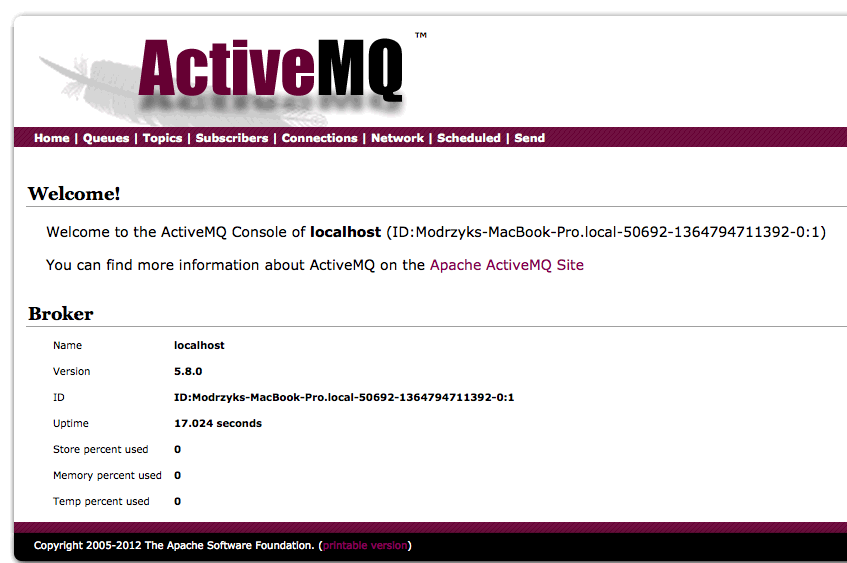
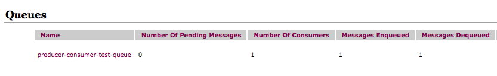
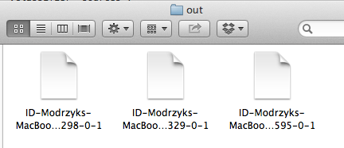

## Messaging

Because your application will probably not be standalone, but will be talking to a horde of different systems, we have created the Messaging chapter. I had the experience, though, to connect a clojure system to an impossible to configure banking system. The messages were so big I was only hoping the messaging queues will not blow up. What Clojure brought to me is the incredible flexibility to just say, "Yes, I can handle that message." or "Yes I can handle that timing and react in realtime" and have a pretty good certitude that if a problem was coming in the integration, it was not coming from the people at the dining table that we are. 

Here, we would like to show you a bit of this, and give you some insurance about easiness, readability and performances. 

This section will go in a bit details how to connect to different middleware like RabbitMQ, MemCache, Redis, JMS... and a few others, so you can get started quickly to core level of your work.

### Clamq, or your clojure toolkit for JMS, AMQP and RabbitMQ

Here comes the most generic [JMS, AMQP/RabbitMQ](https://github.com/sbtourist/clamq) middle ware in the Clojure land. Clamq basically connects you to the most famous queuing system of these days, with the same client code, so you won't even face problems if you need to switch from one to the other, or actually if you have the chance to change from one to the other.

For a short example, we will use [ActiveMQ](http://activemq.apache.org/download.html), not only for efficiency but because it is probably the fatest way to get started.
Let's start by downloading the package from:
	
	http://activemq.apache.org/download.html

Or your favorite package manager.
Once expanded, we can go to the *bin* folder where all the binaries are installed. We will then start the system with the simple command:

	./activemq start

Once the system is started, you can go to your browser, and access the admin [web console](http://activemq.apache.org/web-console.html):

	http://localhost:8161/admin/

Where the login is:

	admin / admin

If all goes well, you should see the following screen:

Now we are all ready for some quick examples. To start working with clamq, we will require two dependencies:

	[clamq/clamq-jms "0.4"]
	[clamq/clamq-activemq "0.4"]

One for the core of clamq, the other one for the extra activemq extension. We could as well work with a simple JMS provider, but I like ActiveMQ all the same.

Our code presents how to write a simple producer/consumer test using a remote messaging queue, that will be created in ActiveMQ:

@@@ ruby chapter05/src/clamq.clj @@@

If we look, at the admin web console, we can see the queue is empty before the code is run:

and contains the message we sent using our small snippet:

Our next example will be showing how to use a Topic. Remember a topic is the way to broadcast the same message to multiple subscribers. 

@@@ ruby chapter05/src/clamq_topic.clj @@@

And, we pretty much notice that the code was very similar that the one for queues with the extra addition of:

	{:pubSub true}

For more of the ActiveMQ fun, you can have a look at the [ActiveMQ test suite](https://github.com/sbtourist/clamq/blob/master/clamq-activemq/test/clamq/test/activemq_test.clj) and its related [jms suite](https://github.com/sbtourist/clamq/blob/master/clamq-jms/src/clamq/test/base_jms_test.clj).

Suiiiiite.

### I have my horse, ride your Camel, easy messaging bus with everyone

I took exampes from [Apache Camel from Clojure](https://github.com/denlab/apache-camel-clojure) and 
[Camel Routes with Clojure](https://github.com/hellonico/clj-camel) to create this really short introduction to using Apache Camel, which acts as a *versatile open-source integration framework* or how to pretty much connects any kind of protocol to any other one in a snap. Snaps.

#### Camel on files 

In the first example we are going to connect a file to .. a file. Not very useful you might say, but wait, we will get the basics and ride on a nice wave of communication.

For this tutorial, we will use a somewhat custom dependency of clj-camel (see above) that we have thrown in the pot of clojars. Let's grab it with:

	[clj-camel "1.0.1"]

Once our REPL is sorted out, let's go through the file to file connection:

@@@ ruby chapter05/src/camel_file.clj @@@

So we start by configuring routes the Camel way to point from an endpoint :from to and endpoint :to. 

Then we start the Camel context which is now able to listen to all the endpoints that were defined.

Programmatically we can check that when we send a message to the queue :from, we will get a new file created in the folder we have defined, here *in*.

The next obvious step is to check whether we can create a file in the folder *in* and see if it appears in folder *out*. On *nix machines we can use:

	echo "hello" in/test.txt

In Windows all the same we can create a simple text file, with some "hello" the world of wine content. And there we go:

Files are created as we put some content in the in folder.

We have commented out the line:

	   ; [:to "log:com.mycompany.order?level=INFO"]

But if you put it back, you will see a logging message in the REPL showing that the message was properly processed. 

#### Camel on queues 

Our next example will extend our first example with some queues to connect to ActiveMQ since we put some time to set it up earlier on. The ActiveMQ endpoint is not part of the core camel components so we added that to our set of dependencies already with clj-camel.

@@@ ruby chapter05/src/camel_queue.clj @@@

Only one added line to register the ActiveMQ component. But then adding a file to our :from folder will send directly a message to active mq with the content of the message.

But this is not all. Camel has an impressive set of [default components](http://camel.apache.org/components.html) that you can use just by accessing them through their URL scheme. All this at your Clojure hands. 

### Sometimes you need some Quartz, to schedule your Clojure

This short section will in no way go over the extensive documentation that is available the official [Quartzite](http://clojurequartz.info/articles/guides.html) documentation, because it so very good as almost any of the other [Clojurewerkz](http://clojurewerkz.org/) libraries.

No this section will get you started over how to schedule things with it, and then you should go and see how you can do more.

Quartz is the Grandfather of them scheduler on the Java platform, but while powerful, it was a little bit awkward to use it. With some Clojure DSL added to the mix, now at last it's easy to integrate it in a robust manner into your Clojure application.

To add it to our project:

	[clojurewerkz/quartzite "1.0.1"]

Quartz is known to work with a set of three main objects:

* Job: the task to be executed
* Trigger: When to execute the task
* Scheduler: Responsible to execute task at times defined by a trigger

Now that we have the concepts defined we can have an example and give it a go:

@@@ ruby chapter05/src/quartzite.clj @@@

Voila. 
We have a production proven scheduling engine taking care of our tasks.
There is more to come with grouping jobs, persisted stores, etc... and everything is clearly written in the documentation so time to give it a try.

### When in need of portable cron jobs

Sometimes you do not really need an incredibly difficult system to schedule jobs, but just in need of hacking some code at regular intervals.
For this kind of hard moments, we have [cronj](https://github.com/zcaudate/cronj).

We add it to the project with:

	[cronj "0.6.1"]

And now we can use the familiar cron notation to schedule some so exciting printing jobs. Have a look.

@@@ ruby chapter05/src/cronj.clj @@@

Not that difficult to get our order to the waiter properly is it ? So, wine or Champagne ? 

### Redis in your clojure

#### Getting Ready for Redis

You have probably heard of [Redis](http://redis.io/topics/introduction) in the world of key value stores. Redis can contain way more than just a handful of key values, it also supports strings, hashes, lists sets and sorted sets.
It also supports master slave replication that is meant to be trivial to setup.

To install redis on OSX, use homebrew with:

	brew install redis

To install redis on other plateforms, download and run from:

	http://redis.io/download

And to start with the default configuration, just run:

	redis-server

#### Some command line pong

You will notice there is a *redis-cli* command available to you, that we can start as is.

	redis-cli

And some very basic things you can do straight from the command line to test that everything is more or less ok:

	redis 127.0.0.1:6379> ping
	PONG
	redis 127.0.0.1:6379> set mykey somevalue
	OK
	redis 127.0.0.1:6379> get mykey
	"somevalue"
	redis 127.0.0.1:6379> 

Voila. All the commands can be tested from here, and the help menu is for once, very useful. Just try

	help <tab>

To display the different help sections.

#### Some Redis to use Clojure

Now that our Redis server is ready, we can start by preparing our project for Redis with [labs-redis](
[Redis](https://github.com/wallrat/labs-redis-clojure)). To insert it in our project, we do:

	[labs-redis "0.1.0"]

We have prepared a simple example to store and retrieve values. Please have a red wine look at it:

@@@ ruby chapter05/src/redis.clj @@@

You will not that the simple methods without *@* sign will return futures, meaning evaluation will not be done straight away. Also, the values are returned as byte arrays, because this is the way Redis handles data, and that is one of the reason why it makes it so fast too.

We have prepared also a simple pub-sub example, because this is one very good way of using Redis for real time analysis and execution. 
You will need to start the following in one REPL session first:

@@@ ruby chapter05/src/redis_sub.clj @@@

It will start a client waiting for specific kind of messages, in this case "msgs", "msg2" ...

In another REPL, you would start the companion Clojure code with:

@@@ ruby chapter05/src/redis_pub.clj @@@

If all goes well, the REPL of the subscriber should start writing a few things like this:

	user=> (load-file "src/redis_sub.clj")
	R  msgs hello 0
	R  msgs hello 1
	R  msgs hello 2
	R  msgs hello 3
	R  msgs hello 4

Saying that the messages were received properly.

#### Alternative Client

We would not have been very complete without talking about the [Carmine](https://github.com/ptaoussanis/carmine) redis client.

For basic usage, it is slightly more convoluted than the other client we have been using, but it's actually slightly more robust.

This is how you add it to your project:

	[com.taoensso/carmine "1.6.0"]

And look at the basic pong example at:

@@@ ruby chapter05/src/carmine.clj @@@

The rest is up to read the excellent [carmine documentation](https://github.com/ptaoussanis/carmine) available online.

We particularly like the [Message Queue](https://github.com/ptaoussanis/carmine#message-queue) section. It simple and concise !

#### What does Redis solve ? 

Redis has a number of common key IT usages, such as:

* Caching, is the most obvious choice, when you want to store something that should be computed somewhere and be made available to a range of different machines.
* Queues, when you just want to receive values and handle them later on.
* Pub/Sub, when you want to have multiple clients aware of some data change
* Unique N Items, Redis has a direct command to uniquely add to sets, so it is easy to know the number of concurrent users at a given time.
* Counting, more generally, keeping stats of different kinds is an easy and recurrent pattern usage for Redis.

etc..

And way more. 
In the past, we have used Redis to enqueue messages coming from many concurrent clients as fast as possible and allow the processing to be done later on by another system, which proved to work quite well.

### Distribute your application state with zookeeper and avout

Clojure came along with a [powerful Multiversion Concurrency Control](http://en.wikipedia.org/wiki/Multiversion_concurrency_control) (MVCC) [STM](http://en.wikipedia.org/wiki/Software_transactional_memory) to manage transactions.

For this example we are going to present shared references stored in Zookeeper.

	ZooKeeper is a centralized service for maintaining configuration information, naming, providing distributed synchronization, and providing group services.

#### Installing and Running Zookeeper

There are a few ways to get running, we will only show the one that get you up to speed the quickest.

Download the package from the [official page](http://zookeeper.apache.org/)
As of writing 3.4.5 was the latest version for it.

Once expanded, you need to rename the file in the *conf* directory named *zoo_sample.cfg* to *zoo.cfg*.
We will only use the default settings here.

After that, from the top folder, we can run:

	./bin/zkServer.sh start-foreground

or the equivalent Windows command, 
	
	bin¥zkServer.cmd start-foreground

And our zookeeper server should start without some exciting output.

	[Niko@Modrzyks-MacBook-Pro][17:53][~/Downloads/zookeeper-3.4.5/] % ./bin/zkServer.sh start-foreground
	JMX enabled by default
	Using config: /Users/Niko/Downloads/zookeeper-3.4.5/bin/../conf/zoo.cfg
	2013-04-02 17:53:15,411 [myid:] - INFO  [main:QuorumPeerConfig@101] - Reading configuration from: /Users/Niko/Downloads/zookeeper-3.4.5/bin/../conf/zoo.cfg
	...
	2013-04-02 17:53:15,462 [myid:] - INFO  [main:ZooKeeperServer@744] - maxSessionTimeout set to -1
	2013-04-02 17:53:15,473 [myid:] - INFO  [main:NIOServerCnxnFactory@94] - binding to port 0.0.0.0/0.0.0.0:2181

#### Now let's play in the Zoo

[Avout](https://github.com/AlexBaranosky/avout) has been build by some serious people at Relevance.
They have been writing all the [proper documentation](http://avout.io/index.html#background) and the metaphysics of things behind it. I seriously recommend you go through it. It explains both the reasons behind Clojure and the thoughts behind distributed Software Transactional Memory.

We slightly updated the dependencies for avout, so to add it to our project we will use a customize version of it:

	[hellonico/avout "0.5.4"]

The example we have created here is separated in two parts, one to set up the distributed reference. 

@@@ ruby chapter05/src/avout_1.clj @@@

The other will retrieve the value from the distributed system.

@@@ ruby chapter05/src/avout_2.clj @@@

That is such an interesting feature. That means there is almost nothing to setup to share references between different Clojure applications. 
It could for example be used to know the global state of a system, and each module takes different action depending on that global state. (In recovery, in production, in test mode etc...)

#### Using distributed locks

Avout comes with a reliable implementation of distributed locks. As in our previous example, we rely on persistence in Zookeeper in the background, but most of it is transparent from a client code point of view.

If we look (and run!) at the following example:

@@@ ruby chapter05/src/avout_lock.clj @@@

We notice that the *if-lock* calls gives you the alternative of doing different branch of code depending on whether the lock was obtained or not.

If we run the above in two different REPLs, we will notice two different outputs:

The first time, we will get the lock and wait for a bit...

	user=> (load-file "src/avout_lock.clj")
	Have the lock
	Release lock

The second time we can simply not get the lock.

	user=> (load-file "src/avout_lock.clj")
	Could not get the lock

This recipe is very useful when accessing shared data on systems that do not support locking, or we are not sure accessing the data in writable mode is safe.

Short recipe, but you can put it straight to action.

### Where would you be without a spyglass (and a proper memcache client)

There is probably no need to present memcached in much details since it has now been the de facto caching solution for many companies including Facebook.
The reason you would want to use it is to avoid having to recompute expensive values, or maybe a place where the data is taken from while the next value is computed in the background. 
Whatever the reason, it is very easy to integrate, so let's have look

#### Getting ready.

Installing and starting memcached on OSX, is about as difficult as typing those two commands:

Install:

	brew install memcached

Start:

	memcached

Windows users, should find the custom build that has been created:

	http://www.urielkatz.com/archive/detail/memcached-64-bit-windows/

And run it all the same.

#### Clojure it

[Spyglass](http://clojurememcached.info/articles/getting_started.html) will be our friend when connecting to memcached. We add it with:

	[clojurewerkz/spyglass "1.1.0-beta3"]

And we can start playing at the REPL.

##### Insert and retrieve a cached timed key

Our first example shows the core basics of inserting and retrieving values from memcached:

@@@ ruby chapter05/src/memcached_text.clj @@@

Most of the difficulty comes from including the spyglass client:

	clojurewerkz.spyglass.client

The rest reads very easily. The test waits for a few seconds to show the key expires properly after the time setup.

##### Distributed Binaries cached key 

The two next examples shows simply the distributed nature of memcached. We will complicate things a tiny bit by connecting to two memcached servers. Let's start a new memcached server on a different port (11212) with the following command:

	memcached -p 11212 

The next two examples will connect to both our first server and to the second new one. 
The connection url has been updated to connect to the two servers with:

	127.0.0.1:11211 127.0.0.1:11212

The following will connect, store and retrieve the binary key. As binary we use a simple Clojure array:

@@@ ruby chapter05/src/memcached_binary.clj @@@

The next even shorter piece of code, will connect and only retrieve the key:

@@@ ruby chapter05/src/memcached_binary_2.clj @@@

You will notice that if one server drops, you can still connect to the second one and retrieve the value.

##### Some notes on caching

There is some inherent problems when using caching about managing the cache. The timing is very important. You do not want the cache to expire at the exact time 10000 clients try to connect simultaneously.

Two interesting approaches have been proposed to make things for a better world so we will expose them here.

	Set the cache item expire time way out in the future.
	Embed the "real" timeout serialized with the value. For example, set the item to timeout in 24 hours, but the embedded timeout might be five minutes in the future.
	On a get from the cache determine if the stale timeout expired and on expiry immediately set a time in the future and re-store the data as is. This closes down the window of risk.
	Fetch data from the DB and update the cache with the latest value.
	
	Alexey describes a different two key approach:
	Create two keys in memcached: MAIN key with expiration time a bit higher than normal + a STALE key which expires earlier.
	On a get read STALE key too. If the stale has expired, re-calculate and set the stale key again.

That is most of it to get you started with memcached. Get it up and ready right now on your high traffic website !

### Every one talks about Hadoop, so let's talk to it with Clojure
[Hadoop](HBase: http://twitch.nervestaple.com/2012/01/12/clojure-hbase/)

### Hadoop queries from Clojure with Cascalog
[https://github.com/nathanmarz/cascalog/wiki](https://github.com/nathanmarz/cascalog/wiki)
Hadoop Query from Clojure

### Basic Apple Push Notifications
[Apple Push Notifications](https://github.com/HEROLABS/herolabs-apns)

### Calling SIP, calling clojure
[SIP](https://github.com/Ruiyun/cljain)

### Apache Cassandra, at your clojure tips
[Cassaforte](https://github.com/clojurewerkz/cassaforte)

### Simple Apache Thrift, powering Facebook, in Clojure
[Thrift from Clojure](http://thecomputersarewinning.com/post/simple-thrift-in-clojure/)

### Storm is a distributed realtime computation system, accessible from Clojure
[https://github.com/nathanmarz/storm/wiki/Clojure-DSL](https://github.com/nathanmarz/storm/wiki/Clojure-DSL)

