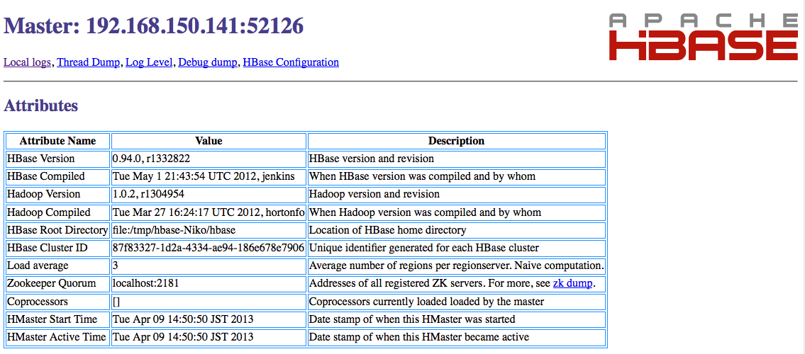

### Convenient HBase from Clojure

#### Getting Ready 

Before we delve right into some serious Hadoop-ness, let's have a quick look at how to access hbase from Clojure.

This quick hbase recipe will show us how to define schemas, store some values, and do some minor processing with the received data.

Right now at one of the project we are working on we are processing a large amount of fine grained events from concurrent users, and processing this vast amount of data to different time scale viewing.

You can install hbase with your favorite package manager, or [download it](http://www.apache.org/dyn/closer.cgi/hbase/)

On OSX, it goes simply with:

    brew install hbase

Once on your machine, let's kick in a master node with the following command:

    hbase master start

To make sure, all is working fine so far, we can check the web UI at the following URL:

    http://localhost:60010/master-status

#### Clojuring hbase

We will use the [clojure-hbase](https://github.com/davidsantiago/clojure-hbase) to do manipulation of schemas and store some values.

To add it to our project, let's add the following dependency:

    [org.clojure/clojure "1.4.0"]
    [clojure-hbase "0.92.1"]

Note that it seems the project does not support Clojure 1.5.1 yet. 

Once we have this, let's define a very basic schema:

@@@ ruby chapter05_hadoop/src/hbase/setup.clj @@@

One table and one family only, but that will be enough for our easy playing around.
Note also, that the table needs to be disabled when adding families to the table schema.

Next on our list, is to do some basic CRUD operations:

@@@ ruby chapter05_hadoop/src/hbase/core.clj @@@

Since, hbase talks only byte arrays, we are introducing methods

* vectorize
* keywordize

to see the content of result values slightly more easily.

The next example, shows how to see maps results directly:

@@@ ruby chapter05_hadoop/src/hbase/core2.clj @@@

To retrieve a set of values from hbase, we use a scanner. The arguments for your filters are in this list:

    (def ^{:private true} scan-argnums
      {:column       1    ;; :column [:family-name :qualifier]
       :columns      1    ;; :columns [:family-name [:qual1 :qual2...]...]
       :family       1    ;; :family :family-name
       :families     1    ;; :families [:family1 :family2 ...]
       :filter       1    ;; :filter <a filter you've made>
       :all-versions 0    ;; :all-versions
       :max-versions 1    ;; :max-versions <int>
       :time-range   1    ;; :time-range [start end]
       :time-stamp   1    ;; :time-stamp time
       :start-row    1    ;; :start-row row
       :stop-row     1    ;; :stop-row row
       :use-existing 1})  ;; :use-existing <some Get you've made>

And now to put it in brief action, see how to use the scanner to retrieve rows:

@@@ ruby chapter05_hadoop/src/hbase/scan.clj @@@

That would be it for some crud operations in hbase. Using Clojure is a great way to actually go inside rapidly and see the data that is stored directly in hbase. 
You will get use to the tooling pretty rapidly. 

Now on the road for some querying in our next section.

### Hadoop queries from Clojure with Cascalog
[https://github.com/nathanmarz/cascalog/wiki](https://github.com/nathanmarz/cascalog/wiki)
Hadoop Query from Clojure
[Hadoop](HBase: http://twitch.nervestaple.com/2012/01/12/clojure-hbase/)

http://nathanmarz.com/blog/introducing-cascalog-a-clojure-based-query-language-for-hado.html
https://github.com/nathanmarz/cascalog
http://twitch.nervestaple.com/2012/01/12/clojure-hbase/
https://github.com/Quantisan/Impatient/wiki
http://thecomputersarewinning.com/post/simple-thrift-in-clojure/