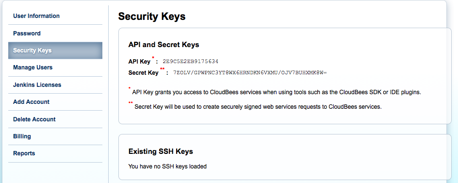
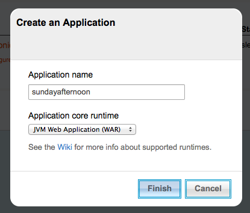
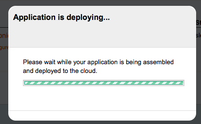
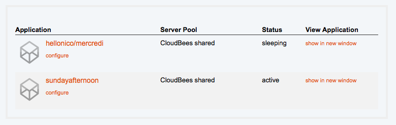

## Clojure in the Clouds, it's a sunny day

### Did we say ? 5 minutes to deploy your clojure application on Heroku

This recipe takes some steps from the following excellent documentation on heroku about [Deploying Clojure Web Application on Heroku](https://devcenter.heroku.com/articles/clojure-web-application). Feel free to refer to it !

#### Generate a new project

In order to have a sweet web app on Heroku, we will quickly go over the steps we have seen before in the Web chapter to generate a Ring based application.

We will reuse the luminus template for now, and run the leiningen new template to generate a project for us:

		lein new luminus test-project

To make sure the resulting ring project is working fine, by running 

		lein ring server

and then we can directly be checking the local URL:

		http://localhost:3000/

Voila. First sip of Heroku-ness.

#### Heroku toolbelt

You may have been missing a git client earlier on, also we do hope you had it already.
Heroku provides what they call a Toolbelt, available at:

[https://toolbelt.heroku.com/](https://toolbelt.heroku.com/)

It provides you for most famous platforms, including Windows and OSX a set of tools to control your Heroku applications.

* git
* foreman
* heroku Command Line Interface

While the last two are not required to be installed on your machine, they do make life easier, and Heroku is totally based on git hooks to deploy and run applications, so you cannot escape having git installed on your machine. 

#### Prepare your SSH keys and access

The short version is simply to add your existing ssh key to your heroku account. Copy your public key at the following place:

[https://dashboard.heroku.com/account](https://dashboard.heroku.com/account)

The second version is actually to go through the Heroku login with the toolbelt provided command line interface. This is done with:

		heroku login

This command will ask you for your heroku email and password, and will log you in Heroku as well as authenticate subsequent calls to Heroku services.

Now the slightly longer version, in case you:

* do not have existing SSH keys
* run into troubles later

Indeed, while you can use your existing keys, we suggest you generate a new set of SSH key with: 

		 ssh-keygen -t rsa -f ~/.ssh/id_rsa_heroku

Add it to your local ssh agent:

		ssh-add ~/.ssh/id_rsa_heroku

Make sure that the new key is showing up in the ssh-agent with: 

		 ssh-add -l

Remove unnecessary keys with the -d flag. (This will not delete the key, only remove it from the ssh-agent.)

		ssh-add -d /Users/Niko/.ssh/id_rsa_hellonico

Add the ssh key to your account:

[https://dashboard.heroku.com/account](https://dashboard.heroku.com/account)

Voila. We have gone in details through the authentication steps. We do not need more for now, so we can step to setup heroku.

#### setup heroku 

Prepare for creating a new application on Heroku. Let's head to our account page again, and create a new app through the following steps:

![../images/chap06/heroku1.png]

![../images/chap06/heroku2.png]

![../images/chap06/heroku3.png]

Then back to our application, we can add the necessary git remote.

		git remote add heroku git@heroku.com:glacial-tundra-7926.git

Once this is done, we just have to perform a git push:

		git push heroku master 

And hop, the wine is poured, and our application is up and running in the cloud:

[http://glacial-tundra-7926.herokuapp.com/](http://glacial-tundra-7926.herokuapp.com/)]

Note that with the Heroku tool belt, a shorter version of this would be:

		heroku apps:create

#### Some explanations

Heroku runs on top of Amazon AWS, and performs all the dirty tasks for you. Heroku relies heavily on a Ruby based infrastructure mostly based on the [Foreman gem](ddollar.github.io/foreman/).

We need a _Procfile_ file to tell heroku what to do with our application. That file is a one liner:

		web: lein with-profile production trampoline ring server

It could be even simplified to:

		web: lein ring server

Which contains exactly the command we used earlier on. The simplest version to run our _ring based_ Clojure web application.

The toolbelt you have installed earlier on contains the Foreman utilities which can locally start your application the way Heroku does.

		foreman start

Puts your application to the forefront of the web with a locally running web application.

#### One off script

In the chapter06/test-heroku sample project, we provided a simple fibonacci script:

@@@ ruby chapter06/test-heroku/src/demo.clj @@@

That can be run as a one off script on Heroku infrastructure.

To run the script locally from the project folder we do:
		
		lein trampoline run -m demo 100

To run this on heroku, we simply add a prefix command:

		heroku run lein trampoline run -m demo 100

We suppose you have installed the heroku toolbelt to have heroku on your path.

More on this [one-off script](https://devcenter.heroku.com/articles/clojure#oneoff-scripts) feature on the Heroku wiki.

#### More with Clojure on Heroku, debugging in real time

We scratched the top of what is needed to have your application on heroku, but we hope we have you hooked.

But to be honest, since we have had so much drinking wine and do things interactively from the beginning of this book, we are going to delve into why Clojure makes sense on Clojure, with a nice clean way of connecting a REPL to a running application.

This is mostly inspired from the following Heroku article on [Debugging clojure on Heroku](https://devcenter.heroku.com/articles/debugging-clojure). 

To checkout the code that we will review, please get it with:

		git clone https://github.com/technomancy/chortles.git

Chortles is the official application of the world wide web to:

		Calculate the magnitude of a given laugh over HTTP and JSON.

Now that we have clone the application, let's set it up for our own personal Heroku account with:

		heroku apps:create

A new application will be created for your account, and we can push to it with the simple git command we have seen before:

		git push heroku master 

We set up some privacy settings needed so not anyone can destroy our code with:

		heroku config:set AUTH_USER=nico AUTH_PASS=nico

In the last line, we can configure any of the system environment needed for our Heroku application.

### A short note on Google App Engine deployment

There used to be two main ways of deploying Clojure applications to Google App Engine.

* [AppEngine-magic](https://github.com/gcv/appengine-magic)
* [Gaeshi](https://github.com/slagyr/gaeshi)

The first one is slightly outdated, and the second one has been recently deprecated. 

Anyway .. let's get googled. And maybe you will be the one involved to save Clojure on Google App Engine !

#### Here comes Gaeshi, prepare yourself

We will go quickly through the easiness of Gaeshi for a quick ride, and put an application on the app engine in ... 5 minutes. Deal ? If not, wine's on us.

First, we are going to need a few command line tools, that are provided by Google. Those can be downloaded from:

[https://developers.google.com/appengine/downloads](https://developers.google.com/appengine/downloads)

We will not be using them directly, just unzip and remember the path where you have downloaded them, it will come handy in a few minutes.

Then we add a plugin for Leiningen in our ~/.lein/profiles.clj

		{:user {:plugins [
									[gaeshi/lein-gaeshi "0.10.0"]
									...
									]}}

Now, to prepare a new project from scratch, let's issue a few commands with the newly installed plugin:

		lein gaeshi new test_1 
		cd test_1  
		lein gaeshi server

That is it. We have replicated the google app engine locally, so we can directly start developing against it.

To see the result locally:

[http://localhost:8080/](http://localhost:8080/)

If you need to start on a different port, we can check the parameters for that:

		gaeshi/lein-gaeshi 0.10.0: Command line component for Gaeshi; A Clojure framework for Google App Engine.
		Usage: [lein] gaeshi [options] <command> [command options]
			command  The name of the command to execute. Use --help for a listing of command.
			-v, --version  Shows the current joodo/kuzushi version.
			-h, --help     You're looking at it.
			Commands:
			deploy    Deploy the project to Google AppEngine
			generate  Generates files for various components at the specified namespace:
										controller - new controller and spec file
			help      Prints help message for commands: gaeshi help <command>
			new       Creates all the needed files for new Gaeshi project.
			prepare   Build a deployable directory structure of the app
			server    Starts the app in on a local web server
			version   Prints the current version of gaeshi/lein-gaeshi

#### Prepare Google for our arrival

In the World of the web, let's create an application on google app engine. We access it through:

[https://appengine.google.com/start/createapp](https://appengine.google.com/start/createapp)

And go through the steps of creating an application. This is pretty easy and left up as a task to the reader of this book:

The application name will be reuse later on, so let's pay attention to not forget it.

#### Attaching our application to Google App Engine

Make sure your 

		config/production/appengine-web.xml 

file reflects the domain name <application>sub_domain_name</application>. For example, if you named your app pure_natto, and you got the domain pure-natto.appspot.com, then you should have 

		<application>pure-natto</application> 

in that file.

		Finally you will need to have a config file in ~/.gaeshi/ named the same as your Clojure project.

So if your project has been named test-1, you should have a file 

		~/.gaeshi/test-1

The content of the file should be like this:

		{
		:appengine-sdk-dir "/path/to/appengine-java-sdk-1.4.3"
		:appengine-email "sato.satoshi@gmail.com"
		:appengine-password "yourpassword"
		}

That's it, now we can run the gaeshi plugin again to deploy:

		lein gaeshi deploy production 

And in a few seconds we have our application at:

		http://<application_name>.appspot.com/

The old version of this documentation can be found online at:

		http://gaeshidocs.appspot.com/

Please have a look !

#### Limitations

Now you probably know that GAE has a severe limitations on threading, meaning you have virtually no control on them, and cannot even spawn new ones.

That means, everything about _clojure futures_ are not usable. 

But if you can go around that limitation, GAE is sure a great way to put your application online pretty reliably fast and on Google infrastructure.

Also, recently, Google is pushing to help its Google Glass project through GAE applications, so it may be the time to go through the limitations and get working on something great.

### Cloudbees

[Cloudbees](http://www.cloudbees.com/) is a great vendor proposing  reliable support for cloud deployment. 

They have a super simple and [brilliant page](http://blog.cloudbees.com/2011/11/easy-deployment-of-clojure-apps-on.html) that explains everything you need to get going.

You first go to the [Cloudbees login page](https://grandcentral.cloudbees.com/login)

You can simply sign in with your google address and get going !

Get your Cloudbees keys from the following place:

Copy your keys, and put them in a file in your home folder named:

		~/.bees/bees.config

With the two following lines:

		bees.api.secret=<your api secret> 
		bees.api.key=<your api key>

From the Cloudbees console that you can access from the Application tab, or going through the following URL:

	https://run.cloudbees.com

Create a new application, with most of the default settings:

That's. The application container is ready in the cloud, we just have to push something to it.

I have re-used the same Ring application template as usual, and added two lines to the project.clj file.

Have a look:

@@@ ruby chapter06/cloudbees/project.clj @@@

We have the [leiningen plugin for cloudbees](https://clojars.org/lein-cloudbees):

		:plugins [
		[lein-cloudbees "1.0.4"]
		]

And the application id: 

			:cloudbees-app-id "hellonico/sundayafternoon"

We can check our application and our settings are all good with:

		lein cloudbees list-apps

And finally, deploy our ring application with the simple command:

		lein cloudbees deploy

The application is ready to be accessed at:

		http://<applicationname>.<accountid>.cloudbees.net/

In this case:

[http://sundayafternoon.hellonico.cloudbees.net/](http://sundayafternoon.hellonico.cloudbees.net/)

You have 5 applications ready to be deployed for free ! So go on, and launch some great honey tasting wine with some cloud bees !

### Beanstalk or Clojure on Amazone Web Service

In the world of Cloud computing, it is hard to go without Amazon AWS these days. Even our earlier example on Heroku was, without us knowing it, based on the Amazon infrastructure.

This recipe will be based on the excellent blog post entry:

[http://www.ctdean.com/2012/04/10/aws-beanstalk-on-clojure.html](http://www.ctdean.com/2012/04/10/aws-beanstalk-on-clojure.html)

#### Preparing (yet again) a Clojure Web application

Same as the Heroku recipe we will use Luminus to quickly have a prototyped Clojure web application:

		lein new luminus test2

We need to be careful to not have a *_* character in the name of your application, so for example, trying to use *test_2* will later on end up in:

		Created /Users/Niko/projects/mascarpone/chapter06/test_2/target/test_2-0.1.0-SNAPSHOT-20130416172805.war
		java.lang.IllegalArgumentException: Bucket name should not contain '_'

#### Setting up the AWS Account

The first time you try to access the Amazon Web Service page, you will need to go through a few registration steps:

Once you have gone through the registration step, and the oh so cool phone call with the real time web automated form, we go directly to the beanstalk section:

or

When the time comes to choose the infrastructure type, make sure you choose Tomcat, whichever version is fine:

The Amazon registration is ready, let's go back to our application.

#### Use the beanstalk Leiningen plugin

To make use of the Leiningen plugin for AWS, named beanstalk, we will add it to our profiles.clj file with:

		{:user {:plugins [
									[lein-beanstalk "0.2.7"]

The plugin code itself is hosted at:

[https://github.com/weavejester/lein-beanstalk](https://github.com/weavejester/lein-beanstalk)

We then need to write our AWS credentials so Leiningen can find them. Add a lein-beanstalk-credentials definition to your ~/.lein/init.clj file that contains your AWS credentials:

		(def lein-beanstalk-credentials
			{:access-key "XXXXXXXXXXXXXXXXXX"
			 :secret-key "YYYYYYYYYYYYYYYYYYYYYYYYYYYYYYYYY"})

As a reminder, your credentials are stored in:

[https://portal.aws.amazon.com/gp/aws/securityCredentials](https://portal.aws.amazon.com/gp/aws/securityCredentials)

Once this is done, we can use the beanstalk command:

		lein beanstalk deploy development

Which will start creating the war file, and deploying it to a tomcat instance on Amazon infrastructure:

		Created /Users/Niko/projects/mascarpone/chapter06/test2/target/test2-0.1.0-SNAPSHOT-20130416174902.war
		Uploaded test2-0.1.0-SNAPSHOT-20130416174902.war to S3 Bucket
		Created new app version 0.1.0-SNAPSHOT-20130416174902
		Creating 'development' environment (this may take several minutes)
		...................

Eventually succeeding:

		Creating 'development' environment (this may take several minutes)
		........................................................... Done
		Environment deployed at: test2-dev.elasticbeanstalk.com

Your application is ready, enjoy some more red wine ! 

### DIY System Monitoring in 3 steps

This is going to be a brief 3 parts tutorial, on how to put in place a simple but practical system monitoring in Clojure. This is based on the excellent [post entry on monitoring](http://architects.dzone.com/articles/how-monitoring-ec2-clojure-and) available on DZone.

#### Parallel SSH

RJMetrics's [Parallel SSH](https://github.com/RJMetrics/Parallel-SSH) is the base that will pave the way to monitoring. We can run the same shell command on multiple servers at the same time. This requires you have all of your SSH keys setup properly in place.

For example, if you want to know the disk space left for a certain number of machines in one go, you would just use the command this way:

@@@ ruby chapter06/parallelssh/space.sh @@@

And the output could be:

		df -ah | grep sda1
		This command will run on all servers, please type 'yes' to confirm: yes
		JP-1
		/dev/sda1             236M   25M  200M  11% /boot
		JP-2
		/dev/sda1             228M   16M  201M   8% /boot
		JP-3
		/dev/sda1             142G  109G   26G  81% /

Note that the way it was simply implemented, ParallelSSH does not run on Windows, you would need to use the recipe we saw in Chapter2 with the [clj-ssh](https://github.com/hugoduncan/clj-ssh) dependency to get something similar running on the Microsoft Operating System.

#### Simple monitoring

Building on the previous recipe we will build a simple monitoring system that runs commands on a set of servers, and send alerts when some threshold are reached.

[ServerStats](https://github.com/RJMetrics/Server-Stats) does exactly that. 
We will do a simple check out and review how that works.

First we have a simple configuration file in Clojure syntax:

@@@ ruby chapter06/ServerStats/server-stats.clj @@@

As you see first we defined some alert handlers, one that simply prints a message when an alert was detected. 

Then we set up our username, and finally different group of servers to run parallel commands on. 
This is where the parallel ssh feature comes useful and pretty much the core of it.

After that we define a set of commands, that will be recognize as argument of our executable.

Here a command to see the top processes and another one to disk how much disk space is left on the remote server.

The top command doesn't trigger any alert but the disk command will do.
The disk command can be run with 

		lein run disk

or, via the jar file, (after using lein uberjar) with:

		java -jar target/server-stats-0.1-standalone.jar disk

The output, provided you have servers accessible through ssh would look like:

		JP-9
		Filesystem            Size  Used Avail Use% Mounted on
		udev                   12G  156K   12G   1% /dev

The top command itself would return a list of the top ten processes.

Based on this output, we can create alert handlers, those alerts being triggered when some values are over or below some defined limit.

In our configuration file above, the following is a list of alerts:

		[{:column "Use%"
						 :value-type percent
						 :handlers [email]
						 :msg "Disk space over 90% full"
						 :trigger (> 90)}]}

Meaning the email alert handler will be triggered if the percentage value of the disk space is over 90%.
Et voila!

Note that the list of commands is generated automatically for you:

A run with no parameters would return:

		Usage: [switches] command-name

		Switches                   Default  Desc              
		--------                   -------  ----              
		-h, --no-help, --help      false    Show help         
		-a, --no-alerts, --alerts  false    Send email alerts 

		Valid commands are:
		disk                            Get the disk usage using df   
		top                             Get the top 10 processes by CPU

And you are ready to go. Implement different alerts for different servers.

#### Monitor your amazon ec2 instance directly from Clojure

Based on the previous recipe, we can take a look at how we can perform [monitoring of a running clojure application on ec2](http://architects.dzone.com/articles/how-monitoring-ec2-clojure-and)

Nothing should be new to you at this stage, since this pretty much the same as what we had before, including some basic cron setups.

Note the boolean alert trigger, in the following command:

	(add-cmd is-artifactory
		{:doc "Is Artifactory Running?"
		:servers [web-servers]
		:cmd "[[ -z `ps aux | grep org.artifactory.standalone.main.Main` ]] && echo 'false' || echo 'true'"
		:alerts [{:value-type bool
		:msg "Artifactory is not running"
		:handlers [email]
		:trigger (= false)
		:mute-for 1860000}]})

We are checking for the presence or the absence of a shell script. Easy no ? 

The original configuration for the [ServerStats](https://github.com/RJMetrics/Server-Stats/blob/master/server-stats.cfg) also has a trivial Twilio configuration to send a SMS in case you are in a supported country:

    (import com.twilio.sdk.TwilioRestClient)
    (set-command-failure-handler [server-name]
        (let [client (TwilioRestClient. "ACCOUNT_SID" "AUTH_TOKEN")
        account (. client getAccount)
        smsFactory (. account getSmsFactory)]
        (. smsFactory (create {"To" "5554155484"
                          "From" "2675551234"
                          "Body" (str server-name " is not responding to ssh")}))))

Sweet. Nice. Simple.

Enjoy some wine while your cluster is running in peace.

### Controlling with Clojure

The next two recipes are simply deliciously tasty.

We are going to define clusters of machines, and start performing tasks on them.

In a second step, we will build upon running tasks and perform a complex but simple to use monitoring system.

#### Define clusters and tasks for system administration or code deployment, then execute them on one or many remote machines

[clojure control/](https://github.com/killme2008/clojure-control/) will be the best of this recipe. What we can achieve is define a set of machines, and a set of tasks that can then reliably be run on defined clusters.

To get started, we will download the control script from the following URL:

	wget https://raw.github.com/killme2008/clojure-control/master/bin/control
	chmod 744 control 

And check we have everything we need:

	./control 

Will output:

	[chapter06/control/] % ./control 
	Usage:control [-f control.clj] command args
	Commands available:
	init                           Initialize clojure-control, create a sample control file in current folder
	run <cluster> <task> <args>    Run user-defined clojure-control tasks against certain cluster
	show <cluster>                 Show cluster info
	server                         Start a control server for handling requests from clients
	upgrade                        Upgrade clojure-control to a latest version.

As indicated, we will create a sample control file with:

	./control init

A file named _control.clj_ will be created with the following content:

	 (defcluster :default-cluster
         :clients [
                  {:host "localhost" :user "root"}
         ])

     (deftask :date "echo date on cluster"  []
         (ssh "date"))

We have defined a cluster, and task to run on it.

We can now run a task on a cluster with the following command:

	control run default-cluster date

We can also run a task directly on a host with the _@_ mark. For example:

	./control run nicolas@jp-1 date

	Performing nicolas@jp-1
	Performing date for nicolas@jp-1
	jp-1:ssh:  date
	jp-1:stdout: Wed Apr 24 17:01:15 JST 2013

	jp-1:exit: 0 

Every task's running result is a map contains output and status,you can get them by:

	  (let [rt (ssh "date")]
       (println (:status rt))
       (println (:stdout rt))
       (println (:stderr rt)))

In short, the task definition goes like this:

	 (deftask :ps [process]
        (ssh (str "ps aux | grep " process)))

* deftask 
* a symbol
* name that can be passed as argument to the control script
* a command to run in the body of deftask

You can run the above with the same script, and an additional parameter:

	control run [cluster-name] ps java

Sweet ?

Lastly, here is how you would go to deploy a generic java application using this framework:

	  (deftask :deploy-app []
          (local "tar zcvf app.tar.gz app/")
          (scp "app.tar.gz" "/home/user/")
          (ssh
               (run 
                   (cd "/home/user"
                       (run
                          (run "tar zxvf app.tar.gz")
                          (env "JAVA_OPTS" "-XMaxPermSize=128m"
                             (run "bin/app.sh restart")))))))

Note the usage of the run command here. *run* accept several commands at one time to execute.

Note also the usage of *local*, which will run a command on the local machine.

##### Further Readings

The website takes you further in details with:

* [Define clusters](https://github.com/killme2008/clojure-control/wiki/Define-clusters)
* [Define tasks](https://github.com/killme2008/clojure-control/wiki/Define-tasks)
* [Clojure Control DSL](https://github.com/killme2008/clojure-control/wiki/commands)
* [Shell Commands](https://github.com/killme2008/clojure-control/wiki/Control-shell-commands)

That should be enough to get going smoothly for a while.

#### Monitor your clojure application using clojure-control

[clj.monitor](https://github.com/killme2008/clj.monitor) builds up where Clojure Control left. Now that we can run any number of commands on remote machines and clusters, we reuse the same notations, namely:

* defcluster
* deftask

And we add to the mix a new keyword:

	defmonitor

For a simple example:

	   (defmonitor mysql-monitor
         :tasks [(ping-mysql "root" "password")]
         :clusters [:mysql])

This will check that Mysql is indeed running properly on the mysql cluster.

A set of defined tasks is ready for you to use. You can have a look at:

[https://github.com/killme2008/clj.monitor/blob/master/src/clj/monitor/tasks.clj](https://github.com/killme2008/clj.monitor/blob/master/src/clj/monitor/tasks.clj)

The count process task reads pretty cleanly with:

	(deftask count-process
		[process min]
		(let [
			rt (cast-int (:stdout 
				(ssh 
					(format "ps aux|grep %s |grep -v -c grep" process))))]
    	(>= rt min)))	

This will check the number of processes running and return true if we have the minimum required.

You can of course define your own tasks and go wild. But do not spill wine all over the Cluster. It's bad for the wine !

### The best cloud infrastructure right at your fingertips with Pallet

[Pallet ](http://palletops.com/)is the culmination of this chapter. It is a reliable and proven cloud infrastructure tool. 

Pallet is platform for agile and programmatic automation of infrastructure in the cloud, on server racks or directly on virtual machines.

#### Why Pallet ? 

Pallet is similar in features to [chef](http://www.opscode.com/chef/), and [puppet](https://puppetlabs.com/) which are also infrastructure automation tools.

Basically, as we have seen continuously all along this chapter we want to have a reliable way of controlling and monitoring our cluster of servers.

At my current customer, we now use this kind of tools and infrastructure to build, manage and expand on demand the necessary power to handle the user demand.

These days it is pretty much a given that you do not want to go and run the command one by one on the production environment, but have tested and reliable set of commands to achieve this.

In the Clojure world, Pallet is currently the project for it.

#### Getting started with Pallet

[pallet-lein-new](https://github.com/pallet/pallet-lein-new) is the Leiningen new template to get started. 

We (You!) do remember that with Leiningen 2 we only need to run the command itself so here go.

	lein new pallet quickstart

Pallet works with a list of Clouds provider. Sample examples of providers are:

 * Amazon Web Services' EC2
 * RackSpace Cloud Servers
 * Virtualbox
 * GoGrid Cloud Hosting
 * Eucalyptus

The full list is currently hosting on the [jclouds website](http://www.jclouds.org/documentation/reference/supported-providers/).

But first let's step back a bit and see what we can do with a virtual box wrapper.

#### VMFest: A VirtualBox wrapper 

VirtualBox is a general purpose virtualizer, that makes it a no brainer to start using virtual machines on your host.

We start by downloading it from the VirtualBox website at:

	https://www.virtualbox.org/wiki/Downloads

Once this is done, on OSX this will install a command line web server for us.
The default is blocked by authorized calls but for the purpose of this tutorial we will simply disable it:

	VBoxManage setproperty websrvauthlibrary null

Then we can start a local virtual box webserver with:

	vboxwebsrv -t0

You can check accessible by accessing its local URL:

	http://localhost:18083/

That's it. Our VirtualBox waiter is ready to receive orders from us.

This is where [vmfest](https://github.com/tbatchelli/vmfest) comes into play. VMFest is a Clojure wrapper around the command line tool for VirtualBox.

As usual, the easiest way to get up and running is by updating our project.clj file with a dependency:
	
	[vmfest "0.2.8"]

And start a REPL with Leiningen.

Most of the following file is available in the code of this book in the chapter06/vmfest project, but let's go through it together. You should be typing the lines one by one to avoid surprises.

	; We start with the vmfest namespace imports
	(use 'vmfest.manager)
	(use '[vmfest.virtualbox.image :only [setup-model]])

	; We create a connection reference to the webserver 
	; that we started before. This is the same local URL
	; it could also be remote so you can have your models
	; hosted remotely
	(def my-server (server "http://localhost:18083"))

	; We need an image model. We will go for a lightweight ubuntu server image
	(setup-model "resources/lubuntu.vdi" my-server)
	;; This will also look for an associated .meta file in the same folder.
	;; {:image-file "/var/folders...}

	;; let's check that the image model has been installed
	(models)
	;; (:lubuntu) <-- you should see something like this

	;; Time do create a VM instance. We'll call it my-vmfest-vm. This is
	;; the name that will appear in VirtualBox's GUI.
	(def my-machine (instance my-server "my-vmfest-vm" :lubuntu :micro))

	;; Notice that once we have created a VM we don't need to reference
	;; the server anymore
	(start my-machine)

	;; Get the IP address of the machine. At this point, you can SSH into
	;; this machine with user/password: vmfest/vmfest
	(get-ip my-machine)
	;; "192.168.56.103"

	;; You can pause and resume the VM.
	(pause my-machine)
	(resume my-machine)

	;; Stopping the VM will send a signal to the OS to shutdown. 
	;; This will not close the VM itself, 
	;; just the OS run by the VM
	(stop my-machine)

	;; This will turn off the VM completely and immediately.
	(power-down my-machine)

	;; Once we are done with this VM, we can destroy it, which will remove
	;; any trace of it's existence. Your data will be lost, but not the
	;; original image this VM was booted off.
	(destroy my-machine)

So we have seen how to 

* connect to the VirtualBox web service layer
* create models for virtual machines
* create virtual machines 
* control the lifecycle of the virtual machines

Now, as you have seen, everything we have written is pure Clojure, so we can now apply our concept of code as infrastructure and create multiple VMs on-demand.

This is in the following example:

@@@ ruby chapter06/vmfest/src/vmfest/multiple.clj @@@

Et voila. 

Most of this recipe comes from the simple introduction available at the [vmfest playground](https://github.com/pallet/vmfest-playground).

I especially like the fact that since this is call code, all this workflow can be recreated from a code source checkout.

Ian Rumfort has some more detailed [notes](http://ianrumford.github.io/blog/2012/10/13/using-vmfest-with-virtualbox-4-dot-2/) on how he went to use VMFest, and I recommend you have a look.
Also, he details how to add your own hardware models.

If you noticed, VMFest is very close to the Ruby project named [Vagrant](http://www.vagrantup.com/), which is the side kick of [Chef](http://www.opscode.com/chef/). 

So who's the sidekick of VMFest? 

Let's see in the next section.

#### Code as Infrastructure with Pallet

Now most of the pallets recipe are run from the REPL, so we will start a REPL and get ready to pallet the way.

Navigate to the newly create folder from the previous lein command then:

	lein repl

And from the REPL:

	(require 'pallet.core 'pallet.compute 'pallet.configure)

Good. We are ready.

[http://ianrumford.github.io/blog/2012/10/24/first-steps-using-pallet-with-vmfest-and-virtualbox-4-dot-2/](http://ianrumford.github.io/blog/2012/10/24/first-steps-using-pallet-with-vmfest-and-virtualbox-4-dot-2/)
