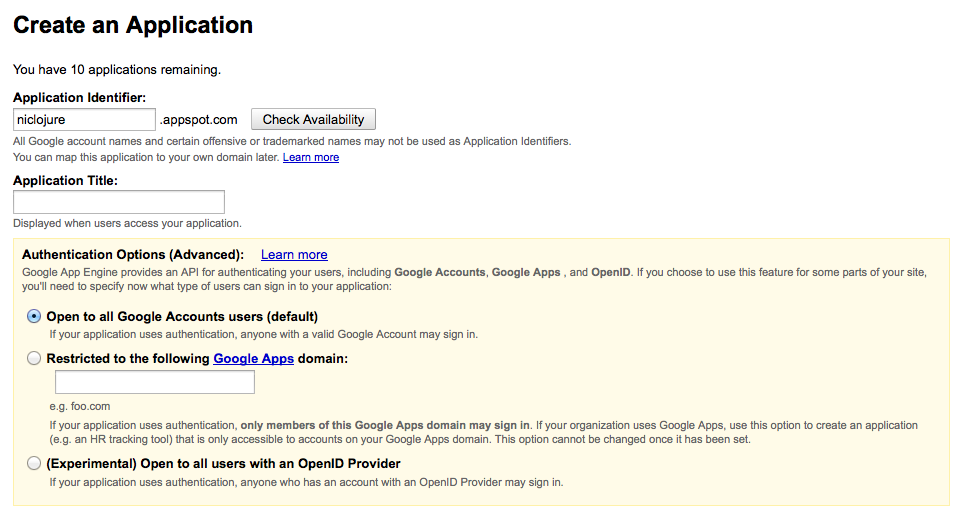

## Clojure in the Clouds, it's a sunny day

### Did we say ? 5 minutes to deploy your clojure application on Heroku

This recipe takes some steps from the following excellent documentation on heroku about [Deploying Clojure Web Application on Heroku](https://devcenter.heroku.com/articles/clojure-web-application). Feel free to refer to it !

#### Generate a new project

In order to have a sweet web app on Heroku, we will quickly go over the steps we have seen before in the Web chapter to generate a Ring based application.

We will reuse the luminus template for now, and run the leiningen new template to generate a project for us:

    lein new luminus test-project

To make sure the resulting ring project is working fine, by running 

    lein ring server

and then we can directly be checking the local URL:

    http://localhost:3000/

Voila. First sip of Heroku-ness.

#### Heroku toolbelt

You may have been missing a git client earlier on, also we do hope you had it already.
Heroku provides what they call a Toolbelt, available at:

[https://toolbelt.heroku.com/](https://toolbelt.heroku.com/)

It provides you for most famous platforms, including Windows and OSX a set of tools to control your Heroku applications.

* git
* foreman
* heroku Command Line Interface

While the last two are not required to be installed on your machine, they do make life easier, and Heroku is totally based on git hooks to deploy and run applications, so you cannot escape having git installed on your machine. 

#### Prepare your SSH keys and access

The short version is simply to add your existing ssh key to your heroku account. Copy your public key at the following place:

[https://dashboard.heroku.com/account](https://dashboard.heroku.com/account)

The second version is actually to go through the Heroku login with the toolbelt provided command line interface. This is done with:

    heroku login

This command will ask you for your heroku email and password, and will log you in Heroku as well as authenticate subsequent calls to Heroku services.

Now the slightly longer version, in case you:

* do not have existing SSH keys
* run into troubles later

Indeed, while you can use your existing keys, we suggest you generate a new set of SSH key with: 

     ssh-keygen -t rsa -f ~/.ssh/id_rsa_heroku

Add it to your local ssh agent:

    ssh-add ~/.ssh/id_rsa_heroku

Make sure that the new key is showing up in the ssh-agent with: 

     ssh-add -l

Remove unnecessary keys with the -d flag. (This will not delete the key, only remove it from the ssh-agent.)

    ssh-add -d /Users/Niko/.ssh/id_rsa_hellonico

Add the ssh key to your account:

[https://dashboard.heroku.com/account](https://dashboard.heroku.com/account)

Voila. We have gone in details through the authentication steps. We do not need more for now, so we can step to setup heroku.

#### setup heroku 

Prepare for creating a new application on Heroku. Let's head to our account page again, and create a new app through the following steps:

![../images/chap06/heroku1.png]

![../images/chap06/heroku2.png]

![../images/chap06/heroku3.png]

Then back to our application, we can add the necessary git remote.

    git remote add heroku git@heroku.com:glacial-tundra-7926.git

Once this is done, we just have to perform a git push:

    git push heroku master 

And hop, the wine is poured, and our application is up and running in the cloud:

[http://glacial-tundra-7926.herokuapp.com/](http://glacial-tundra-7926.herokuapp.com/)]

Note that with the Heroku tool belt, a shorter version of this would be:

    heroku apps:create

#### Some explanations

Heroku runs on top of Amazon AWS, and performs all the dirty tasks for you. Heroku relies heavily on a Ruby based infrastructure mostly based on the [Foreman gem](ddollar.github.io/foreman/).

We need a _Procfile_ file to tell heroku what to do with our application. That file is a one liner:

    web: lein with-profile production trampoline ring server

It could be even simplified to:

    web: lein ring server

Which contains exactly the command we used earlier on. The simplest version to run our _ring based_ Clojure web application.

The toolbelt you have installed earlier on contains the Foreman utilities which can locally start your application the way Heroku does.

    foreman start

Puts your application to the forefront of the web with a locally running web application.

#### One off script

In the chapter06/test-heroku sample project, we provided a simple fibonacci script:

@@@ ruby chapter06/test-heroku/src/demo.clj @@@

That can be run as a one off script on Heroku infrastructure.

To run the script locally from the project folder we do:
    
    lein trampoline run -m demo 100

To run this on heroku, we simply add a prefix command:

    heroku run lein trampoline run -m demo 100

We suppose you have installed the heroku toolbelt to have heroku on your path.

More on this [one-off script](https://devcenter.heroku.com/articles/clojure#oneoff-scripts) feature on the Heroku wiki.

#### More with Clojure on Heroku, debugging in real time

We scratched the top of what is needed to have your application on heroku, but we hope we have you hooked.

But to be honest, since we have had so much drinking wine and do things interactively from the beginning of this book, we are going to delve into why Clojure makes sense on Clojure, with a nice clean way of connecting a REPL to a running application.

This is mostly inspired from the following Heroku article on [Debugging clojure on Heroku](https://devcenter.heroku.com/articles/debugging-clojure). 

To checkout the code that we will review, please get it with:

    git clone https://github.com/technomancy/chortles.git

Chortles is the official application of the world wide web to:

    Calculate the magnitude of a given laugh over HTTP and JSON.

Now that we have clone the application, let's set it up for our own personal Heroku account with:

    heroku apps:create

A new application will be created for your account, and we can push to it with the simple git command we have seen before:

    git push heroku master 

We set up some privacy settings needed so not anyone can destroy our code with:

    heroku config:set AUTH_USER=nico AUTH_PASS=nico

In the last line, we can configure any of the system environment needed for our Heroku application.

### A short note on Google App Engine deployment

There used to be two main ways of deploying Clojure applications to Google App Engine.

* [AppEngine-magic](https://github.com/gcv/appengine-magic)
* [Gaeshi](https://github.com/slagyr/gaeshi)

The first one is slightly outdated, and the second one has been recently deprecated. 

Anyway .. let's get googled. And maybe you will be the one involved to save Clojure on Google App Engine !

#### Here comes Gaeshi, prepare yourself

We will go quickly through the easiness of Gaeshi for a quick ride, and put an application on the app engine in ... 5 minutes. Deal ? If not, wine's on us.

First, we are going to need a few command line tools, that are provided by Google. Those can be downloaded from:

[https://developers.google.com/appengine/downloads](https://developers.google.com/appengine/downloads)

We will not be using them directly, just unzip and remember the path where you have downloaded them, it will come handy in a few minutes.

Then we add a plugin for Leiningen in our ~/.lein/profiles.clj

    {:user {:plugins [
                  [gaeshi/lein-gaeshi "0.10.0"]
                  ...
                  ]}}

Now, to prepare a new project from scratch, let's issue a few commands with the newly installed plugin:

    lein gaeshi new test_1 
    cd test_1  
    lein gaeshi server

That is it. We have replicated the google app engine locally, so we can directly start developing against it.

To see the result locally:

[http://localhost:8080/](http://localhost:8080/)

If you need to start on a different port, we can check the parameters for that:

    gaeshi/lein-gaeshi 0.10.0: Command line component for Gaeshi; A Clojure framework for Google App Engine.
    Usage: [lein] gaeshi [options] <command> [command options]
      command  The name of the command to execute. Use --help for a listing of command.
      -v, --version  Shows the current joodo/kuzushi version.
      -h, --help     You're looking at it.
      Commands:
      deploy    Deploy the project to Google AppEngine
      generate  Generates files for various components at the specified namespace:
                    controller - new controller and spec file
      help      Prints help message for commands: gaeshi help <command>
      new       Creates all the needed files for new Gaeshi project.
      prepare   Build a deployable directory structure of the app
      server    Starts the app in on a local web server
      version   Prints the current version of gaeshi/lein-gaeshi

#### Prepare Google for our arrival

In the World of the web, let's create an application on google app engine. We access it through:

[https://appengine.google.com/start/createapp](https://appengine.google.com/start/createapp)

And go through the steps of creating an application. This is pretty easy and left up as a task to the reader of this book:

The application name will be reuse later on, so let's pay attention to not forget it.

#### Attaching our application to Google App Engine

Make sure your 

    config/production/appengine-web.xml 

file reflects the domain name <application>sub_domain_name</application>. For example, if you named your app pure_natto, and you got the domain pure-natto.appspot.com, then you should have 

    <application>pure-natto</application> 

in that file.

    Finally you will need to have a config file in ~/.gaeshi/ named the same as your Clojure project.

So if your project has been named test-1, you should have a file 

    ~/.gaeshi/test-1

The content of the file should be like this:

    {
    :appengine-sdk-dir "/path/to/appengine-java-sdk-1.4.3"
    :appengine-email "sato.satoshi@gmail.com"
    :appengine-password "yourpassword"
    }

That's it, now we can run the gaeshi plugin again to deploy:

    lein gaeshi deploy production 

And in a few seconds we have our application at:

    http://<application_name>.appspot.com/

The old version of this documentation can be found online at:

    http://gaeshidocs.appspot.com/

Please have a look !

#### Limitations

Now you probably know that GAE has a severe limitations on threading, meaning you have virtually no control on them, and cannot even spawn new ones.

That means, everything about _clojure futures_ are not usable. 

But if you can go around that limitation, GAE is sure a great way to put your application online pretty reliably fast and on Google infrastructure.

### Beanstalk or Clojure on Amazone Web Service

In the world of Cloud computing, it is hard to go without Amazon AWS these days. Even our earlier example on Heroku was, without us knowing it, based on the Amazon infrastructure.

This recipe will be based on the excellent blog post entry:

[http://www.ctdean.com/2012/04/10/aws-beanstalk-on-clojure.html](http://www.ctdean.com/2012/04/10/aws-beanstalk-on-clojure.html)

#### Preparing (yet again) a Clojure Web application

Same as the Heroku recipe we will use Luminus to quickly have a prototyped Clojure web application:

    lein new luminus test2

We need to be careful to not have a *_* character in the name of your application, so for example, trying to use *test_2* will later on end up in:

    Created /Users/Niko/projects/mascarpone/chapter06/test_2/target/test_2-0.1.0-SNAPSHOT-20130416172805.war
    java.lang.IllegalArgumentException: Bucket name should not contain '_'

#### Setting up the AWS Account

The first time you try to access the Amazon Web Service page, you will need to go through a few registration steps:

Once you have gone through the registration step, and the oh so cool phone call with the real time web automated form, we go directly to the beanstalk section:

or

When the time comes to choose the infrastructure type, make sure you choose Tomcat, whichever version is fine:

The Amazon registration is ready, let's go back to our application.

#### Use the beanstalk Leiningen plugin

To make use of the Leiningen plugin for AWS, named beanstalk, we will add it to our profiles.clj file with:

    {:user {:plugins [
                  [lein-beanstalk "0.2.7"]

The plugin code itself is hosted at:

[https://github.com/weavejester/lein-beanstalk](https://github.com/weavejester/lein-beanstalk)

We then need to write our AWS credentials so Leiningen can find them. Add a lein-beanstalk-credentials definition to your ~/.lein/init.clj file that contains your AWS credentials:

    (def lein-beanstalk-credentials
      {:access-key "XXXXXXXXXXXXXXXXXX"
       :secret-key "YYYYYYYYYYYYYYYYYYYYYYYYYYYYYYYYY"})

As a reminder, your credentials are stored in:

[https://portal.aws.amazon.com/gp/aws/securityCredentials](https://portal.aws.amazon.com/gp/aws/securityCredentials)

Once this is done, we can use the beanstalk command:

    lein beanstalk deploy development

Which will start creating the war file, and deploying it to a tomcat instance on Amazon infrastructure:

    Created /Users/Niko/projects/mascarpone/chapter06/test2/target/test2-0.1.0-SNAPSHOT-20130416174902.war
    Uploaded test2-0.1.0-SNAPSHOT-20130416174902.war to S3 Bucket
    Created new app version 0.1.0-SNAPSHOT-20130416174902
    Creating 'development' environment (this may take several minutes)
    ...................

Eventually succeeding:

    Creating 'development' environment (this may take several minutes)
    ........................................................... Done
    Environment deployed at: test2-dev.elasticbeanstalk.com

Your application is ready, enjoy some more red wine ! 

### Monitor your amazon ec2 instance directly from Clojure
[http://architects.dzone.com/articles/how-monitoring-ec2-clojure-and](http://architects.dzone.com/articles/how-monitoring-ec2-clojure-and)

Mixpanel allows you to track any kind of event from Within your Application.
[https://github.com/pingles/clj-mixpanel](https://github.com/pingles/clj-mixpanel)
[https://mixpanel.com/account/](https://mixpanel.com/account/)

### Define clusters and tasks for system administration or code deployment, then execute them on one or many remote machines
[https://github.com/killme2008/clojure-control/](https://github.com/killme2008/clojure-control/)

### Monitor your clojure application using clojure-control
[https://github.com/killme2008/clj.monitor](https://github.com/killme2008/clj.monitor)

### Parallel SSH
[http://blog.rjmetrics.com/Parallel-SSH-and-system-monitoring-in-Clojure/](http://blog.rjmetrics.com/Parallel-SSH-and-system-monitoring-in-Clojure/)
[https://github.com/RJMetrics/Parallel-SSH](https://github.com/RJMetrics/Parallel-SSH)
[Monitoring EC2 with clojure](http://paulosuzart.github.com/blog/2012/04/17/monitoring-ec2-with-clojure-and-server-stats/)

### robin: a RRDtool or system graphing and monitoring in Clojure
[http://www.jrobin.org/index.php/Main_Page](http://www.jrobin.org/index.php/Main_Page)

### Your cloud infrastructure right at your fingertips
[http://palletops.com/](http://palletops.com/)

Pallet is the mother of them all of cloud infrastructure tool. See the [list of providers](http://www.jclouds.org/documentation/reference/supported-providers/) it supports! 
They are actually doing this through [jclouds](http://www.jclouds.org/)

### Easy VirtualBox wrapper for easy cloud management
[https://github.com/tbatchelli/vmfest](https://github.com/tbatchelli/vmfest)

@@@ ruby 14_vmfest.clj @@@

Make sure you also look at the [playground](https://github.com/pallet/vmfest-playground) and have a look at the [tutorial](https://github.com/pallet/vmfest-playground/blob/master/src/play.clj)

### Lemur, your friend to launch hadoop jobs locally or on EMR
[Lemur is a tool to launch Hadoop jobs locally or on EMR](https://github.com/TheClimateCorporation/lemur)

### Ever wanted to deploy on Redhat's openshift plateform ?
[Deploy on Redhat's openshift](http://sisciatech.tumblr.com/post/29614188595/webnoir-in-openshift)

### Deploying clojure app in the cloud with jetlastic. it's super easy !

Along the lines of deploying a war file in the Cloud, jetlastic has done some pretty award-type job recently and even put some detailed documentation on how to get Clojure started with Jetlastic

[http://jelastic.com/ja/docs/clojure)](http://jelastic.com/ja/docs/clojure) 

There is a Japanese provider right beside your door at:

    https://app.jelastic.tsukaeru.net/

and [sample app](https://github.com/cemerick/clojure-web-deploy-conj)