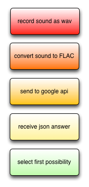
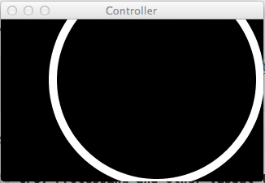
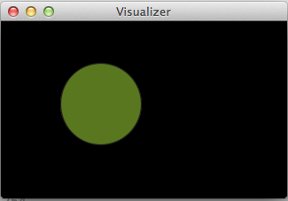
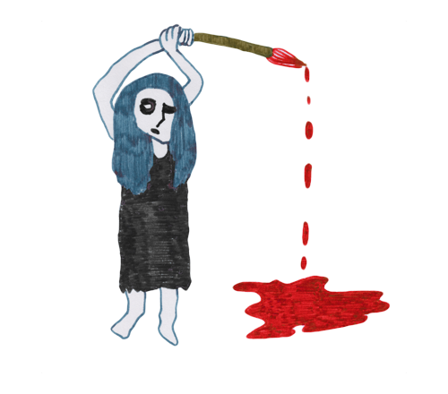
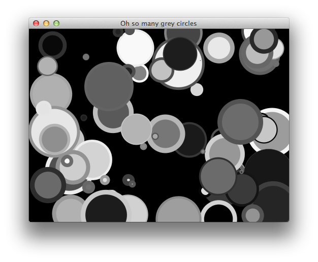
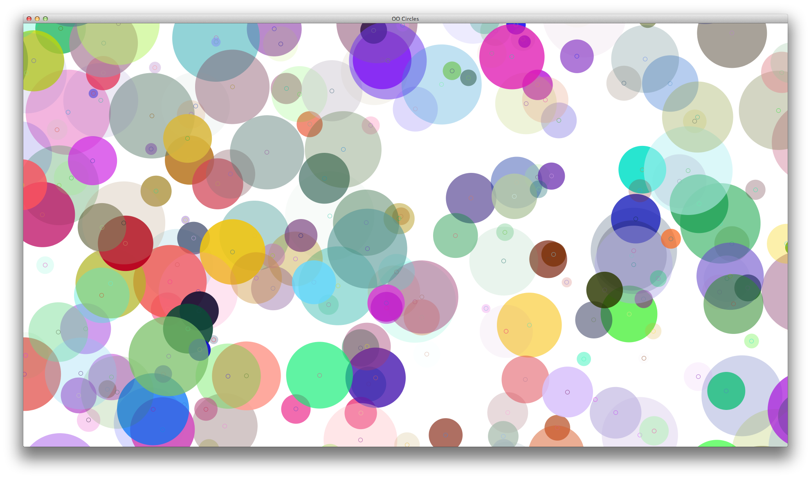
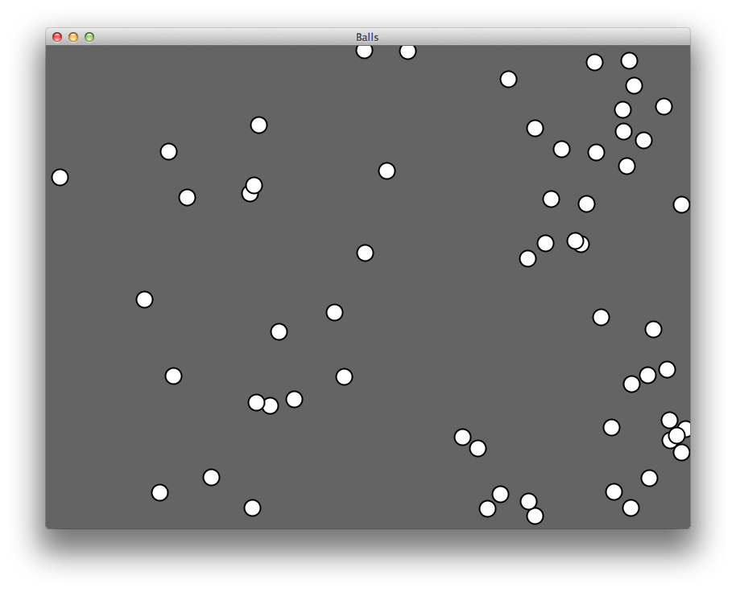

## Music and sound in Clojure

###### Salade: Salad, what you get right before the cheese of course

Well, we may have been going too far in the last chapter !! All this PAAS and Cloud management is great, but .. you know.

I think it's time we switched to something more fun. So we will go through this section with some sound fun. Speech, voice, sounds of sound. Then on to do a bit of live music programming to make the wine dance with the salad.
Last part, we will go through some graphic samples on how to make pictures and graphics dancing along with the music.
Bring your glass and enjoy !

### Clojure with Speeech, Clojure with Recognition!

#### Voice Recognition with Clojure

To get your wine order properly you need to get it recognized properly. We will be using a semi-hidden Google API to analyze our recorded sound for this. 

To add the necessary glue to do our work, we will add the following dependency:

    [hellonico/speech-recognition "1.0.2"]

[Our customized Speech Recognition](https://github.com/hellonico/speech-recognition) is entirely based on [speech-recognition](https://github.com/klutometis/speech-recognition) with just enough updated code to perform.
I found [Peter Danenberg](https://github.com/klutometis) research just fascinating, with a few lines of his code pumping inspiration into new projects and ideas. Check it out !

Now that we have the above in our project, we can start a REPL, and be done with:

@@@ ruby chapter07/speech/src/speech/hear.clj @@@

So a few notes on this code. First we can change the language to *en*, *fr* etc... to get our speech recognized in different languages. 

The input index, is relative to your machine and the number of devices. You need to search for the proper input on your machine, with _(get-mixers)_ :

    user=> (get-mixers)
    #<DirectAudioDeviceInfo Default Audio Device, version Unknown Version>
    #<DirectAudioDeviceInfo Built-in Input, version Unknown Version>
    #<DirectAudioDeviceInfo Built-in Output, version Unknown Version>

The easy life cycle to get this working is detailed in the diagram below:

Now to extend this to something great, you realize we have just the start of a Siri, Apple copyright here, framework. You can hear the sentence and process it with some clever pattern matching.

#### Voice with Clojure

The above part would be incomplete if we could not get our order to be pronounced properly as well. Here comes the speaking text part.

We will use a library from Peter again, [speech-synthesis](
https://github.com/klutometis/speech-synthesis), this time with no modification. 
To add this to your project:

    [facts/speech-synthesis "1.0.0"]

@@@ ruby chapter07/speech/src/speech/speak.clj @@@

But, I know what you are going to say .. "Wait here ... where's my Japanese Girl talking to me?"

That is where, we are going to realize that we did not need a library after all !!

This is the whole source code for the library above with some slight changes:

@@@ ruby chapter07/speech/src/speech/speak_ja.clj @@@

That is all. We just added some lines to recognize Japanese sentence for us.

"Arigatou ne-"

### Midi sound with Clojure

Transitioning from recording and playing sound, we will now move to Midi sounds. The JVM already has by default everything needed to play them. 

We will go over the [Clojure Midi Library](https://github.com/pcsanwald/clojure-midi) so see how we can turn data to music and at the same time this will be a great introduction for the coming audio recipes concepts.

Let's start a REPL from the clojure-midi folder in the examples. And let's go through the following code line by line.

@@@ ruby chapter07/clojure-midi/src/music/simple.clj @@@

We first start by defining a scale. Here A Major. If you remember your classes of music from junior high school, or your latest DJ sets, you'll remember that the scale of A is _A B C# D E F# G#_ and we declare it as is here.

We then make a chord, using that scale, and the base note of the chord. We have triads and seventh chords implemented, that will return a set of 3 or 4 notes depending.

Now we prepare a sound by using each of the note, and a duration, the default duration being 2000ms, and we have something that is ready to play through the midi interface.

And that is it, we last use the *perform* method to actually make the sound go through the speaker.

My favorite scale is E Dorian, which goes like:

    (def e-dorian [:E :F :G :A :B :C :D])

So please, be sure to try a few chords with that scale.

Now this little piece of recipe, while very short, has gained us some knowledge and insight as to how to use data, or simple text, to make sound. This is the core concept of Clojure here again exposed as code is data is code. 

### All you need to perform live music, is here

#### Overtone basics

[Overtone](http://overtone.github.io/) is for me one of the most successful project for the Clojure community. 

It is based on [open standards](https://github.com/overtone/osc-clj), has everything from [great code](https://github.com/overtone/overtone), to [great documentation](https://github.com/overtone/overtone/wiki/Getting-Started), the awesome [cheatsheet](https://github.com/overtone/overtone/raw/master/docs/cheatsheet/overtone-cheat-sheet.pdf) and even more, a [great community](http://groups.google.com/group/overtone) around it.

We will not go through all the details of Overtone in this book, because that in itself, could be the idea for another book.

Instead we will briefly present, or actually simply give a short introduction so you can get going and have some fun, because you really need to live audio programming to be a real VD, Visual Developer these days.

Our working folder is in the chapter07/overtone folder of the sources to this book, and note how the single dependency to the project is:

    [overtone "0.8.1"]

We are ready for a REPL session.

At its core, overtone sends wave signals to a server, that will respond to message it receives from overtone itself. The protocol is also written in Clojure, and wraps some core audio functionalities using native libraries.

But, enough with the details and let's get some beats going:

    (use 'overtone.live)
    (def kick (sample (freesound-path 2086)))
    
   
We include the overtone.live namespace in our current namespace, then start by downloading a free sound from the [http://www.freesound.org/](http://www.freesound.org/) website.
This is already done for us, and the sound file itself will be downloaded and cached for later use.

We can play with our kick with:

    (kick)

or

    (kick 2)

Which will raise the pitch of our sound. But enough play on one sound. We now define a metronome, on a 120 beat per minute tempo. It reads well in Clojure/Overtone:

    (def one-twenty-bpm (metronome 120))

In the loop we are going to create, we are coming back to a library we described a long time ago in Chapter02. Remember ? The wine was sparking *at* the time, pun intended.

If you forgot how the library was used, please go again and check again some [examples](https://github.com/overtone/at-at)

To put at-at in practice right now, let's look at the following line:

    (apply-at ((metronome 120) 4) println 2 [])

This will print *2* in exactly 4 beats at 120bpm. So wait, printing is out of fashion, we can do the same with our kick sample:

    (apply-at ((metronome 120) 4) kick 2 [])

That's it. in 4 bears, we will have a kick. Now let's define our loop with:

     (defn looper [nome sound]    
        (let [beat (nome)]
            (at (nome beat) (sound))
            (apply-at (nome (inc beat)) looper nome sound [])))

And start it with:

    (looper one-twenty-bpm kick)

Sweeeet? 

Once the neighbors are banging at the door, maybe it's time for a ..

    (stop)

Now is your turn to play with different beats, and different sound !

#### Overtone swings

The next overtone example will show how to define instruments using a macro named definst.

The easiest way to create a instrument, or a sound, it to use a saw tooth wave, given its name not from an old Viking, but from the curve it shows when displaying Amplitude versus time. See the [wikipedia](http://en.wikipedia.org/wiki/Sawtooth_wave) viking.  

Here is a functions taken from the tutorial, that shows how to create a sound:

    (definst saw-wave 
        [ frequency 440 
          attack 0.01 
          sustain 0.4 
          release 0.1 
          volume 0.4] 
         (* 
            (env-gen (lin-env attack sustain release) 1 1 0 1 FREE)
            (saw frequency)
            volume))

The parameters to define an instrument are ... anything. You give a default value to each of them. So in the above example, we have 5 parameters, each with a default value.

The instrument sound itself is using a generator (env-gen), a curve (saw) and the volume to generate a *player* in overtone language.

So, we can use saw-wave to generate different sounds, using different parameters for the frequency, or the attack:

    (saw-wave 440)
    (saw-wave 440 0.02)

etc...
You can go along the *chords.clj* for more on chords ... 

For now, we will swing our way with:

@@@ ruby chapter07/src/overtone/swing.clj @@@

If you look carefully, you see the open hat and the close hat are using same generators and same curves but with different parameters.

That keeps the rhythm !

#### Overtone rocks

Lastly, and this is mostly for the fun, we can implement some famous hard rock riffs in just a few lines:

@@@ ruby chapter07/src/overtone/acdc.clj @@@

Most of the code above is about importing a predefined instrument, *guitar* and play with the *guitar-strum*. Note how conveniently the chords can be drawn using Clojure arrays. It reads like your usual guitar tab !

#### Over the tone

Up to now, we have seen how to play around and create loops, schedule sounds, repeat sounds, create chords and play some swing and basically have some audio fun.

Overtone is actually way more than that. It's a full on sound creator. You can design any kind of sound with it to some very high level of professionalism.

In this book, we have taken the choice to not go too far into how to generate sounds and instruments. Personally, I usually copy and paste some, change the parameters, or simply download some free samples and play with them.

For more details on how sound works, we recommend the same book that Overtone does, [Designing Sound](http://www.amazon.co.jp/Designing-Sound-Andy-Farnell/dp/0262014416/)
It will expose the concepts slowly, gradually and better than the time we have here.

#### Live Samples with the beast

[mini beast](https://github.com/overtone/mini-beast) is a great extension for live programming of music. There's not much to add to it as this is really a finished product, and you can just run it with:

    git clone https://github.com/overtone/mini-beast.git
    cd mini-beast
    lein run

And this will launch a ready to play interface, based on overtone, and some graphical library, named quil, we will go over in a few minutes.

Up to your keyboard to play the music now.

And if you cannot find inspiration (yet!), go and have a look at the [meta-ex band](http://meta-ex.com/). The 40 minutes [Zurich live](http://soundcloud.com/meta-ex/zurich-live) track is just incredible. All live coding in Clojure. 

#### Clojure and Chicago pizza

The best (and only?) place to find Chicago pizza in Tokyo is called the [Devil's Craft](http://www.devilcraft.jp/), near Kanda station.

While this is not the main point of this note, I stumbled upon some [creative work from Chicago](https://github.com/neatonk/overtone-quil-hacknight), during a nice hacking night.

Mostly the only commands you need to run to get going with it:

    git clone https://github.com/neatonk/overtone-quil-hacknight.git
    overtone-quil-hacknight
    lein run

And you get some very interactive way of controlling sound:

and to display it on screen:

Your turn to hack !

## Clojure on GPU, Processing, OpenCV, OpenCL, appellations controlees. 

This section will lead us to some graphical adventure, first to a port of Processing for Clojure, that will lead us to some easy graphic work in Clojure, with live programming as a mantra.

We will then move to different sort of open-ness. 

Direct OpenGL fun, followed by attempting to shed some light on OpenCL, or how to use the power of your graphic card (almost) straight from Clojure. 
Then on to OpenCV for some easy photo and imaging work.

Last, we will briefly get into some gaming fun.

### Processing, the best visual tool ported to Clojure for easy animation

In the world of independent artists, [Processing](http://www.processing.org/) is a favorite. It is entirely open source, run originally on the Java machine, thus running as is on Android devices, it has recently been ported to the javascript world with [processingjs](http://processingjs.org/).

There are already quite a few books teaching the original [Processing](http://www.amazon.co.jp/Processing%E3%82%92%E3%81%AF%E3%81%98%E3%82%81%E3%82%88%E3%81%86-Make-PROJECTS-Casey-Reas/dp/4873115159/ref=pd_sim_b_2), especially from the original Author Casey Reas.

Today we will look at bits of code on how to run this smoothly from Clojure.

Why would you even want to run Processing in the language world ? You asked. 
Easy. As we have seen with overtone, and all those chapters we have done up to know: Live Programming.

In Processing, you write a sketch, and once you have put it all together you click on the start button.
In Quil, you press the start button first, and just add things to a live sketch. Sounds fun ? Bet it is.

Processing in the Clojure universe is named [quil](https://github.com/quil/quil).

We add it to our project the usual way with:

    [quil "1.6.0"]

If you have seen a processing sketch before, you basically know it's made up of two separate parts:

* setup
* draw

The setup is run once, to initialize frame rate, background color, and a few other start up variables.

Draw is run a certain number of times per second, and is responsible for drawing the content that will be showing up on screen. (or on pdf by the way...)

Our simplest sketch, will be just drawing random circles. It will define the setup and draw method, as well as putting it all together using the defsketch macro. Let's have a look:

@@@ ruby chapter07/quil-start/src/zero_nc.clj @@@

Setup, in our case, sets the background to black, as well as setting the draw method as anti-aliasing.

Draw, setups the stroke color and stroke weight, as well as the color of the circle, then draw a circle randomly on screen using those parameters.

Now we can run the sketch, and get something like this on the screen:

Now if we replace the line in the draw method:

    (fill (random 255)) 

with:

    (fill-int 
     (color (random 255) (random 255) (random 255)) 
     (random 255))

Then we see that without restarting the sketch, the applet keeps on drawing itself with nice colors:

The drawing adds itself *over* the already drawn shapes.

If you want to redraw everything, you will need to black out the background by resetting the color:

    (background 0)

And then do your usual drawings.

To keep in touch with the different functions available for Quil, there is your friendly [cheatsheet](https://github.com/quil/quil/raw/master/docs/cheatsheet/cheat-sheet.pdf) in the neighborhood. 

To keep you learning for a while, all the [examples](https://github.com/quil/quil/tree/master/examples/gen_art) you have ever dreamed from the [Generative Art](http://www.amazon.co.jp/%E3%82%B8%E3%82%A7%E3%83%8D%E3%83%A9%E3%83%86%E3%82%A3%E3%83%96%E3%83%BB%E3%82%A2%E3%83%BC%E3%83%88--Processing%E3%81%AB%E3%82%88%E3%82%8B%E5%AE%9F%E8%B7%B5%E3%82%AC%E3%82%A4%E3%83%89-Matt-Pearson/dp/4861008565/ref=sr_1_1?ie=UTF8&qid=1368513628&sr=8-1&keywords=generative+art) book have been implemented in Clojure/Quil.
Go slowly through each of them and enjoy some great time.

Lastly, a nice little test sketch taken from [https://github.com/gtrak/quilltest/](https://github.com/gtrak/quilltest/) that includes physics, ball objects, etc.. and shows you how to start a project yourself and organize it nicely.

Now explore your wine driven creativity, with Clojure.

### OpenGL for Clojure is here
[https://github.com/ztellman/penumbra](https://github.com/ztellman/penumbra)

OpenGL binding library.  This is not actively developped anymore, but still a good way to play with OpenGL from clojure, or simply to do GPU computing straight from your computer.

The version we are including here is not from the original author but is compatible with the latest clojure
<code>
[bronsa/penumbra "0.6.0-SNAPSHOT"] 
</code>

@@@ ruby 43_penumbra.clj @@@

#### Blender exporter for Penumbra
[https://github.com/krumholt/penumbra-blender-exporter](https://github.com/krumholt/penumbra-blender-exporter)

### OpenCL
[https://github.com/ztellman/calx](https://github.com/ztellman/calx)

[OpenCL](http://www.drdobbs.com/parallel/a-gentle-introduction-to-opencl/231002854) binding library. OpenCL is meant to be a universal parallel computing library. With calx we now have its power straight from Clojure. 

<code>
[calx "0.2.1"]
</code>

@@@ ruby 42_calx.clj@@@

#### More on Clojure with OpenCL, using SimpleCL

Simple CL
https://bitbucket.org/postspectacular/simplecl

## OpenCV and Imaging

### You have Vision !
[https://github.com/nakkaya/vision](https://github.com/nakkaya/vision)
[http://nakkaya.com/vision.html](http://nakkaya.com/vision.html)

### Fiji, the best imaging tool in java can be clojure scripted !
[Clojure Scripting in Fiji](http://fiji.sc/wiki/index.php/Clojure_Scripting)

## Monkeys like gaming, so does Clojure

A long time I ago, just around 10, I picked up a book on [Game theory](http://en.wikipedia.org/wiki/Game_theory). I was a lot into Role Playing games at the time, and thought that this was going to help me design more entertaining games for those role playing sessions. Little did I know I was completely off. It did take me some time to read the different explanations and was quite soon on the path to be very interested into the process of decision making.

