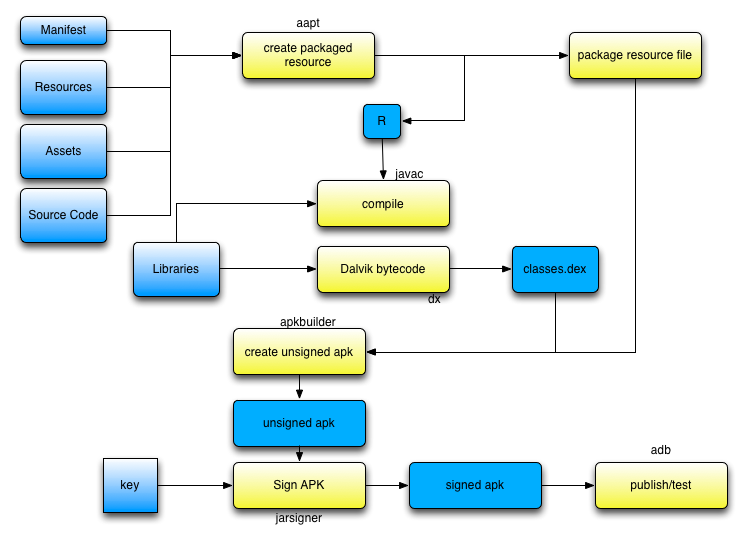
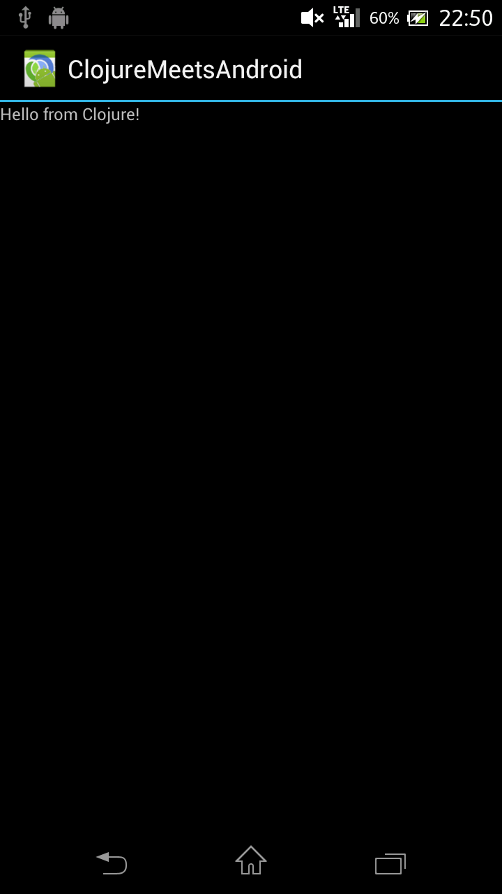
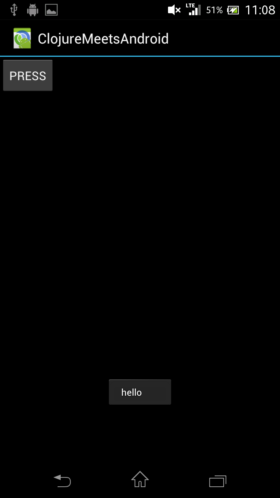
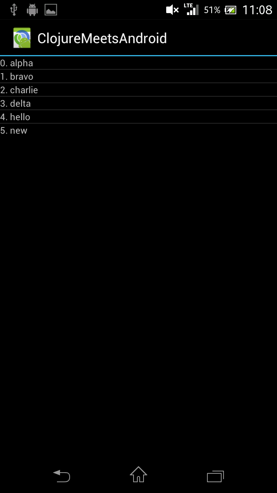

## Android drugged with Clojure 

So we got pretty close to the world of devices and electronics in the last chapter with OpenCV, checking on webcams and working on graphics.

Now this chapter is going one step in the direction of embedded programming before we completely run out of wine, and can't really see what we are programming anymore.
Given the cheap prices of regular and new Android devices, get a second hand Android handset from your favorite kakaku site, and let's hack a little bit.

So, this chapter will present live programming with Clojure on an Android device. Yes, you heard well. changing the User Interface of your application from your usual REPL.

### Getting started

The Android support for Clojure was introduced at the Google Summer of Code 2012, by [Alex Yakushev](http://clojure-android.blogspot.jp/2012/04/proposal-gsoc-2012.html).

Somehow, he took over what was existing in the Clojure ecosystem to [create and run UI](https://github.com/clojure-android/neko) on Android, repackaged a [fork of Clojure](https://github.com/clojure-android) that works smoothly on the Android device and created a [Leiningen plugin](https://github.com/clojure-android/lein-droid) to do all those android tasks. Did I forgot to say a REPL server was embedded in your application and you could remote debug and program just like any other Clojure applications ?

Pure awesomeness for breakfast. 

This chapter is mostly taking your hand, and take you through all the different steps to have some fun with your Android phone.

### Getting started

Most of the code and modules we will be using are coming from the newly created and clean [clojure-android](https://github.com/clojure-android) set of repositories in github.

### Install the SDK

If you have worked with Android before then you already know we need to head to [http://developer.android.com/sdk/index.html](http://developer.android.com/sdk/index.html) and download the latest and greatest of the SDK.

If you have not worked with Android before, all the same, head to the above link and download yourself a nice SDK on your machine.

While I am not going to review the content of each folder yet, because this is mostly outside the scope of this book, here is what you have just extracted on your machine:

![../images/chap08/android_sdk.png]

Within that folder, we need to install a slightly more compatible version of the Android core. We will do that using the *SDK Manager* that can be started using the following command:

    tools/android

And we will install the version 11, as shown in the screenshot below:

![../images/chap08/sdk.png]

That's it. You could play with the native android examples but you have so many Clojure things to do, let's move on.

### Lein Droid

So, with all the toolset available in the Android SDK, there's quite a lot of knowledge needed to get that Clojure anywhere near something that can be used on Android.

To install the Droid plugin, we now know we just have to edit our profiles.clj file with the plugin settings. Here we go:

    {:user {:plugins [
                  [lein-droid/lein-droid "0.1.0-SNAPSHOT"]
                  ; ...
                  ]}}

And we are ready to use it. Now a quick run of:

    lein help droid

Returns a list of ...

    Subtasks available:
    new                   Creates new Android project given the project's name and package name.
    help                  Shows the list of possible `lein droid` subtasks.
    crunch-resources      Updates the pre-processed PNG cache.
    create-dex            Creates a DEX file from the compiled .class files.
    release               Metatask. Builds, packs and deploys the release version of the project.
    deploy                Metatask. Runs `install, `run`, `forward-port`.
    forward-port          Binds a port on the local machine to the port on the device.
    create-apk            Creates a deployment-ready APK file.
    run                   Launches the installed APK on the connected device.
    sign-apk              Signs APK file with the key taken from the keystore.
    build                 Metatask. Builds dependencies, compiles and creates DEX (if not a library).
    repl                  Connects to a remote nREPL server on the device using REPLy.
    init                  Creates project.clj file in an existing Android project folder.
    code-gen              Generates the R.java file from the resources.
    zipalign-apk          Aligns resources locations on 4-byte boundaries in the APK file.
    compile               Compiles both Java and Clojure source files.
    doall                 Metatask. Performs all Android tasks from compilation to the deployment.
    install               Installs the APK on the only (or specified) device or emulator.
    gather-dependencies   Compatibility task. Copies the dependency libraries into the libs/ folder.
    apk                   Metatask. Crunches and packages resources, creates, signs and aligns an APK.
    package-resources     Packages application resources.

And you're like ... whaaaaat ? Should I ? Do ? With all this ? 

That's where a quick glance at the build process should help.

### Build Process

Here we go:

So basically, in a few steps:

* Prepare the resource package from the source tree structure
* Compile the code to regular java bytecode
* Turn that bytecode to Dalvik bytecode, the Android equivalent, smaller and better suited for embedded software
* Assemble the resources and the dalvik bytecode into an unsigned package, named apk
* while the unsigned version can be used, to distribute it you effectively need to sign it.

Voila. "Simple non ?"

But best of it, you do not really need to know all this. Lein droid does it for you.

### Creating the Android project and first run

Using the [tutorial](https://github.com/clojure-android/lein-droid/wiki/Tutorial) as a base line, we will now create the base for our Android project.

The command itself is taken straight from the plugin we have installed:

    lein droid new clojuroid org.stuff.clojuroid :activity MyActivity :target-sdk 11 :app-name ClojureMeetsAndroid

That command is way too long to explain in a one liner, so let's go through it in bullet points:

* lein: our favorite build tool
* droid: the Android plugin for Leiningen
* new: the subcommand for the droid plugin, this will create a new project "a la newnew"
* clojuroid: the name of the clojure project
* org.stuff.clojuroid: the namespace we will use for the clojure code
* :activity MyActivity:  name of the main activity that will be started when the application starts
* :target-sdk 11: I haven't tried to many combination, but targeting Android 3.0 (= 11) brought a great amount of success.
* :app-name ClojureMeetsAndroid: the name of the Android Application.

The code generated we have included in this book's samples.

In the generated *project.clj*, there are a few things we want to chek:

*neko's version*:
neko is the feline animal who's going to help us build the UI for our Android application.
In our case, make sure it is at least version: [neko/neko "2.0.0-snapshot"]

*:sdk-path*: the path to the installation of the Android sdk we have just done.
As quoted below, you can put it in your *profiles.clj* to make it easier to maintain different projects.

        :android {;; Specify the path to the Android SDK directory either
        ;; here or in your ~/.lein/profiles.clj file.
            ;; :sdk-path "/home/user/path/to/android-sdk/"
            :sdk-path "/Users/niko/Downloads/adt-bundle-mac-x86_64-20130514/sdk"

That's about all for the settings. If you have already put the */platform-tools* folders in your path, then let's check the Android phone is correctly connected to our computer with:

    adb devices

Which should return something like:

    List of devices attached 
    CB5A1N28SL  device

Meaning we have a device connected to our machine. Alright !! Bring it up.

    lein droid doall

And .... tadadam ♩

Our first Android application in Clojure just appearing on the screen.

*Hello from Clojure!*

### What's behind the scene ? More on coding Android UI in Clojure

The generated code for the Android application is located in *main.clj*:

@@@ ruby chapter08/clojuroid/src/clojure/org/stuff/clojuroid/main.clj @@@

The code is readable enough so that we can see 4 different blocks:

* namespace declarations: we will see those in details slightly later, for now, those are the ones we will use.
* (declare ^android.app.Activity a): put a forward declaration of the android application
* (defapplication org.stuff.clojuroid.Application): this is it, the core of the code is here. Macro that does the work for us.
* (defactivity org.stuff.clojuroid.MyActivity ...: where we define an Android activity. As describe in the Android [original documentation](http://developer.android.com/reference/android/app/Activity.html), "An activity is a single, focused thing that the user can do." This is where we put the content of our UI.

The activity itself, is defined by a name and a lifecycle:

* a: will be the name of the Activity. Since we have forward referenced it with *declare* we can also access it later on from the current namespace.
* :on-create: the activity has a complete lifecycle, and we will define the UI components when the activity itself is instantiated and created. Here, this is the on-create phase.
* make-ui: takes a vector, and adds widgets one by one into a view
* (on-ui (set-content-view!: on the UI thread, will replace the content of the current view, with something create from make-ui

Voila, that's about it as to how to understand the core of this chapter in 5 minutes. Now the real fun begins.

### Live Programming of an Android UI with Clojure

Yes. There was a nice little Clojure trick in that last example we have seen. If you look carefully at the last message from the *doall* sub command, you probably have seen:

    Binding device port 9999 to local port 9999 ...

In fact, the apk we have installed in our device, actually included a REPL server. Yes indeed. That means that we can just connect and send command to it and do our application live.
Shall we ? 

    lein droid repl

And you should see the following:

    Unable to set signal handlers.
    REPL-y 0.1.10
    Clojure 1.4.0
    reply.eval-modes.nrepl=> 

Yes ! We are ready to code.

So if you remember from the command when we created our project, we use the following top namespace:

    org.stuff.clojuroid

So let's switch to the code in *main* with the usual Clojure ns command:

    (ns org.stuff.clojuroid.main)

The first thing you want to check is that the Activity can be accessed:
    
    org.stuff.clojuroid.main=> a
    #<MyActivity org.stuff.clojuroid.MyActivity@41deab30>

Oh yeah baby. Android Activity nice and ready to be hacked.

#### First Live Programming Session

In our first quick session, we will slowly run through a set of commands and see the updated UI changing real time on the Android handset.

@@@ ruby chapter08/clojuroid/live/first_en.clj @@@

At the end of our coding session, we will get a screen similar to this:

With actually a new notification in the status bar.

#### Android adapters, and live list updating

In our second quick session, we will create a list adapter, and update the values supporting the adapter to see the UI list being reflect in real time.

@@@ ruby chapter08/clojuroid/live/list_en.clj @@@

At the end of our coding session, we will get a screen similar to this:

Easy ? Sweet ? You bet !

#### Starting an intent: Call my number !

In this last live coding session, we will quickly see how to start an [intent](http://developer.android.com/reference/android/content/Intent.html), the base for changing views in Android.

@@@ ruby chapter08/clojuroid/live/intent_en.clj @@@

And you are ready to call and get the dessert:

Hungry for more yet ?

### Android References and what's next

The next thing you should read from now is the list of [namespaces](https://github.com/alexander-yakushev/neko/wiki/Namespaces) from the maintainer of the Neko library, Alexander Yakushev.

I also recommend reading the [lein droid tutorial](https://github.com/clojure-android/lein-droid/wiki/Tutorial) for more info on how to package your application for release.

In this rather short chapter we have seen how to:
* install the Android sdk to have the necessary tools and libraries
* install leiningen android support
* create a new android clojure application ready to be coded
* how to connect a REPL to our cell phone or Android device
* how to change the UI in real time, including how to use list and adapters
* how to start and use an Android Intent through the REPL

That is quite an achievement ! We're getting closer to the end of the meal, but for now, another sip of that bubbly wine.
