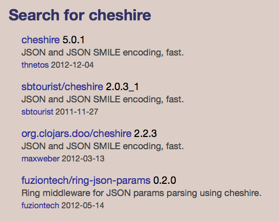
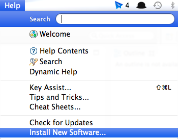
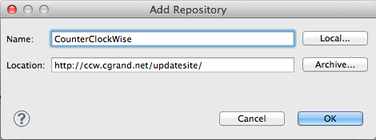
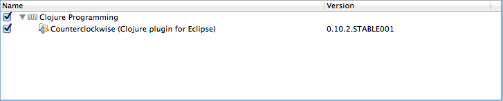
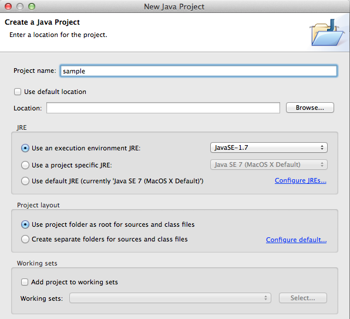
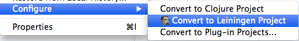
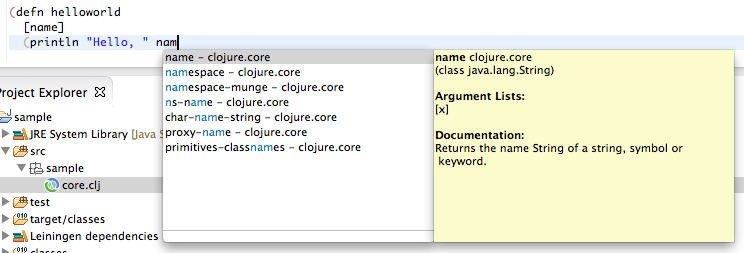
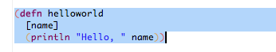
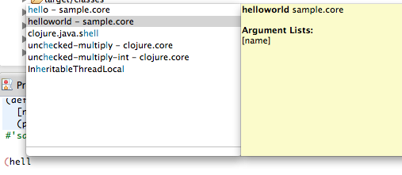

## Clojureするのに必要なもの

###### ヴァン（Vine）: ワインのこと。 料理の注文が終わると、ソムリエがワインを選びに来る。

さっそく、Clojureについて始めましょう。 なぜClojureを使うのか？ コンピュータの達人である必要はありません。

お気に入りのエディタが準備できたら、スタートです

### 道に迷ったときは

この本ではClojureについて、何も無い状態からステップバイステップで一から説明していません。 とは言え、Clojureのインストールだとかセットアップとか必要な場合もあると思います。 ここでは、Web上のリソースを挙げておきますので、参考にしてください。

更新頻度の高いサイト：

[http://learn-clojure.com/clojure_tutorials.html](http://learn-clojure.com/clojure_tutorials.html)

詳細なClojure入門ページ：

[John](http://www.unexpected-vortices.com/clojure/brief-beginners-guide/index.html)

Clojure Koans：
[clojure koans](https://github.com/functional-koans/clojure-koans)

Clojureで迷子になったときのClojureDocs
[cheatsheet](http://clojuredocs.org/quickref/Clojure%20Core)

### LeiningenでClojureを操る
#### REPLがありますか？
Clojureのコードを実行する場合、基本的にこの本ではREPL(Read-Eval-Print-Loop = 「読んで評価して表示して」を繰り返す)を使います。

REPLを使うと、入力されたコマンドはインタプリタによって読み込まれ(Read)、評価され(Eval)、結果が表示(Print)されます。 そして、再びコマンドの入力待ちの状態になります。

入力されたコマンドはすべてメモリ中にあるので、過去に実行したコマンドを再利用したり、コマンドの結果を使ったりすることが出来ます。

Clojureを始めるにあたって、この本ではClojureそのものをインストールするのではなく、代わりにLeiningenというツールをインストールします。 Leiningenを使うことによって、依存関係や実行環境の差異による問題に煩わされることが少なくなるので、Clojureを始める前にClojureが嫌になってしまう可能性が低くなります。

LeiningenのWebサイトはここにあります。

[https://github.com/technomancy/leiningen#installation](https://github.com/technomancy/leiningen#installation)

Unix系環境へのインストール：

* [script](https://raw.github.com/technomancy/leiningen/preview/bin/lein) からleinスクリプトをダウンロード
* $PATH の通った場所に保存する
* 実行可能にする _(chmod 755 lein)_

Windowsへのインストール：

バッチファイル lein.bat をダウンロードします [batch](https://raw.github.com/technomancy/leiningen/preview/bin/lein.bat)
予め wget.exe か curl.exe をインストールしておき、PATH 環境変数にパスを通しておきましょう。 あとは "lein self-install" を実行するだけです。

Cygwin を使っているのであれば、バッチファイルではなく、上記のスクリプトファイルを使用できるはずです。

インストールが終わったら、下記のコマンドで lein のバージョンを確認しましょう。

    lein version

次のように表示されるはずです。

    Leiningen 2.0.0-preview10 on Java 1.7.0_10 Java HotSpot(TM) 64-Bit Server VM

もし、うまく行かないようであれば、上記のサイト等を参考に手順を確認してください。

lein のインストールがうまく行ったら、早速REPLを使ってみましょう。

コマンドラインから "lein REPL" と入力します。

    [niko@Modrzyks-MacBook-Pro-2][11:42][~/projects/mascarpone/chapter01/] % lein repl
    nREPL server started on port 54311
    REPL-y 0.1.0-beta10
    Clojure 1.4.0
        Exit: Control+D or (exit) or (quit)
    Commands: (user/help)
        Docs: (doc function-name-here)
              (find-doc "part-of-name-here")
      Source: (source function-name-here)
              (user/sourcery function-name-here)
     Javadoc: (javadoc java-object-or-class-here)
    Examples from clojuredocs.org: [clojuredocs or cdoc]
              (user/clojuredocs name-here)
              (user/clojuredocs "ns-here" "name-here")
    user=>

このように表示されたでしょうか？ おめでとうございます！

これで、Clojureの最初のレシピを試す準備ができました。 早速、付録.Aにある最初のサンプルを自分で試してみてください。 最初にお話しした通り、実際に自分の手を動かしてみることが大切です。

#### REPL で友達とつながる ?

ここでは Leiningen 2 で可能になったちょっとしたトリックについてお話しします。

起動した REPL に対して、他のユーザがローカル/リモートから接続することが出来ます。

REPL を以下のように起動します。

    lein repl :headless

次のようなメッセージが表示されます。

    nREPL server started on port 53337

ポート番号が表示されたら、他のターミナルから REPL を実行し、そのポートに接続します。

    lein repl :connect 53337

このトリックを使えば、より性能の高いマシンに何かの処理をさせたり、データを持ってきたり、クラウド的なことができますね。

#### 開発の流れ

Lispに慣れている人は、大抵 REPL で開発を行う際の独自の作業手順を持っています。 ここでは、私の見つけた手順を示しますが、是非自分の手順を見つけてください。

* REPLで、必要な変数や計算結果を取得するための入力をする
* 後から使う情報を順々に変数に保存してく
* 再利用できそうなコードは小さなファンクションあるいはコードブロックにする。 それらを利用することで、反復開発が早く簡単になる
* それらのファンクションを使ってビルドすると、副作用もなく、間違いも少ない。
* 他のユーザが使えるように、ファイルやネームスペースはAPIのように作る。
* それぞれのファンクションの機能や副作用について、ちょっとしたドキュメントを書く。

#### 誰かを頼りにしよう

フォアグラを注文したとたん、いくらのトッピングされたサーモンサラダを頼めば良かったと思ったことありませんか？

Clojureの世界で人の書いたコードを取得するには、leinが作成する _project.clj_ というファイルに記述します。 そうすれば、後はleinがやってくれます、

実際の動きを確認するために、以下のコマンドを入力します:

    lein new <appname>

例:

    lein new sample00

    [~/projects/mascarpone/] % lein new sample
    Generating a project called sample based on the 'default' template.
    To see other templates (app, lein plugin, etc), try `lein help new`.

Lein がディレクトリとファイルを作成します:

    .
    ├── README.md
    ├── doc
    │   └── intro.md
    ├── project.clj
    ├── src
    │   └── sample
    │       └── core.clj
    └── test
        └── sample
            └── core_test.clj
    5 directories, 5 files

マークダウン形式のドキュメントファイル、コードを記述するclojureファイル、そして以下のような _project.clj_　ファイルが作成されます。

    (defproject sample "0.1.0-SNAPSHOT"
      :description "FIXME: write description"
      :url "http://example.com/FIXME"
      :license {:name "Eclipse Public License"
                :url "http://www.eclipse.org/legal/epl-v10.html"}
      :dependencies [[org.clojure/clojure "1.4.0"]])

これが正にclojureのコードです。 見れば何となく意味が読み取れて、中にはApache AntとかApache Maven 10.0 とかを思い出す人もいるのではないでしょうか？ もしそうでなくても、今は気にすることありません。 この本を読み進めることで、理解出来るようになります。 ;)

さて、コードの中を見ると、「プロジェクト」に対するメタデータが記述されています。 メタデータ詳細はLeiningenのWebサイトにあります。 [sample file](https://github.com/technomancy/leiningen/blob/master/sample.project.clj)

ここでは、ひとまずプロジェクトに必要な依存関係を記述しましょう。 cheshire という json のパーサライブラリをプロジェクトに追加します:

    [cheshire "5.0.1"]

変更した project.clj は以下の通りです:

    (defproject sample "0.1.0-SNAPSHOT"
      :description "FIXME: write description"
      :url "http://example.com/FIXME"
      :license {:name "Eclipse Public License"
                :url "http://www.eclipse.org/legal/epl-v10.html"}
      :dependencies [
        [org.clojure/clojure "1.4.0"]
        [cheshire "5.0.1"]
        ])

ファイルを変更してREPLを実行すると、lein は1回だけ、以下のようなメッセージを出力します:

    Could not find artifact cheshire:cheshire:pom:5.0.1 in central (http://repo1.maven.org/maven2)
    Retrieving cheshire/cheshire/5.0.1/cheshire-5.0.1.pom (3k)
        from https://clojars.org/repo/
    Retrieving com/fasterxml/jackson/core/jackson-core/2.1.1/jackson-core-2.1.1.pom (6k)
        from http://repo1.maven.org/maven2/
        ...
        ...
    Retrieving cheshire/cheshire/5.0.1/cheshire-5.0.1.jar (12k)
        from https://clojars.org/repo/

lein が自動的に必要な物をダウンロード開始します。 カリフォルニアの片田舎のホテルで、ワインでも飲みながらのんびりとモデム経由でインターネットしているのでなければ、おそらくあっという間にダウンロードが終了します。

ダウンロードが完了したら、早速試してみましょう。 JSON のコードを生成してみます:

    (use 'cheshire.core)

付録のサンプルにある通り、_doc_を使ってドキュメントを取得することが出来ます:

    user=> (doc generate-string)
    -------------------------
    cheshire.core/generate-string
    ([obj] [obj opt-map])
      Returns a JSON-encoding String for the given Clojure object. Takes an
      optional date format string that Date objects will be encoded with.
      The default date format (in UTC) is: yyyy-MM-dd'T'HH:mm:ss'Z'
    nil

まず、通常のClojureシーケンスをJSONに変換します:

    user=> (generate-string '(1 2 3))
    "[1,2,3]"
    user=> (generate-string '{:name (1 2 3)})
    "{\"name\":[1,2,3]}"

そして、逆にJSON文字列をパースして、それをClojureシーケンスに置き換えることもできます:

    user=> (parse-string "{\"foo\":\"bar\"}")
    {"foo" "bar"}

色々な可能性を感じますね。 とりあえず、南仏のシャルドネ 2010 で乾杯しますか。

### Javaライブラリ、そしてIbiblio

もしかしたら、cheshireの依存関係はどこから来るんだろう？と思うかもしれませんね。
Javaの世界では、良いか悪いかは別にして、Mavenは必要なライブラリをibiblioと呼ばれるところにあるJavaのアーカイブから取得します。

[http://mirrors.ibiblio.org/maven2/](http://mirrors.ibiblio.org/maven2/)

純粋なJavaのライブラリであれば、たいていの場合、Clojureでも同じようにibiblioからダウンロードされます。

例えば、有名なApacheのライブラリにcommon-ioというのがあります。
それに対応するpomと呼ばれるファイルがあります:

[descriptor](http://mirrors.ibiblio.org/maven2/commons-io/commons-io/2.4/commons-io-2.4.pom)

pomの中身は、大量のXMLですが、その中に以下の記述があります:

    <groupId>commons-io</groupId>
    <artifactId>commons-io</artifactId>
    <version>2.4</version>

これをClojureの世界の言葉に置き換えると:

    [commons-io/commons-io "2.4"]

ということで、以下の記述でJavaの世界とつなげることができます:

    user=> (org.apache.commons.io.FileUtils/readLines (java.io.File. "README.md") "UTF-8")
    #<ArrayList [# sample, , A Clojure library designed to ... well, that part is up to you., , ## Usage, , FIXME, , ## License, , Copyright © 2013 FIXME, , Distributed under the Eclipse Public License, the same as Clojure.]>

この本では、これからも色々なJavaとの連携について出てきますが、興味があれば次のサイトを参照すると良いでしょう。
[Clojure interop page](http://clojure.org/java_interop).

### ClojarとClojureライブラリ

Clojureに特化したライブラリは、ここで見つけることができます:

[Clojar](https://clojars.org/).

前のセクションで使ったCheshireをClojarで見つけるには、次のようにアクセスします:

    https://clojars.org/search?q=cheshire

すると、以下のように表示されます:

Clojureを使う人はほとんど皆Clojarを利用しているので、そこには最新のコードが存在するはずです。

以上、何か材料が必要になったときに探すべき2つの場所を紹介しました。 これで、素晴らしい献立が思いついても、材料が無くて断念。。ということが少なくなりそうですね。

では、ワインをもう一杯？

### LeiningenでClojarsを探す

LeiningenでClojarsのライブラリを探すことが出来ますが、少し説明が必要です。

  lein search "postal"

このコマンドは、正規表現を使っていて、見た目よりも動作が少し複雑です。 実際にこのコマンドを実行すると、以下のような表示が出力されます:

  Searching over Artifact ID...
   == Showing page 1 / 1
  [paddleguru/postal "1.7-SNAPSHOT"]
  [org.jmatt/postal "1.6-SNAPSHOT"]
  [org.clojars.sethtrain/postal "0.2.0"] Clojure email support
  [org.clojars.sethtrain/postal "0.1.0-SNAPSHOT"] Clojure email support
  [org.clojars.maxweber/postal "1.6-SNAPSHOT"]
  [org.clojars.doo/postal "1.8-SNAPSHOT"]
  [org.clojars.danlarkin/postal "1.3.2-SNAPSHOT"]
  [org.clojars.btw0/postal "1.4.0-SNAPSHOT"]
  [org.clojars.blucas/postal "1.8-SNAPSHOT"]
  [com.draines/postal "1.7.1"]
  ...
  [com.draines/postal "1.9.1"]
  [com.draines/postal "1.9.2"]

※ もしインターネットの接続状態が悪いと、ローカルの検索インデックスが壊れてしまうことがあります。 その場合は、以下のフォルダを削除します:

  ~/.lein/indices

そうすることで、次回の _lein search_ 実行時に検索インデックスが再構築されます。

### パンとバター。 Leiningenのプラグインをインストールする

Leiningen にはプラグインの新しい定義方法があります。 数年前、プラグインはプロジェクトごとにインストールが必要でした。 なので、新しいプロジェクトを始めるたびに必要なプラグインをまたインストールして、別のプロジェクトを作ったらまた同じプラグインをインストールして。。ということを繰り返す必要がありました。 ま、ワインを飲みながらであれば、あまり時間も気にならないかも知れませんが。。

今は、以下のファイルにClojure流の定義を書くことが出来るようになりました。

    ~/.lein/profiles.clj

Clojar自体がホストしているシンプルですがとても有用な _lein-pprint_ というプラグインがあります。

このプラグインを使用する場合、上記のファイルには以下のように記述します:

    {:user {:plugins [[lein-pprint "1.1.1"]]}}

すると、leinはプラグインを見つけ、ダウンロードし、使えるようにします。 _lein help_ を実行すると、以下のように表示されます:

    Several tasks are available:
    check               Check syntax and warn on reflection.
    ...
    pprint              Pretty-print a representation of the project map.
    repl                Start a repl session either
    test                Run the project's tests.
    ...

そして、次のコマンドによって、すべてのプロジェクトからプラグインが使えるようになります:

    lein pprint

すべての関連するメタデータをClojureプロジェクトに出力します。

### 作ったコードをClojarsで共有する

Leiningen2 は Clojarと連携するのに、もうプラグインを必要としません。

    lein deploy clojars

これだけで、裏ではあなたのコードはアーカイブされ、_jar_ファイルはメタデータと共にClojarに転送されます。

そして、他の開発者は我々が今やったことと同じ手順であなたのコードを使うことが出来るようになるのです。

デプロイの状況を見るには:

    lein help deploying

と入力します。

### 依存関係を見る

依存関係を確認するには、以下のコマンドを実行するのでしたね:

    lein deps :tree

ここまでの作業をやっているのであれば、以下のように表示されます:

     [cheshire "5.0.1"]
       [com.fasterxml.jackson.core/jackson-core "2.1.1"]
       [com.fasterxml.jackson.dataformat/jackson-dataformat-smile "2.1.1"]
     [commons-io "2.4"]
     [org.clojure/clojure "1.4.0"]

### Eclipseで一仕事

Clojureに最適なIDEはおそらくEclipseでしょう。 Eclipseは以下のサイトからダウンロード可能です:

    http://www.eclipse.org/downloads/index-developer.php

CounterClockWiseはClojureの開発にとても適したEclipseのプラグインで、頻繁にアップデートされています。

[http://code.google.com/p/counterclockwise/](http://code.google.com/p/counterclockwise/)

Counterclockwise のインストールは、下記メニューから行います:

次のアップデートサイトのURLを追加します:

    http://ccw.cgrand.net/updatesite/

これでプラグインがインストールされ、生成したプロジェクトをインポートできるようになりました。

通常のJavaプロジェクトとしてインポートします:

続いて、Leiningenを使用するように設定を変更します:

これでEclipseから直接REPLを開始できるようになりました !

Eclipseを使う一番の理由は、やはりその素晴らしい補完機能でしょうか。 早速試してみましょう:

新しいコード入力して、 _Command-Enter_ を押すと:

REPLから直接補完されます:

ちょー簡単ですね。

### セッションにライブラリをダイナミックに追加する

Eclipseからコマンドラインに話を戻すと、気がついているかも知れませんが、Clojureで何かを変更すると毎回REPLを起動し直さないと新しい依存関係が反映されません。

_Chas Emerick_ は、こりゃ面倒だと思い、pomegranateという魔法のライブラリにすべてを取り込むようにして、実行時に依存関係を追加できるようにしました。

プロジェクトでずっと利用するライブラリではなく、開発時にちょっと試すようなライブラリを追加してみましょう。

まずは、pomegranateを _project.clj_ に定義します:

    :profiles {:dev {:dependencies [
        [com.cemerick/pomegranate "0.0.13"]]}}

REPLを起動します。

    lein repl

必要な新しいネームスペースをインポートします:

    (use '[cemerick.pomegranate :only (add-dependencies)])

xyzzyというXMLライブラリをインポートしてみます

    (add-dependencies
        :coordinates '[[antler/xyzzy "0.1.0"]]
        :repositories {"clojars" "http://clojars.org/repo"})

classpathに追加された依存関係が出力されます:

    {[org.clojure/data.zip "0.1.0"] nil, [org.clojure/clojure "1.3.0"] nil, [antler/xyzzy "0.1.0"] #{[org.clojure/clojure "1.3.0"] [org.clojure/data.zip "0.1.0"]}}

これで、新たにダウンロードされたライブラリを呼び出すことが出来ます。:

    (require '[xyzzy.core :as xyzzy])

    (xyzzy/parse-xml "<html><body><h1>It works</h1></body></html>")

ライブラリでパースした結果が表示されます:

    [{:tag :html, :attrs nil, :content [{:tag :body, :attrs nil, :content [{:tag :h1, :attrs nil, :content ["It works"]}]}]} nil]

もちろん、試して気に入ったら _project.clj_ に定義します。

### 内緒でScalaのコードを走らせる

もし、leinプロジェクトのソースファイルを統合したいのであれば、 [scalac-plugin](https://github.com/technomancy/lein-scalac) を使うことが出来ます。

プラグインのインストールはとても簡単です:

* [lein-scalac "0.1.0"] を :plugins project.clj に追加する。
* :scala-source-path in project.clj に .scala ソースファイルのある場所(通常、"src/scala")を設定する。
* .class ファイルにコンパイルする:

    lein scalac

* もし、scalac を自動的に実行するのであれば、 :prep-tasks ["scalac"] を project.clj に追加する
* たいていの場合、scala-library の設定も必要です:

    :dependencies [org.scala-lang/scala-library "2.9.1"]

では、実施の scala のコードを書いてみましょう:

@@@ ruby chapter01/src/scala/sample.scala @@@

で、それを Clojure から呼び出すには:

@@@ ruby chapter01/src/sample/scala.clj @@@

以下のように出力されます。

    sample.core=> (import HelloWorld)
    HelloWorld
    sample.core=> (.sayHelloToClojure (HelloWorld.) "Hi there")
    "Here's the second echo message from Scala: Hi there"

お友達にJVM上で別の言語が使えるようになったと自慢しましょう。 :)

それか、ウェイトレスさんに別の品種のワインをお願いしましょう！

### Javaのコードを走らせるっていうのは、ここだけの話

前のセクションの内容は、昔のスタイルのJavaでも使うことが出来ます。

まず、javaのclassを用意します:

@@@ ruby chapter01/src/java/HelloWorldJava.java @@@

_project.clj_ を設定します:

    ; javaのクラスへのパス
    :java-source-paths ["src/java"]
    ; javacのコンパイルオプション
    :javac-opts ["-target" "1.6" "-source" "1.6" "-Xlint:-options"]

もう一行、以下の修正をします:

    :prep-tasks ["scalac" "javac"]

これで、scalacに加えてjavacが実行されるようになります。
REPLを再起動して、以下のClojureコードを入力します:

    sample.core=> (.sayHello (HelloWorldJava.) "World")
    "This is a warm welcome from old Java to World"

### Clojureのメソッドをhookeでラップする

前のセクションで紹介した javac プラグインのサンプルを探しているときに、偶然ですが、関数をフックする素晴らしい方法を見つけました。

_project.clj_ ファイルに依存関係を記述しましょう:

    [robert/hooke "1.3.0"]

そして、サンプルを動かしてみましょう:

@@@ ruby chapter01/src/sample/hooke.clj @@@

これで、手軽に関数を拡張することができるようになりました！ しかも美しく・・？ :)

### One more ruby: Jruby

Just for the sake of it, if you need to run a some Ruby code but do not want to go through the pain of the set up, you can just ask Leiningen.

Add

    [lein-jruby "0.1.0"]

to the _:plugins_ section of your settings file _profile.clj_.

Then, you can could scripts this way:

    lein jruby -S src/ruby/fibonacci.rb 1000

fibonacci.rb is a matrix way of computing fibonacci numbers in Ruby. See:

@@@ ruby chapter01/src/ruby/fibonacci.rb @@@

Again, you do not need to have ruby install to get this running.
The first example was without any dependencies, but if you need jruby to install a ruby gem for you, here is how you do it:

    lein jruby -S gem install json-jruby

Then you can can call the ruby example that can be found in the chapter01:

@@@ ruby chapter01/src/ruby/json.rb @@@

with

    lein jruby -S src/ruby/json.rb

Voila. Ruby wine. But do not forget to keep reading this book and learn Clojure.

### おいしいプラグインのスープLeiningen仕立て
### Rubyをもう一つ： Jruby
### Leiningen用のプラグインを書いてみる
### clojure-contribって知ってる？ ヤバいよ、それ。
### サンプル
### 自分専用のWebベース Clojureインタープリタを作る