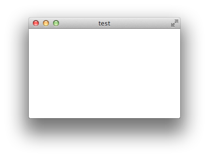
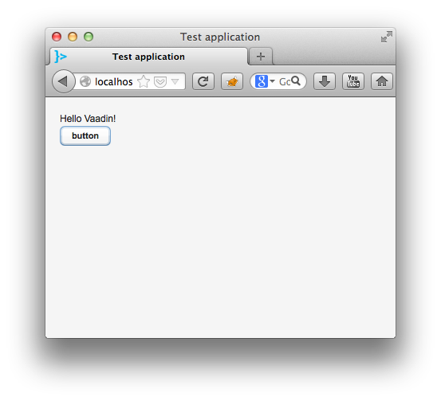
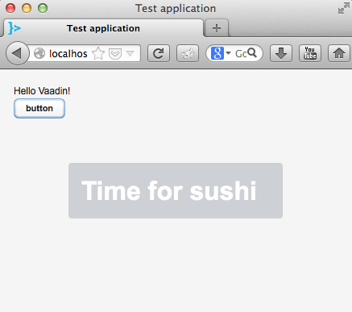
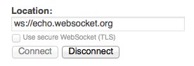
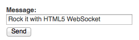
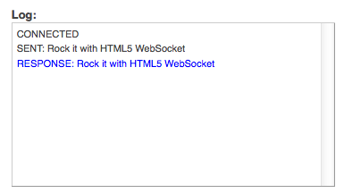
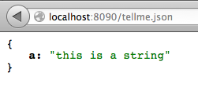

### おまけ

#### JavaFX UI

通常のInteropコールを使ってJavaFX UIを作る:

@@@ ruby chapter03x/simple-javafx/src/javafx/core.clj @@@

simple-javafxプロジェクトのフォルダへ行き、以下のコマンドでそのまま実行することが出来ます:

    lein run

以下の空っぽのウィンドウが表示されます。

#### Vaadin

以前、[Vaadin](https://vaadin.com/home)を銀行システムで使ったことがあります。

ClojureでVaadinを使うには、Clojureのコードを呼び出すJava Servletを用意する必要があります。

そのservletがこれです:

@@@ ruby chapter03x/simple-vaadin/src/vaadin/servlet.clj @@@

次に、Clojureの中にVaadinアプリケーション・オブジェクトを定義します:

@@@ ruby chapter03x/simple-vaadin/src/vaadin/nico.clj @@@

以下のコマンドでスタートします:

    lein run

これで、Vaadinのアプリケーションが起動しました:

ボタンをクリックすると、*Button$ClickListener*を経由して:

#### Lein-exec, scripting Clojure

[lein-exec](https://github.com/kumarshantanu/lein-exec) is a plugin for leiningen that now allows you to script whatever you want in Clojure. That's it. Leiningen is actually put in the background for a bit, and you can run your one off script when needed.

To install lein-exec we write the plugin dependency in our *profiles.clj* file:

    {:user {:plugins [[lein-exec "0.3.0"]]}}

We now have access to the following Leiningen shortcut:

    lein exec -e <string-s-expr>

That we can try straight away with:

    lein exec -e "(println (+ 1 1))"
    > 2

We can also run scripts written in files, so our good old friend factorial can be called from Clojure:

@@@ ruby chapter03x/lein-exec/factorial.clj @@@

And run it with:

    lein exec factorial.clj 20
    > 2432902008176640000

##### Executable scripts

On Unix machines, it gets even better with the proper shebang. As you have seen the factorial.clj file contains:

    #!/bin/bash lein-exec

To install the necessary files we download them and put them in our classpath:

    $ wget https://raw.github.com/kumarshantanu/lein-exec/master/lein-exec
    $ wget https://raw.github.com/kumarshantanu/lein-exec/master/lein-exec-p
    $ chmod a+x lein-exec lein-exec-p
    $ mv lein-exec lein-exec-p ~/bin  # assuming ~/bin is in PATH

Now, the factorial.clj file can be turned into an executable with:

    ./factorial.clj 20
    > 2432902008176640000

##### Dependencies

The "Cerise sur le gateau" is the dependency feature available to us through some pomegranate magic.

To create a Ring application (see the web chapter) on the spot, we call:

    (use '[leiningen.exec :only  (deps)])
    (deps '[[ring "1.2.0-beta1"]])
    (deps '[[compojure "1.1.5"]])

First line brings the power of pomegranate to us, the two other lines, are fetching the dependencies.

So running the script with:

    ./ring.clj

Brings a full webservice application that can be tweaked at will right on the sweeeeet spot.

##### Websockets on the spot

Building on the power of the ring example above, we have included a chat room based on *http-kit* that we have seen earlier.

Running the script with:

    ./async.clj

Brings some chat room goodness. Your browser will open, and you can try it following the indications on the screen:

Could not get any sweeter.

Note that by some random accident, that *async.clj* example also includes parsing and returning json.

Try to access:

    http://localhost:8090/tellme.json

And check the result by yourself. !

