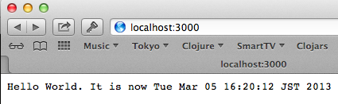

## Clojureでお手軽、チョー楽しいWeb開発

###### プラ（Plat） ポワソン:メインのお魚料理

### Lord of the Ring：Web開発の最強パートナー

[Ring](https://github.com/ring-clojure/ring) はライブラリというか、RubyのRackに触発されたライブラリセットです。

Ring はローレベルのフレームワークなのでインポートして使いたいものだけ使うのですが、逆に言うとキチっとコンセプトを理解する必要があるということです。

#### コンセプト
Ringアプリケーションのコア・コンポーネント:

##### ハンドラ

Ringハンドラはインプットのリクエストマップを受け取り、レスポンスマップを返すClojure関数です。 シンプルな例を挙げると:

    (defn what-is-my-ip [request]
      {:status 200
       :headers {"Content-Type" "text/plain"}
       :body (:remote-addr request)})

##### リクエスト

Ringリクエストはシンプルなマップです。 キーには以下のものがあります:

* :server-port リクエストを処理するポート
* :server-name 解決されたサーバ名、またはIPアドレス
* :remote-addr クライアントのIPアドレス、またはリクエストを送信した最終のプロキシ
* :uri リクエストURI
* :query-string クエリ文字列(もしあれば)
* :scheme トランスポート・プロトコル http または https.
* :request-method HTTP リクエストメソッド :get、:head、:options、:put、:post、:delete のいずれか
* :content-type リクエストボディのMIMEタイプ (分かっている場合)
* :content-length リクエストボディのバイト数 (分かっている場合)
* :character-encoding エンコーディング (分かっている場合)
* :headers ヘッダ値に一致する小文字のヘッダ名文字列の Clojureマップ
* :body リクエストボディ (存在する場合)

##### レスポンス

Ring レスポンスは３つのパラメータで構成されるマップです:

* :status HTTP ステータスコード  例：200、302、404、...
* :headers HTTPヘッダ名のClojureマップ
* :body レスポンスボディ  下記のいずれか:
** 文字列
** ISeq
** ファイル
** 入力ストリーム

##### ミドルウェア

ミドルウェアは少なくとも一つのハンドラを受け取り、ハンドラとして振る舞う関数を返す高レベルの関数です。 例えば、Ringではパラメータ、セッション、ファイルのアップロードはミドルウェアによって処理されます。

#### Ring の世界

お決まりの HelloWorld サンプルを動かすために、Ringをプロジェクトに追加します:

    [ring "1.1.8"]

そして、リクエストを処理するためのRingハンドラが必要ですね。

@@@ ruby chapter04/src/chapter04/core.clj @@@

ここで、HTTPレイヤーの処理が必要ですが、サンプルではJVMで動くWebサーバとしては大変信頼性のあるJettyを使っています。 Jettyは*ring*パッケージに含まれてるので、インストールや依存関係の設定をする必要はありません。

以下のコードでサーバをスタートします:

@@@ ruby chapter04/src/chapter04/jetty.clj @@@

[http://localhost:3000](http://localhost:3000) にアクセスしてみましょう。 Ringの世界にようこそ！

#### Ring の世界 2: leiningen を使う

さて、WebアプリケーションをいちいちREPLから起動するのもちょっと面倒ですね。 そんな大げさなことをしなくても、もっと手軽に出来ないものでしょうか？

project.clj ファイルに以下の２行を追加しましょう:

      :plugins [[lein-ring "0.8.3"]]
      :ring {:handler chapter04.core/handler}

これで何が変わるかというと、[lein-ring](https://github.com/weavejester/lein-ring)というleiningenのプラグインが使えるようになり、２行目では呼び出されるハンドラを指定しています。

では、ウェイター、、、ではなくサーバを呼びましょう:

    lein ring server

以下のように表示されたでしょうか？

コードを変更したときにWebアプリケーションを再起動する必要の無いことに注意してください。 ハンドラのコードを変更したら、すぐにそれが反映されますね！

アジャイル・ワインとでも呼びましょうか。

#### Compojure による HTTPルーティング

##### セレブにルーティング

Webアプリケーションの基本は分かりました。 って言っても、毎回HelloWorldばかりを見ているわけにも行かないので、もう少しセクシーなアプリケーションにしましょう。

まずは、[Compojure](https://github.com/weavejester/compojure) を使ってサンプルをやってみましょう [sample app](https://github.com/weavejester/compojure-example).

依存関係のリストを見ると Compojure はRingに含まれていますが、念のため、project.cljに以下の設定をしておきましょう:

    [compojure "1.1.5"]
    [hiccup "1.0.2"]

第1章で使った hiccup も設定に加えています:

@@@ ruby chapter04_01/project.clj @@@

このアプリケーションには、ルーティングの定義をするファイルとビューの定義をする２つのファイルがあります。

まず、ルーティング部分です:

@@@ ruby chapter04_01/src/compojure/example/routes.clj @@@

ルーティングは、４つのパートに別れた行ベースのDSLで記述されています:

    (GET "/" [] (index-page))

GET : 最初のパートはHTTPのメソッドで、この場合はGETです。 ANYはすべてに合致します。

"/" : ルートパス ２番目のサンプルでは、"/user/:id"というパターンを使ってパラメータを受け取っています。

[] : リクエストマップからの情報を受け取る配列

(index-page) : 第1章で見たようにhiccupがhtmlを生成するためのシンプルなClojure関数。 関数の実際の中身はこんな感じ:

@@@ ruby chapter04_01/src/compojure/example/views.clj @@@

これで準備ができました。 先ほどと同じメソッドを使ってサーバをスタートしましょう:

    lein ring server

さて、ルーティングが出来たとなると、次はJSONを使ったWebサービスでしょうか？ ここではやりませんが、ぜひチャレンジしてみてください。 以前に使ったライブラリ *cheshire* をインクルードして、レスポンスの中で適切なcontent-typeをセットし、JSONマップを返すようにすれば出来ると思います。

##### Clojureのデータ分解機能について

良い機会なので、一連のデータから必要なものだけにアクセスするClojureの*destructuring*について説明しましょう。

ルーティングDSLの２番目のパラメータ、[]を思い出してください。

    (GET "/" [] (index-page))

例えば、訪問者のIPアドレスを取得したいとします。 その場合、リクエスト自体のマップのサブセットを作成する分解フォームとして２番目のパラメータを使うことが出来ます。 少し前に、リクエストはシンプルなマップであると説明しました。 上記のサンプルをちょこっと変更して:

    (GET "/yourip" {ip :remote-addr} (str "Your IP is:" ip))

元々のリクエストマップから、:remote-addrパラメータを受け取ります。 でも、待って。 元々のリクエストマップって何でしたっけ？ これです:

@@@ ruby chapter04_01/resources/public/request-sample.json @@@

Ringサーバをスタートしているのであれば、以下のアドレスに直接アクセスして見ることもできます:

    http://localhost:3000/request-sample.json

次は、セキュリティ関連です。

### 何でもかんでもNoirなワケじゃないけど、数行のコードでWebサイトが出来上がる
### 面倒な作業はVaadinとかGoogle Web Toolkitにお任せ
#### 初めての Vaadin アプリケーション
### Compojure はクールなWebフレームワーク
### AlephのおかげでWebソケットはとてもシンプルになりました
### RESTful なアプリケーションは今や当たり前