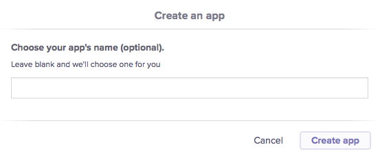
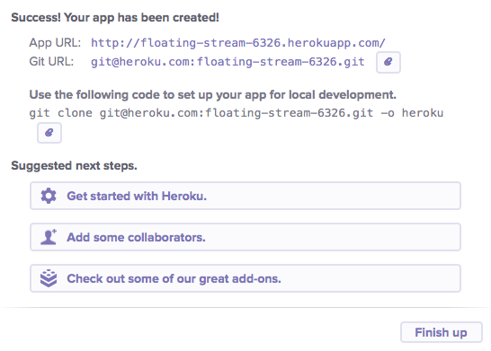
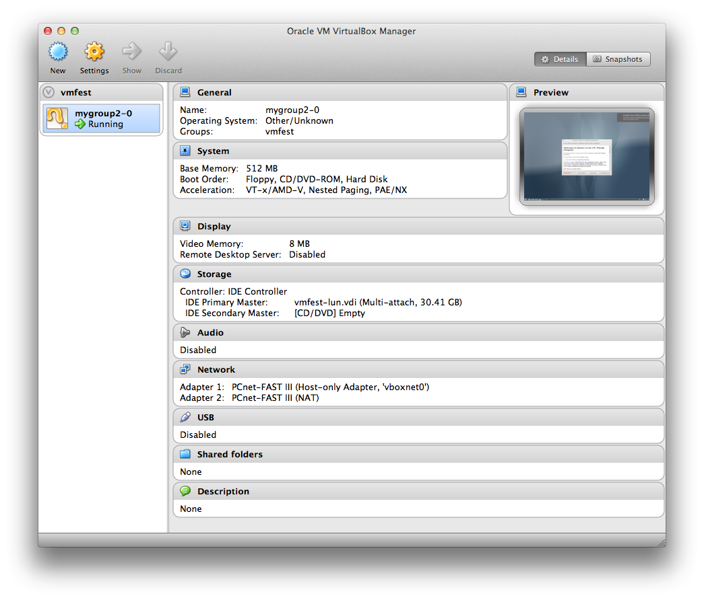

## クラウドとClojure、明るい日々

### 5分でHerokuにデプロイする。

このレシピでは、[Deploying Clojure Web Application on Heroku](https://devcenter.heroku.com/articles/clojure-web-application) に書かれている素晴らしいドキュメントを紹介します。 ぜひ、オリジナルを一度参照してください。

#### 新しいプロジェクトを生成する

Heroku用のWebアプリケーションを作るために、Webの章でやったRingのアプリケーションをもう一度作成しましょう。

ここでは、luminusテンプレートを再利用し、leiningenを実行してプロジェクトを生成しましょう:

		lein new luminus test-project

以下のコマンドを実行して、プロジェクトが動くことを確認しましょう。

		lein ring server

以下のURLを確認します:

		http://localhost:3000/

herokuの第一歩は成功です。

#### Heroku toolbelt

HerokuにはToolbeltと呼ばれるツールがあります:

[https://toolbelt.heroku.com/](https://toolbelt.heroku.com/)

WindowsやMacを含む大体のプラットフォームで動作し、Herokuアプリケーションをコントロールすることができます。

* git
* foreman
* heroku Command Line Interface

上記の２番目と３番目のツールは必ずしも必要ではありませんが、日々の作業を楽にしてくれます。 Herokuは基本的にGitベースなので、Gitのインストールは必須です。

#### SSH でのアクセスを準備する

すでにsshがあるなら、herokuのアカウントに追加しましょう。 以下のページに、公開鍵をコピーします:

[https://dashboard.heroku.com/account](https://dashboard.heroku.com/account)

もう一つの方法は、Toolbeltを使って以下のコマンドでHerokuにログインします:

		heroku login

herokuのeメールとパスワードを入力すると、herokuにログインし、Heroku サービスの認証を行います。

最後に、SSHキーを作成する場合の方法です。

新しいSSHキーのセットは、以下のコマンドで生成します:

		 ssh-keygen -t rsa -f ~/.ssh/id_rsa_heroku

生成されたキーをローカルのsshエージェントに追加します:

		ssh-add ~/.ssh/id_rsa_heroku

以下のコマンドを実行したときに、追加したキーが表示されることを確認します:

		 ssh-add -l

不要なキーは -d フラグを指定して削除します (sshエージェントからは削除されますが、キーそのものは削除されません。)

		ssh-add -d /Users/Niko/.ssh/id_rsa_hellonico

キーをアカウントに追加する:

[https://dashboard.heroku.com/account](https://dashboard.heroku.com/account)

これで、認証が出来ました。 次はいよいよherokuのセットアップです。

#### herokuのセットアップ

Herokuの新しいアプリケーションを作成します。 再度、herokuのアカウントページに移動し、以下の手順で新しいアプリケーションを作りましょう:

Clojureのアプリケーションに戻って、必要なリモートのgitを追加します。

		git remote add heroku git@heroku.com:glacial-tundra-7926.git

次に、gitのpushを実行します:

		git push heroku master

これで、我々のアプリケーションがクラウドで実行できるようになりました:

[http://glacial-tundra-7926.herokuapp.com/](http://glacial-tundra-7926.herokuapp.com/)]

ちなみにHerokuのToolbeltを使うと、同等のことを以下のコマンドで実行できます:

		heroku apps:create

#### ちょっと説明

Heroku はAmazon AWSで動いており、色々な面倒なことをあなたの代わりにやってくれます。 Herokuは [Foreman gem](ddollar.github.io/foreman/) をベースにしたRubyベースのインフラに大きく依存しています。

アプリケーションに対してHerokuが何をすべきかを伝えるには _Procfile_ ファイルが必要です:

		web: lein with-profile production trampoline ring server

次のように省略して書くことも出来ます:

		web: lein ring server

これは以前我々が使用したコマンドを含んでいます。 RingベースのClojure Webアプリケーションを実行する一番シンプルなバージョンです。

先ほどインストールしたToolbeltはHerokuと同じやり方でローカルにアプリケーションを実行することができるForemanユーティリティを含んでいます。
		foreman start

#### オフスクリプト

chapter06/test-heroku のサンプルでは、シンプルなフィボナッチのスクリプトを使いました:

@@@ ruby chapter06/test-heroku/src/demo.clj @@@

このスクリプトをHerokuのインフラでオフスクリプトとして実行することができます。

プロジェクトフォルダからローカルにスクリプトを実行するには:

		lein trampoline run -m demo 100

これをHerokuで走らせるには、プレフィックスコマンドを追加します:

		heroku run lein trampoline run -m demo 100

※ Heroku Toolbeltがインストールされ、herokuコマンドにパスが通っていること

詳細は [one-off script](https://devcenter.heroku.com/articles/clojure#oneoff-scripts) を参照してください。

#### HerokuでもっとClojure、リアルタイムでデバッグ

HerokuでClojureアプリケーションを動かすためのTipsを見てきました。 少しでも興味を持ってもらえたら良いのですが。

この本ではここまでずっと実際にコードを動かしながら進めてきて、飲んだワインもかなりの量になりましたね。 ここでは、REPLに接続するとても画期的な方法を紹介しましょう。

このレシピは [Debugging clojure on Heroku](https://devcenter.heroku.com/articles/debugging-clojure) に触発されて書きました。

まず、gitでコードをチェックアウトします:

		git clone https://github.com/technomancy/chortles.git

Chortles はワールドワイドウェブのオフィシャルアプリケーションで:

		HTTPとJSON経由で笑いの規模を計算する

アプリケーションのクローンが準備出来たら、Herokuの自分のアカウントにセットアップしましょう:

		heroku apps:create

新しいアプリケーションがアカウントに登録されるので、以前にも使ったherokuのコマンドでpushしましょう:

		git push heroku master

他の人にコードをいじられないように、プライバシー設定も
しておきましょう:

		heroku config:set AUTH_USER=nico AUTH_PASS=nico

このコマンドを使えば、Herokuで動かすアプリケーションに必要なシステム環境の設定を行うことが出来ます。

### Google App Engine へデプロイするときのメモ

Google App EngineにClojureアプリケーションをデプロイするには主に２通りの方法がありました。

* [AppEngine-magic](https://github.com/gcv/appengine-magic)
* [Gaeshi](https://github.com/slagyr/gaeshi)

が、最初の方法はちょっと古く、２番目の方法はここのところ廃れ気味です。。

だったら、何かいい方法がないかググってみましょう。 もしかしたら、あなた自身が何かいい方法を思いつくかも知れませんね！

#### ということで、Gaeshi

まず、あまり手のかからなそうなGaeshiを試して、５分でアプリケーションをGAEにデプロイしてみましょう。

最初に、以下の場所からGoogleが提供しているコマンドラインツールをダウンロードしましょう:

[https://developers.google.com/appengine/downloads](https://developers.google.com/appengine/downloads)

このツールは直接使用はしませんが、展開して、後で使うのでパスをメモっておきましょう。

~/.lein/profiles.clj にLeiningenのプラグインを追加します。

		{:user {:plugins [
									[gaeshi/lein-gaeshi "0.10.0"]
									...
									]}}

これで、新しいプロジェクトを１から作る準備が整いましたので、新しく追加したプラグインを使っていくつかコマンドを実行しましょう:

		lein gaeshi new test_1
		cd test_1
		lein gaeshi server

以上で、google app engineがローカルに複製されましたので、直接それを使って開発することが出来るようになりました。

ブラウザで下記URLにアクセスしてみましょう:

[http://localhost:8080/](http://localhost:8080/)

もしもGaeshiのオプションを確認したければ、下記を参考にヘルプを表示してください:

		gaeshi/lein-gaeshi 0.10.0: Command line component for Gaeshi; A Clojure framework for Google App Engine.
		Usage: [lein] gaeshi [options] <command> [command options]
			command  The name of the command to execute. Use --help for a listing of command.
			-v, --version  Shows the current joodo/kuzushi version.
			-h, --help     You're looking at it.
			Commands:
			deploy    Deploy the project to Google AppEngine
			generate  Generates files for various components at the specified namespace:
										controller - new controller and spec file
			help      Prints help message for commands: gaeshi help <command>
			new       Creates all the needed files for new Gaeshi project.
			prepare   Build a deployable directory structure of the app
			server    Starts the app in on a local web server
			version   Prints the current version of gaeshi/lein-gaeshi

#### Googleの準備

下記の場所から、Google App Engineのアプリケーションを作りましょう:

[https://appengine.google.com/start/createapp](https://appengine.google.com/start/createapp)

画面の表示に従って、アプリケーションを作成します。 この本の読者であれば、おそらく簡単に完了するものと思います:

アプリケーションの名前は後で再利用出来ますが、とりあえず覚えておきましょう。

#### アプリケーションをGoogle App Engineにアタッチする

以下のファイル

		config/production/appengine-web.xml

のドメイン名を確認します： <application>sub_domain_name</application>
例えば、アプリケーションに pure_natto　という名前を付けたのであれば、上記の表記は、

		<application>pure-natto</application>

となり、GAEでのドメインは pure-natto.appspot.com となります。

		最後に、~/.gaeshi/ にClojureのプロジェクト名と同じ名前の設定ファイルが必要です。

プロジェクトの名前が test-1 なら、設定ファイルは

		~/.gaeshi/test-1

となります。 ファイルの中身は以下のようになります:

		{
		:appengine-sdk-dir "/path/to/appengine-java-sdk-1.4.3"
		:appengine-email "sato.satoshi@gmail.com"
		:appengine-password "yourpassword"
		}

これで準備は終わりです。 Gaeshiプラグインを再度実行してデプロイしましょう:

		lein gaeshi deploy production

数秒の後、下記のURLでアプリケーションを確認出来ます:

		http://<application_name>.appspot.com/

このドキュメントの古いバージョンをオンラインでみることが出来ます:

		http://gaeshidocs.appspot.com/

見てみてください。

#### 制限

既にご存知かも知れませんが、GAEはスレッドに関して重要な制限があり、仮想的に制御したり、新規に作成することが出来ません。

ということは、_clojure futures_ は使えないということです。

ですが、もしその制限を受け入れられるのであれば、GAEは信頼性やGoogleのインフラとの連携などアプリケーションのホスト環境として充分に強力な選択肢の一つとなるでしょう。

また、最近、Googleは例のGoogle GlassプロジェクトでGAEアプリケーションを使用しているので、もしかしたら色々な新しい機能が追加されたり、機能的な制限が制限でなくなったりってこともあるかも知れませんね。

### Cloudbees

[Cloudbees](http://www.cloudbees.com/) は信頼性のあるクラウドデプロイメントを提供するPaaSプロバイダです。

CloudBeesは非常にシンプルで、[brilliant page](http://blog.cloudbees.com/2011/11/easy-deployment-of-clojure-apps-on.html) でClojureアプリケーションのデプロイに関してまとめています。

まず、[Cloudbees login page](https://grandcentral.cloudbees.com/login) へ行き:

Googleのアカウントでログインします。

以下の場所から Cloudbees キーを取得します:

取得したキーを、ホームフォルダ下の以下のファイル中の:

		~/.bees/bees.config

下記２行に設定します:

		bees.api.secret=<your api secret>
		bees.api.key=<your api key>

Cloudbeesのコンソールにアクセスします。 コンソールは、Applicationタブから、もしくは下記URLからアクセスします:

	https://run.cloudbees.com

ほとんどはデフォルトの設定で、新しいアプリケーションを作成します:

これで、アプリケーションのコンテナがクラウドに準備出来ました。 後はpushするだけです。

いつものようにRingアプリケーションのテンプレートを使用しますが、project.cljファイルに２行追加しています。

ソースはこちら:

@@@ ruby chapter06/cloudbees/project.clj @@@

まず一つ目は [leiningen plugin for cloudbees](https://clojars.org/lein-cloudbees):

		:plugins [
		[lein-cloudbees "1.0.4"]
		]

そしてもう１行は、アプリケーションのIDをセットしています:

			:cloudbees-app-id "hellonico/sundayafternoon"

アプリケーションと設定が正しいか確認します:

		lein cloudbees list-apps

問題が無ければ、Ringアプリケーションをデプロイします:

		lein cloudbees deploy

ブラウザでアクセスしてみましょう:

		http://<applicationname>.<accountid>.cloudbees.net/

例えば、こんな感じ:

[http://sundayafternoon.hellonico.cloudbees.net/](http://sundayafternoon.hellonico.cloudbees.net/)

無料アカウントでは５つまでのアプリケーションをデプロイすることが出来ます。 ハチになって蜜を味わってください。

### Amazon Web ServiceでBeanstalk か Clojure

クラウドコンピューティングの世界では、今やAmazon AWS抜きで何かをするのは難しい状況です。 少し前にやったHerokuも、知っているかどうか別にして、Amazonのインフラをベースにしています。

このレシピは、次の素晴らしいブログエントリを基にしています:

[http://www.ctdean.com/2012/04/10/aws-beanstalk-on-clojure.html](http://www.ctdean.com/2012/04/10/aws-beanstalk-on-clojure.html)

#### (再び)Clojure Web アプリケーションの準備

Herokuのレシピと同じようにLuminusを使ってClojureのWebアプリケーションを作成します:

		lein new luminus test2

一つ注意しなければいけないことは、アプリケーションの名前に *_* を使ってはいけないことです。 例えば、*test_2*という名前を付けようとするとエラーします:

		Created /Users/Niko/projects/mascarpone/chapter06/test_2/target/test_2-0.1.0-SNAPSHOT-20130416172805.war
		java.lang.IllegalArgumentException: Bucket name should not contain '_'

#### AWSのアカウントを設定する

初めてAmazon Web Serviceのページにアクセスすると、登録のためのいくつかのステップが必要になります:

登録が完了するとBeanstalkの画面に進むことが出来ます:

または

環境を選択するところでは、Tomcatを選択しましょう。 バージョンは何でも構いません:

AWSの準備が出来たら、我々のアプリケーションに戻りましょう。

#### Beanstalk Leiningen プラグインを使う

beanstalというAWS用のLeiningenプラグインを使うには、profiles.clj ファイルに以下の設定を追加します:

		{:user {:plugins [
									[lein-beanstalk "0.2.7"]

プラグイン自体のコードは下記の場所にホストされています:

[https://github.com/weavejester/lein-beanstalk](https://github.com/weavejester/lein-beanstalk)

そして、Leiningenが検索出来るようにAWSのクレデンシャルを設定する必要があります。 lein-beanstalk-credentials の設定を ~/.lein/init.clj を記述します:

		(def lein-beanstalk-credentials
			{:access-key "XXXXXXXXXXXXXXXXXX"
			 :secret-key "YYYYYYYYYYYYYYYYYYYYYYYYYYYYYYYYY"})

ちなみに、クレデンシャルは以下の場所にあります:

[https://portal.aws.amazon.com/gp/aws/securityCredentials](https://portal.aws.amazon.com/gp/aws/securityCredentials)

これで、beanstalkコマンドが使用出来るようになります:

		lein beanstalk deploy development

このコマンドで、warファイルが生成され、AWSのTomcatのインスタンスにデプロイされます:

		Created /Users/Niko/projects/mascarpone/chapter06/test2/target/test2-0.1.0-SNAPSHOT-20130416174902.war
		Uploaded test2-0.1.0-SNAPSHOT-20130416174902.war to S3 Bucket
		Created new app version 0.1.0-SNAPSHOT-20130416174902
		Creating 'development' environment (this may take several minutes)
		...................

デプロイが成功すると:

		Creating 'development' environment (this may take several minutes)
		........................................................... Done
		Environment deployed at: test2-dev.elasticbeanstalk.com

お疲れ様でした。 ワインでも飲んで、一息入れましょう !

### DIY 3 ステップでシステムモニタリング

ここでは、シンプルですが実用的なClojureでのシステムモニタリングを紹介します。 ※ DZoneに載った記事を基にしています。

#### パラレル SSH

RJMetricsの [Parallel SSH](https://github.com/RJMetrics/Parallel-SSH) はモニタリングの可能性を広げます。 これを使うと、同時に複数のサーバに対して、同じシェルコマンドを実行することが出来ます。
※ これを実現するには、全てのサーバに対するSSHキーとセットアップが必要です。

例えば、1回で複数のマシンのディスクの空き容量を確認するには、以下のコマンドを使います:

@@@ ruby chapter06/parallelssh/space.sh @@@

コマンドの実行結果はこんな感じです:

		df -ah | grep sda1
		This command will run on all servers, please type 'yes' to confirm: yes
		JP-1
		/dev/sda1             236M   25M  200M  11% /boot
		JP-2
		/dev/sda1             228M   16M  201M   8% /boot
		JP-3
		/dev/sda1             142G  109G   26G  81% /

ParallelSSHは実装がシンプルなため、残念ながらWindowsでは動きません。 Windowsで動かしたいのであれば、第２章でやった [clj-ssh](https://github.com/hugoduncan/clj-ssh) を使うなどして同じような仕組みを作るのも手ですね。

#### シンプルなモニタリング

この前のレシピを使ってシンプルなモニタリングシステムを作りましょう。 複数のサーバにコマンドを送り、結果があるしきい値に達したらアラートを送ります。

[ServerStats](https://github.com/RJMetrics/Server-Stats) は正にこれを実現します。
中身を確認して、どのように動いているのか見てみましょう。

まず、Clojure形式のシンプルな設定ファイルです:

@@@ ruby chapter06/ServerStats/server-stats.clj @@@

コードを見ていただくと、アラートを検出したときにメッセージを表示するアラートハンドラを定義しています。

次にユーザ名をセットアップし、最後に異なるサーバグループに対してパラレルコマンド実行しています。
ここがパラレルsshのキモですね。

コマンドセットを定義すると、それが実行する対象の引数であると認識されます。

コマンドはtopコマンドとディスクの残り容量がどれだけあるかをチェックするdiskコマンドです。

topコマンドをはアラートを出しませんが、diskコマンドはアラートを出します。
diskコマンドは以下の通り実行出来ます:

		lein run disk

または、lein uberjarをした後で、jar ファイル経由で実行出来ます:

		java -jar target/server-stats-0.1-standalone.jar disk

ssh経由でdiskコマンドの出力はこんな感じです:

		JP-9
		Filesystem            Size  Used Avail Use% Mounted on
		udev                   12G  156K   12G   1% /dev

top コマンドは上位10個のプロセスを一覧で表示します。

この出力を基にアラートハンドラを作ります。 目的の数値が基準値より上か下かでトリガーがかかるようにします。

以下が設定ファイル中のアラート設定部分です:

		[{:column "Use%"
						 :value-type percent
						 :handlers [email]
						 :msg "Disk space over 90% full"
						 :trigger (> 90)}]}

上記の例では、ディスクの使用量が90%を超えるとemail アラートハンドラーのトリガーがかかります。

※ コマンドのリストは自動的に生成されます

パラメータを指定しないでコマンドを実行すると使い方が表示されます:

		Usage: [switches] command-name

		Switches                   Default  Desc
		--------                   -------  ----
		-h, --no-help, --help      false    Show help
		-a, --no-alerts, --alerts  false    Send email alerts

		Valid commands are:
		disk                            Get the disk usage using df
		top                             Get the top 10 processes by CPU

ぜひ、他のサーバに対して他のアラートを実装してみてください。

#### ClojureからAmazon EC2のインスタンスを直接モニターする

この前のレシピで、[monitoring of a running clojure application on ec2](http://architects.dzone.com/articles/how-monitoring-ec2-clojure-and) をやりましたね。

ベーシックなcronをセットアップしている以外は、基本的なところはそれと同じです。

ここでのポイントはブール型のアラートトリガーです:

	(add-cmd is-artifactory
		{:doc "Is Artifactory Running?"
		:servers [web-servers]
		:cmd "[[ -z `ps aux | grep org.artifactory.standalone.main.Main` ]] && echo 'false' || echo 'true'"
		:alerts [{:value-type bool
		:msg "Artifactory is not running"
		:handlers [email]
		:trigger (= false)
		:mute-for 1860000}]})

ここではシェル・スクリプトが起動中かどうかをチェックしています。 簡単です、よね？

[ServerStats](https://github.com/RJMetrics/Server-Stats/blob/master/server-stats.cfg) のオリジナルのセットアップでは、Twilioを使ったSMSによるアラートを実装しています:

    (import com.twilio.sdk.TwilioRestClient)
    (set-command-failure-handler [server-name]
        (let [client (TwilioRestClient. "ACCOUNT_SID" "AUTH_TOKEN")
        account (. client getAccount)
        smsFactory (. account getSmsFactory)]
        (. smsFactory (create {"To" "5554155484"
                          "From" "2675551234"
                          "Body" (str server-name " is not responding to ssh")}))))

原稿執筆時点ではTwilioは日本でまだ使えませんが、これが出来たら強力ですよね。 コードはシンプルですけど。

さぁ、これでサーバの動作チェックも出来るし、安心してワインをおかわり出来ますね。

### Clojureでコントロールする

次の二つのレシピはなかなか美味しいですよ。

まず、複数マシンのクラスタを定義し、その上でタスクを実行します。

それをベースに、２番目のレシピでは複雑ですがシンプルなモニタリングを行います。

#### システム管理やコード開発のためのクラスタとタスクを定義し、複数のリモートマシン上で実行する

このレシピにピッタリなのが、[clojure control/](https://github.com/killme2008/clojure-control/) です。 これを使って、マシン構成を定義、定義されたクラスタ上で確実に実行出来るタスク構成を定義することが出来ます。

それでは、以下のURLよりcontrolスクリプトをダウンロードして、実行出来るようにしましょう:

	wget https://raw.github.com/killme2008/clojure-control/master/bin/control
	chmod 744 control

スクリプトを実行してみましょう:

	./control

スクリプトは以下のような使い方を表示します:

	[chapter06/control/] % ./control
	Usage:control [-f control.clj] command args
	Commands available:
	init                           Initialize clojure-control, create a sample control file in current folder
	run <cluster> <task> <args>    Run user-defined clojure-control tasks against certain cluster
	show <cluster>                 Show cluster info
	server                         Start a control server for handling requests from clients
	upgrade                        Upgrade clojure-control to a latest version.

表示に従って、まずサンプルのコントロールファイルを作成しましょう:

	./control init

以下の内容の _control.clj_ ファイルが作成されます:

	 (defcluster :default-cluster
         :clients [
                  {:host "localhost" :user "root"}
         ])

     (deftask :date "echo date on cluster"  []
         (ssh "date"))

クラスタとクラスタ上で実行されるタスクが定義されています。

次のコマンドで実行することが出来ます:

	control run default-cluster date

また、_@_マークを使ってホストとタスクを直接指定して実行することもできます。 例えば:

	./control run nicolas@jp-1 date

	Performing nicolas@jp-1
	Performing date for nicolas@jp-1
	jp-1:ssh:  date
	jp-1:stdout: Wed Apr 24 17:01:15 JST 2013

	jp-1:exit: 0

全てのタスクの実行結果は、それぞれの出力とステータスを含むmapで、以下のように取得出来ます:

	  (let [rt (ssh "date")]
       (println (:status rt))
       (println (:stdout rt))
       (println (:stderr rt)))

タスクの定義は以下のようになります:

	 (deftask :ps [process]
        (ssh (str "ps aux | grep " process)))

* deftask
* シンボル
* コントロールスクリプトに引数として渡される名前
* 実行するコマンド

上記のコマンドを実行するのは:

	control run [cluster-name] ps java

です。

最後に、このフレームワークを使って一般的なJavaアプリケーションをデプロイするには:

	  (deftask :deploy-app []
          (local "tar zcvf app.tar.gz app/")
          (scp "app.tar.gz" "/home/user/")
          (ssh
               (run
                   (cd "/home/user"
                       (run
                          (run "tar zxvf app.tar.gz")
                          (env "JAVA_OPTS" "-XMaxPermSize=128m"
                             (run "bin/app.sh restart")))))))

ここで、*run*コマンドはいくつかのコマンドを同時に使うことが出来ます。

また、*local*はローカルでコマンドを実行します。

##### より詳細な情報

この先へ進むのに有用な情報があるサイトです:

* [Define clusters](https://github.com/killme2008/clojure-control/wiki/Define-clusters)
* [Define tasks](https://github.com/killme2008/clojure-control/wiki/Define-tasks)
* [Clojure Control DSL](https://github.com/killme2008/clojure-control/wiki/commands)
* [Shell Commands](https://github.com/killme2008/clojure-control/wiki/Control-shell-commands)

#### clojure-controlでClojureアプリケーションをモニターする

[clj.monitor](https://github.com/killme2008/clj.monitor) はClojure Controlの弱いところをカバーします。 なので、リモートマシンやクラスタ上でいくらでもコマンドを実行することが出来ます。

ここでも、前回と同じ表記を使いましょう:

* defcluster
* deftask

そして、もう一つ新しい表記を使って:

	defmonitor

まずは、シンプルな例です:

	   (defmonitor mysql-monitor
         :tasks [(ping-mysql "root" "password")]
         :clusters [:mysql])

これはmysqlクラスタ上でMysqlがちゃんと動いているかどうかをチェックします。

以下の場所には、いくつかすでに定義されたタスクがあります:

[https://github.com/killme2008/clj.monitor/blob/master/src/clj/monitor/tasks.clj](https://github.com/killme2008/clj.monitor/blob/master/src/clj/monitor/tasks.clj)

例えば、プロセス数をカウントするタスクはとても簡潔に書かれています:

	(deftask count-process
		[process min]
		(let [
			rt (cast-int (:stdout
				(ssh
					(format "ps aux|grep %s |grep -v -c grep" process))))]
    	(>= rt min)))

実行中のプロセスの数をカウントし、その数が指定の数と同じか多い場合にはtrueを返します。

もちろん、自分自身でタスクを定義することができますから、色々な使い道がありますね。

### 最高のクラウド・インフラを手に入れる: Pallet

[Pallet ](http://palletops.com/) は信頼性と実績を誇るクラウドのインフラ・ツールであり、この章のハイライトです。

Palletはクラウド、ラックサーバあるいはVM用のアジャイル的なオートメーションプラットフォームです。

#### なぜ Palletか ?

Pallet は機能的には、インフラ用オートメーションツールである [chef](http://www.opscode.com/chef/) や [puppet](https://puppetlabs.com/) に似ています。

この章のここまで見てきたように、根本的に我々はサーバクラスタを信頼出来る方法で制御とモニタリング出来る仕組みが欲しいです。

私のお客さんの所でも、今はこの類のツールとインフラを使い、お客さんの要求に応じられるようにビルド、管理、拡張を行っています。

最近は、運用環境に行ってコマンドを一つ一つ実行してなんてことはしないですよね？ 代わりにテストされた一連のコマンドセットを用意しますよね。

Clojureの世界では、Palletがそのためのプロジェクトなのです。

#### Palletを始める

[pallet-lein-new](https://github.com/pallet/pallet-lein-new) はPalletを始めるためのLeiningen テンプレートです。

Leiningen 2 ではコマンドそのものを実行すれば良いのでしたね！

	lein new pallet quickstart

Palletは様々なクラウドプロバイダをサポートしています。 例えば:

 * Amazon Web Services' EC2
 * RackSpace Cloud Servers
 * Virtualbox
 * GoGrid Cloud Hosting
 * Eucalyptus

現在の完全なサポートリストは [jclouds website](http://www.jclouds.org/documentation/reference/supported-providers/) にあります。

ここでは、とりあえずVirtualBoxのラッパーを使って、まず何が出来るのかを見ることにしましょう。

#### VMFest: VirtualBox ラッパー

VirtualBox は汎用のVMで、手軽にお手元のPCで仮想マシンを使うことが出来ます。

まずは以下のWebサイトよりダウンロードしてインストールしましょう:

	https://www.virtualbox.org/wiki/Downloads

インストールすると、Mac OS Xではコマンドライン版のWebサーバがインストールされます。
デフォルトでは権限でブロックされるので、チュートリアルを進めるためにその設定を無効にします:

	VBoxManage setproperty websrvauthlibrary null

ローカルでVirtualBoxのWebサーバを起動します:

	vboxwebsrv -t0

ブラウザで下記URLにアクセス出来ることを確認します:

	http://localhost:18083/

これで、VirtualBoxウェイターが我々のオーダーを受ける準備が出来ました。

では、早速 [vmfest](https://github.com/tbatchelli/vmfest) で遊んでみましょう。 VMFest VirtualBox用のコマンドラインツールをClojureから使うためのラッパーです。

いつものように、project.cljに依存関係を設定しましょう:

	[vmfest "0.2.8"]

LeiningenでREPLをスタートしましょう。

下記のコードのほとんどはchapter06/vmfestプロジェクトの中にありますが、ここでは一緒にコードを１行ずつ打ち込んでみましょう。

	; vmfest ネームスペースのインポートをスタートする
	(use 'vmfest.manager)
	(use '[vmfest.virtualbox.image :only [setup-model]])

	; さっきスタートしたWebサーバとのコネクション・リファレンスを生成する
	; URLは同じ。 リモートでも可。
	(def my-server (server "http://localhost:18083"))

	; サーバイメージが必要。 ここでは比較的軽量の ubuntu サーバを使う。
	(setup-model "resources/lubuntu.vdi" my-server)
	;; 同じフォルダ中の関連付けられた .meta ファイルを探す。
	;; {:image-file "/var/folders...}

	;; イメージがインストールされたかをチェック。
	(models)
	;; (:lubuntu) <-- こんな表示が出るはず。

	;; my-vmfest-vmという名前のVMのインスタンスを生成する。
	;; この名前はVirtualBoxのGUIに表示される。
	(def my-machine (instance my-server "my-vmfest-vm" :lubuntu :micro))

	;; 一旦VMが作成されてしまえば、サーバへのリファレンスはもう必要ない
	(start my-machine)

	;; マシンのIPアドレスを取得する。 この時点でこのマシンにSSHできる。
	;; ユーザ/パスワード： vmfest/vmfest
	(get-ip my-machine)
	;; "192.168.56.103"

	;; VMを一時停止、再開
	(pause my-machine)
	(resume my-machine)

	;; VMの停止：OSにシャットダウンのシグナルが送信される
	;; VMによって実行されているOSがシャットダウンされるだけで
	;; VM自体は終了しない
	(stop my-machine)

	;; VMを即座に終了
	(power-down my-machine)

	;; VMは終了したら破棄することが出来る
	;; オリジナルのブートイメージを除き、すべてのデータが破棄される
	(destroy my-machine)

ここでやったこと：

* VirtualBoxのwebサービス層にコネクト
* 仮想マシンで動かすモデルの作成
* 仮想マシンの作成
* 仮想マシンのライフサイクルをコントロール

ここまで書いたコードはすべてピュアなClojureなので、これをベースに複数のVMを操作してみましょう。

サンプルは以下の通りです:

@@@ ruby chapter06/vmfest/src/vmfest/multiple.clj @@@

このレシピは、VMFestの紹介記事をベースにしました [vmfest playground](https://github.com/pallet/vmfest-playground)

基本的にコードを呼び出すだけなので、チェックアウトしたソースからそのままワークフローを再構成することができますね。

[notes](http://ianrumford.github.io/blog/2012/10/13/using-vmfest-with-virtualbox-4-dot-2/) には、ここでやったことについてIan Rumfortがより詳細に書いていますので、一度目を通す価値があると思います。
また、ハードウェアモデルの追加についても書いています。

VMFestは、[Chef](http://www.opscode.com/chef/)の仲間である[Vagrant](http://www.vagrantup.com/)というRubyのプロジェクトに非常に近いですね。

では、VMFestの仲間は何でしょうね?

それは次のセクションでのお楽しみにしましょう。

#### Code as Infrastructure with Pallet

ほとんどのPalletレシピはREPLから直接実行出来るので、REPLを開始しましょう。

前回のleinコマンドで作成したフォルダに移動し、REPLを起動します:

	lein repl

準備が出来ました。

	; 最初に、vmfest/VirtualBoxの準備
	; クラウド・プロバイダ(インターフェイスするミドルウェア)
	(use '[pallet.configure :only [compute-service]])
	;
	; compute-service メソッドはプロバイダを準備し、クラウド・プロバイダ上でアクションを実施するサービスオブジェクトを返す
	(def vmfest (compute-service "vmfest" nil nil))

	(use '[pallet.compute.vmfest :only [add-image]])

	; VirtualBoxプロバイダと使用するサーバイメージを追加する
	; 前回のレシピでやったのと大体同じ
	; VirtualBoxの設定を記述した .meta ファイルを使用する
	(add-image vmfest "../vmfest/resources/ubuntu-10-10-64bit-server.vdi" :model-name "tutorial1")

	; このモデル名は、レシピ中ずっと使う

以下のコードで、vmfestプロバイダがイメージを正しく認識したかどうかをチェック出来ます。

	(require 'pallet.core 'pallet.compute 'pallet.configure)
	(pprint (pallet.compute/images vmfest))

Palletノードのスペックには３つのメインコンポーネントがあります:

* ノードスペック: 使用するハードウェアのスケーリング (:min-cores, :min-ram)、OSイメージ、ネットワーク接続、サービス品質
* サーバスペック: インストールやコンフィグレーションの指定
* グループスペック: ノードのグループ名(pallet.compute/group-name)からサーバスペックへのマッピングを定義することで、ノードとコンフィグレーションを接続する

ということで、ノードとグループを定義しましょう:

	(def mynode
		(pallet.core/node-spec :image {:image-id "tutorial1"}))
	; (pprint mynode)
	(def mygroup
	    (pallet.core/group-spec "mygroup" :count 1 :node-spec mynode))
	; (pprint mygroup)

これが今回のポイントです。 以下のコマンドでvmfestでグループコンフィグレーションを指定してブートしてみましょう:

	; (pallet.core/converge mygroup :compute vmfest)

VirtualBoxのUIは以下のような表示になります:

新しいノードのIPをチェックして:

	(pallet.compute/nodes vmfest)

この状態で、この新しいVMにSSHすることが可能です。

インスタンスの数を0にすることで、シャットダウンすることが出来ます:

	(pallet.core/converge
		(pallet.core/group-spec "mygroup" :count 0)
		:compute vmfest)

#### ユーザを作って、パッケージをインストールする

スーパーユーザーを作成してくれるcreateを使ってスーパーユーザーを作ってタスクを実行する。

何だ、createって？ createはコンフィグレーションや管理のための小さいユニットをカプセル化します。

_bootstrap_ プロセスの中にcreateを追加します。 次のコードを見てみてください:

@@@ ruby chapter06/pallet/src/tutorial02.clj @@@

次に、phasesセクションで*:configure*キーワードを使って、VMにパッケージをインストールすることが出来ます。

@@@ ruby chapter06/pallet/src/tutorial03.clj @@@

#### さらにこの先へ

Palletについてはまだまだ色々あります。

[Ian noticed before](http://ianrumford.github.io/blog/2012/10/24/first-steps-using-pallet-with-vmfest-and-virtualbox-4-dot-2/) にはPalletのさらに実践的な使い方があります。

また、[Documentations](http://palletops.com/doc/), an [extensive API](http://palletops.com/pallet/api/0.8/index.html) と [set of tutorials](http://palletops.com/doc/reference-0.8/) には、Palletの広範囲に渡る説明とコンセプトについて書かれています。

### この章でやったこと

この章では、リモートサーバーで強力なコマンドを実行したり、最小限の管理でサーバーインフラを作ったりということをしました。

それから、ローカルのVMのセットアップやPAASの管理についてやりました。

色々なことを短時間にやってきたので、もし時間があれば、もう一度ざっと読み返してみると良いかも知れません。
