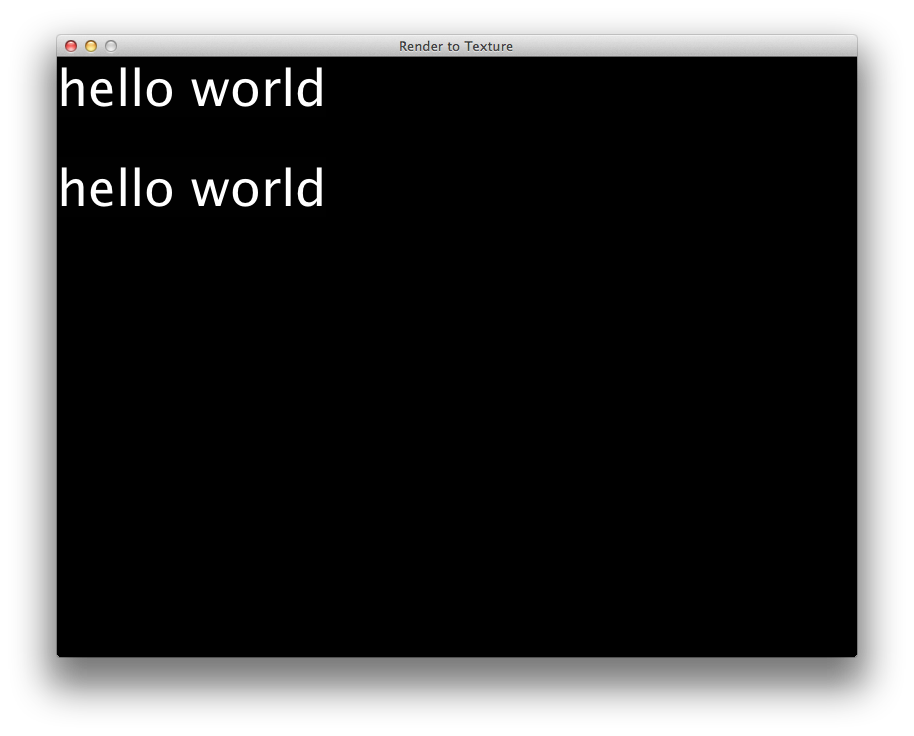
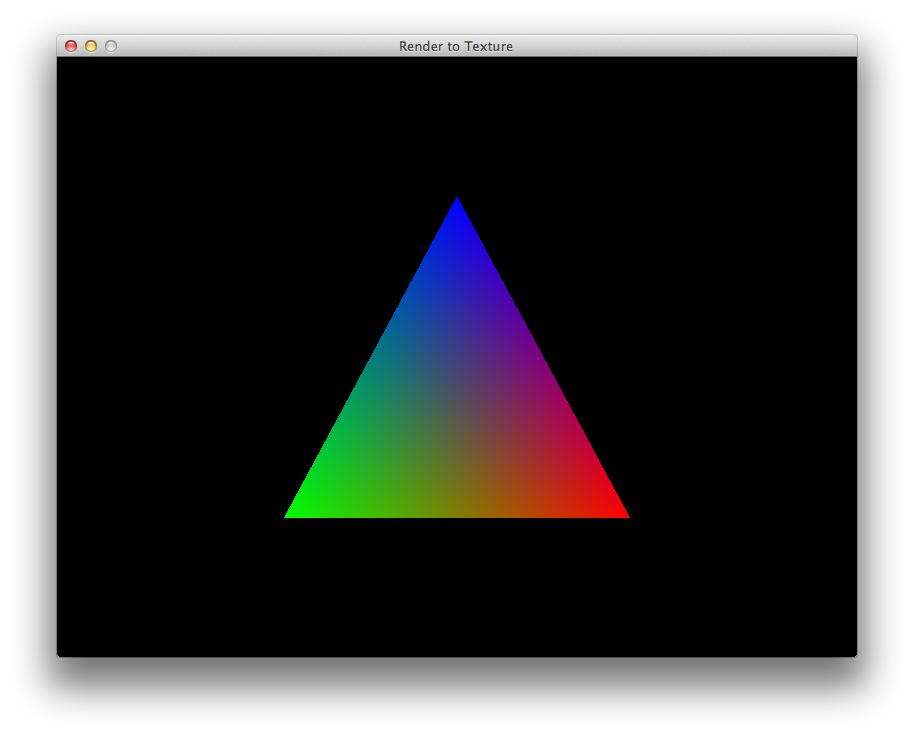
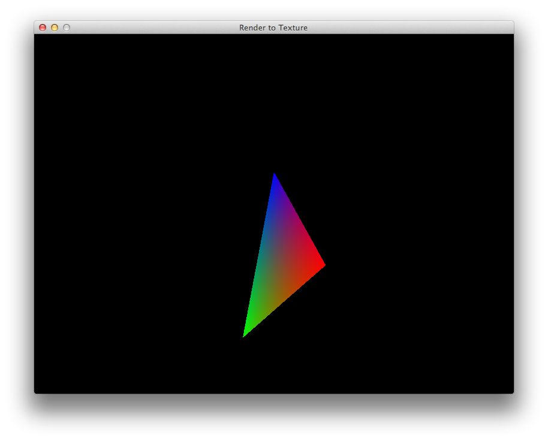
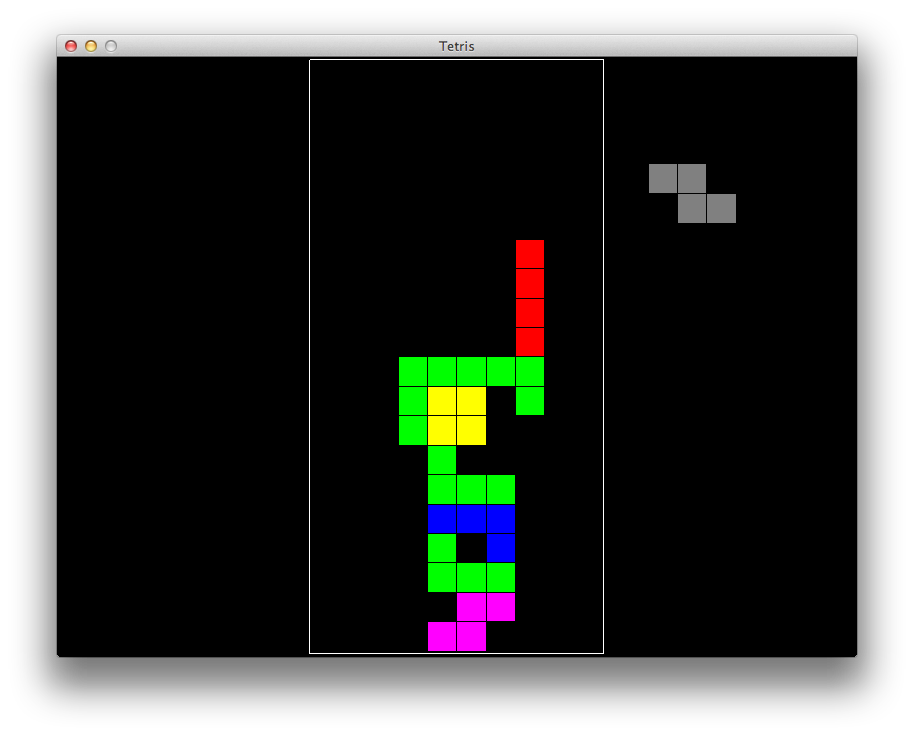
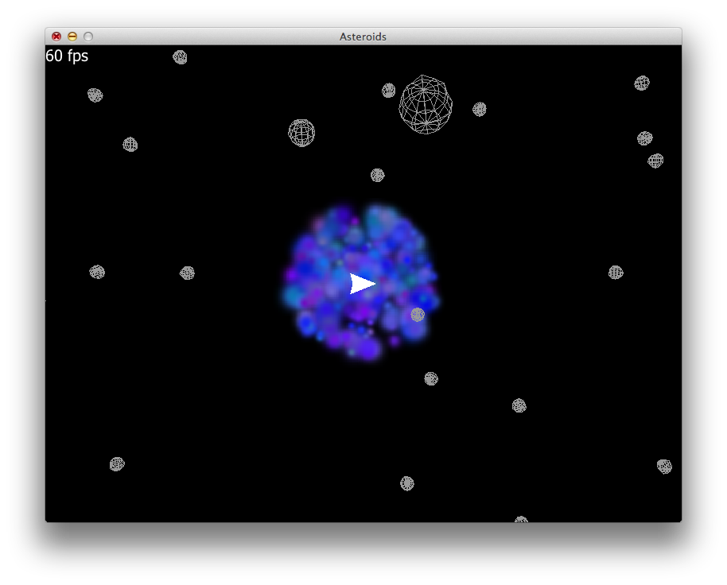
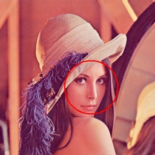
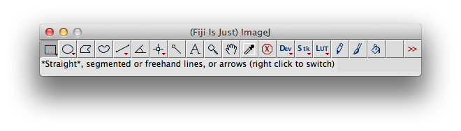
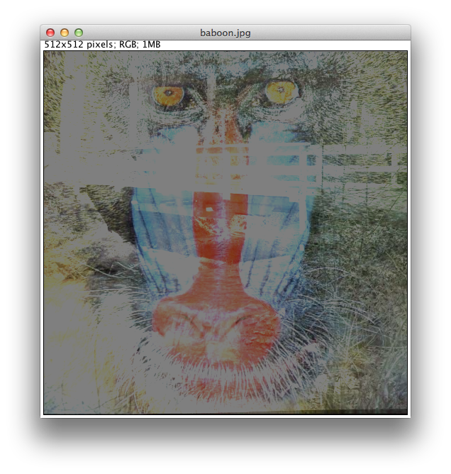

## サウンドもグラフィックもClojureで

###### サラデゥー (Salade):サラダ

前の章ではPAASとかクラウドの管理とか重要だけどちょっと重たいトピックについてやりました。

この章では、ちょっと趣向を変えて楽しい系のトピックを扱ってみたいと思います。 ここでは、特に音系のスピーチ、音声認識、サウンドなどを最初に触れて、その後はサラダでワインダンス(?)
できるようにライブミュージックのプログラミングをやります。
最後のパートでは、いくつかのグラフィックのサンプルをお見せします。
さぁ、お楽しみが始まりますよ！

### スピーチでClojure、音声認識でClojure！

#### Clojureで音声認識

オーダーしたワインをちゃんと受け取るためには、オーダーをちゃんと認識してもらわなければいけません。 ここでは、あまり表に出てこないGoogle APIを使って録音された音声を解析してみたいと思います。

いつもの通り、必要な設定を追加します:

    [hellonico/speech-recognition "1.0.2"]

[Our customized Speech Recognition](https://github.com/hellonico/speech-recognition) は [speech-recognition](https://github.com/klutometis/speech-recognition) をベースに、コードの実行に必要なアップデートを加えました。
また、[Peter Danenberg](https://github.com/klutometis) には興味をそそられる数行のコードがあります。 新しいプロジェクトや発想を刺激するアイディアがあるように思います。 ぜひ一度見てみてください。

それでは、REPLをスタートさせて以下のコードを実行しましょう:

@@@ ruby chapter07/speech/src/speech/hear.clj @@@

このコードの中で、languageは *en*、*fr*、などを指定することで認識する言語を変更することが出来ます。

input indexは、マシンとデバイスに関連します。 お使いのマシンの入力デバイスを _(get-mixers)_ で確認します:

    user=> (get-mixers)
    #<DirectAudioDeviceInfo Default Audio Device, version Unknown Version>
    #<DirectAudioDeviceInfo Built-in Input, version Unknown Version>
    #<DirectAudioDeviceInfo Built-in Output, version Unknown Version>

一連の流れを簡単にダイアグラムまとめると以下のようになります:

これを基に何かスゴいことが出来そうですね。 音声を録音して、認識させて、候補となるフレーズからマッチするものを探して、何かレスポンスする。
そう、まるでAppleのSiriですね。

#### Clojureで話す

上記でやったことは、音声が正しく認識されることを前提としています。 ということは、オーダーするときにきちんと発音しなくてはいけないワケです。 ということで、テキストスピーチを使いましょう。

再び、Peterのライブラリ [speech-synthesis](
https://github.com/klutometis/speech-synthesis) を、今回はそのまま使用します。
プロジェクトに追加します:

    [facts/speech-synthesis "1.0.0"]

@@@ ruby chapter07/speech/src/speech/speak.clj @@@

はいはい、分かってます。 日本語ですよね。

ってことで、日本語を使うためには上記のライブラリに少し変更を加えます。 コードは以下の通りです:

@@@ ruby chapter07/speech/src/speech/speak_ja.clj @@@

これで、あとは日本語のセンテンスを話すためのコードを追加するだけです。

"ありがとうね"

### ClojureでMIDI

音声の録音と再生に続いては、MIDIです。 JVMにはMODIの再生に必要なものがすべて揃っています。

ClojureでMIDIするために [Clojure Midi Library](https://github.com/pcsanwald/clojure-midi)　を使い、どのようにデータを音楽に変えていくかを見ていきます。

サンプルのclojure-midiフォルダからREPLをスタートしましょう。 そして、次のコードを１行ずつ見ていきましょう。

@@@ ruby chapter07/clojure-midi/src/music/simple.clj @@@

最初にスケール(音階)を定義します。 この例では、Aメジャー(イ長調)です。 学生時代の音楽の授業とか、先週のDJ入門クラスとか覚えてますか？ イ長調の音階はラ、シ、ド#、レ、ミ、ファ#、ソ#で、これを英語表記にすると、AメジャーのスケールはA、B、C#、D、E、F#、G#となります。

次に、このスケールを使ってコード(和音)とベース音を作ります。 基本となるトライアドとセブンスコードは予め用意されていて、３つまたは４つの音を返します。

あとは、音と音の長さを指定して音楽にします。 音の長さはデフォルトで2000msです。

最後に *perform*メソッドを使うと、音楽がスピーカーから流れるはずです。

個人的に、私は Eドリアンスケールがお気に入りです:

    (def e-dorian [:E :F :G :A :B :C :D])

良かったら、このスケールを使って音楽を作ってみてくださいね。

このレシピは小さいながらも、どのようにシンプルなテキストデータから音楽を作るかということを我々に教えてくれました。 それが正しく、コードがデータとなり、それがまたコードになるというClojureのコンセプトにつながるわけです。

### 音楽をライブするなら

#### Overtone とは

[Overtone](http://overtone.github.io/) は、私としては、Clojureのコミュニティで最も成功しているプロジェクトだと思います。

Overtoneは [open standards](https://github.com/overtone/osc-clj) をベースにしており、すべてのコードは [great code](https://github.com/overtone/overtone) にあり、ドキュメントは [great documentation](https://github.com/overtone/overtone/wiki/Getting-Started)、虎の巻は [cheatsheet](https://github.com/overtone/overtone/raw/master/docs/cheatsheet/overtone-cheat-sheet.pdf)、そしてOvertoneを取り巻くコミュニティが[great community](http://groups.google.com/group/overtone) にあります。

Overnoteのすべてを網羅しようとしたらもう一冊本が書けてしまうので、この本では詳細までは紹介しませんが、ここでは皆さんに興味を持ってもらえるようなサンプルを紹介します。

今回のワーキングフォルダは chapter07/overtone です。 そして、プロジェクトに追加する設定は:

    [overtone "0.8.1"]

これでREPLの準備が出来ました。

OvertoneはWave信号をサーバに送り、サーバはOvertone自体から受け取るメッセージに応答します。 プロトコルもClojureで書かれており、ネイティブのライブラリを使ってコアオーディオの機能をラップしています。

説明はさておき、ちょっとビートを鳴らしてみましょう:

    (use 'overtone.live)
    (def kick (sample (freesound-path 2086)))

現在のネームスペースに overtone.live をインクルードし、[http://www.freesound.org/](http://www.freesound.org/) からフリーの音源をダウンロードします。
音源はダウンロードされて、後で使用するためにキャッシュされます。

kickは:

    (kick)

または

    (kick 2)

で再生することが出来ます。 数字はピッチを指定します。 次にメトロノームを定義します。 テンポ120を指定しましょう:

    (def one-twenty-bpm (metronome 120))

これから作成するループでは、ずっと前に２章でやったライブラリを使います。 覚えていますか？ *at* です。

もし忘れてしまった場合は、戻っていくつかサンプル [examples](https://github.com/overtone/at-at) をチェックして下さい。

では実際に at-at を使ってみましょう。 次のコードを見て下さい:

    (apply-at ((metronome 120) 4) println 2 [])

これは、120bpmの４拍子で *2* を印字します。 規則正しく印字しても面白くも何ともありませんが、規則正しくkickするとビートになります:

    (apply-at ((metronome 120) 4) kick 2 [])

ということで、これを使ってループを定義しましょう:

     (defn looper [nome sound]
        (let [beat (nome)]
            (at (nome beat) (sound))
            (apply-at (nome (inc beat)) looper nome sound [])))

定義したら、スタートします:

    (looper one-twenty-bpm kick)

ビートが鳴りましたか？

お隣の人が帰ってきたら、一旦 ..

    (stop)

さぁ、違うビートとか違う音源を試してみましょう！

#### Overtone でスウィング

Overtoneの次のサンプルは、definstというマクロを使って楽器を定義します。

楽器または音源を作る最も簡単な方法はノコギリ波を使うことです。 ちなみにノコギリ波とは波形がノコギリの歯の形に似ていることからそう呼ばれています。 詳しくは [wikipedia](http://ja.wikipedia.org/wiki/のこぎり波) を参照して下さい。

チュートリアルから持ってきたファンクションで、音源を定義しています:

    (definst saw-wave
        [ frequency 440
          attack 0.01
          sustain 0.4
          release 0.1
          volume 0.4]
         (*
            (env-gen (lin-env attack sustain release) 1 1 0 1 FREE)
            (saw frequency)
            volume))

音源に対するパラメータは ... いっぱいあります。 各々にはデフォルトの値を渡します。 上記の例では５つのパラメータがあって、それぞれにデフォルト値を設定しています。

楽器の音源自体はOvertone言語中でジェネレータ(env-gen)、カーブ(saw)とヴォリュームを使って *player*を生成しています。

なので、パラメータを変えると同じノコギリ波でも違ったサウンドを作ることが出来ます:

    (saw-wave 440)
    (saw-wave 440 0.02)

などなど...

また、コードについては *chords.clj* を参照して下さい。

では、次のコードを見てみましょう:

@@@ ruby chapter07/src/overtone/swing.clj @@@

コードをよーく見てみると、ハイハットのオープンとクローズは同じジェネレータで同じカーブを使っていますが、パラメータを少し変えています。

スウィングしてますね！

#### Overtoneでロック！

さて、いよいよ本日のメインイベントです。 有名なハードロックのリフを演奏しちゃいますよ:

@@@ ruby chapter07/src/overtone/acdc.clj @@@

上記のコードでは、予め定義された楽器 *guitar* をインポートして、*guitar-strum*を演奏しています。 コードを記述するのにClojureのアレイはとても便利ですね！ まるでギターのタブ譜のようです。

#### 音の彼方へ

ここまで、ループを作成し、音をスケジュールしてそれを繰り返し、コードを作成してスウィングを演奏して楽しんできました。

Overtone ではもっと色々なことが出来ます。 Overtoneはプロフェッショナルな要求にも応えられるほどの、フルスペックのサウンドクリエイターなのです。

この本では紙面の都合上、楽器や音の作り方についてあまり深く掘り下げることが出来ませんが、まずはフリーのサンプルをダウンロードし、パラメータを変えてみたり、その次はコピペして自分の音楽を作ってみたりしてみるのが良いのではないでしょうか。

Overtoneを習得するのに良い本があります [Designing Sound](http://www.amazon.co.jp/Designing-Sound-Andy-Farnell/dp/0262014416/)
Overtoneをじっくり、深く極めたい方にはおすすめです。

#### 野獣とライブ

[mini beast](https://github.com/overtone/mini-beast) は音楽のライブプログラミングにもってこいのエクステンションです。 もう出来上がってしまったプロダクトなので、あまり追加するものがありませんが、簡単に実行出来ます:

    git clone https://github.com/overtone/mini-beast.git
    cd mini-beast
    lein run

これで、Overtoneベースのquilという名前のグラフィカルなインターフェイスが立ち上がります。

これを使って音楽を演奏することが出来ます。

まだピンと来ない場合は、[meta-ex band](http://meta-ex.com/)とか見てみましょう。 40分もある [Zurich live](http://soundcloud.com/meta-ex/zurich-live) のトラックも驚きです。 ぜ〜んぶClojureでライブコーディングです。

#### Clojure とシカゴピザ

東京で一番のシカゴピザと言えば、神田駅近くの[Devil's Craft](http://www.devilcraft.jp/)

というわけで、偶然見つけたピザ、ではなくシカゴのレシピ [creative work from Chicago](https://github.com/neatonk/overtone-quil-hacknight) を紹介します。

先ほどと同じように、以下のコマンドで実行します:

    git clone https://github.com/neatonk/overtone-quil-hacknight.git
    overtone-quil-hacknight
    lein run

起動すると、音をコントロールするインターフェイスが表示されます:

次は自分でやってみましょう！

## Clojureでグラフィック: GPU、Processing、OpenCV、OpenCL

このセクションでは皆さんをグラフィック小旅行へお連れしましょう。 まず、Processingで簡単なグラフィック処理を紹介します。

その次は別のオープン物を。

OpenGLに続いては、OpenCL、そしてClojureからグラフィックカードのパワーを直接使います。
それから、OpenCVを使って簡単な写真とイメージ処理を。

最後は、ゲームの触りを紹介します。

### Processing： Clojureに移植された最高のビジュアルツール

個人でやっているアーティストの間では、[Processing](http://www.processing.org/) は断トツの人気だそうです。 Processingはオープンソースで、元々Java上で動作していたのでAndroidデバイスでもそのまま動きましたし、最近では[processingjs](http://processingjs.org/)でJavaScriptの環境でも実行出来るようになりました。

Processingに関する書籍は既に何冊か出版されていますが、中でもProcessingを開発したCasey Reasが執筆した[Processing](http://www.amazon.co.jp/Processing%E3%82%92%E3%81%AF%E3%81%98%E3%82%81%E3%82%88%E3%81%86-Make-PROJECTS-Casey-Reas/dp/4873115159/ref=pd_sim_b_2)がお勧めです。

それでは、どのようにClojureでProcessingをスムースに動かすかを見ていきましょう。

ところで、何故言語の世界でProcessingを動かしたいの？と思っているかも知れませんね。
答えは、Overtoneでもそうだったようにライブプログラミングするためです。

Processingでは、スケッチするコードを書き、全部出来たらスタートボタンをクリックします。
Quilでは、まずスタートボタンを押し、ライブスケッチに色々追加していきます。 面白そうでしょ？

ClojureワールドのProcessingは [quil](https://github.com/quil/quil)と呼ばれています。

いつもの通り、プロジェクトに追加します:

    [quil "1.6.0"]

これまでにProcessingを使ったことがあるのであれば、Processingには２つの関数があることをご存知かも知れません。

* setup
* draw

setupは一度だけ実行され、フレームレートや背景色等を設定したりする初期化関数です。

Draw は1秒間に一定回数実行され、スクリーンへの描画を行います。

では、早速ランダムな円を描くサンプルを見てみましょう。 以下のコードではsetupとdrawメソッドを定義し、それらをdefsketchマクロを使って一つにまとめています:

@@@ ruby chapter07/quil-start/src/zero_nc.clj @@@

上記コードでのsetupは、背景色を黒にし、drawメソッドをアンチ・エイリアスに設定しています。

Drawは、円描画に使用するストロークの色と太さをランダムにセットし、スクリーンにそれらのパラメータを使って円を描画します。

実際にこのスケッチを実行すると、スクリーンにはこんな感じで表示されます:

drawメソッド中の次の行を:

    (fill (random 255))

以下のように変更します:

    (fill-int
     (color (random 255) (random 255) (random 255))
     (random 255))

すると、スケッチを再起動しなくてもアプレットはカラフルな色で描画を続けます:

すでに描画されているものの上に、どんどん新しい描画が追加されていきます。

もし、一旦スクリーンをキレイにしたいのであれば、背景色を指定し直すとリセットされます:

    (background 0)

その後、本来の描画を行います。

Quilにもやはり虎の巻 [cheatsheet](https://github.com/quil/quil/raw/master/docs/cheatsheet/cheat-sheet.pdf) がありますので、ざっと目を通しておくと良いでしょう。

もっとスケッチなら、[examples](https://github.com/quil/quil/tree/master/examples/gen_art) には様々なサンプルが、書籍で体系的に身につけたければ [Generative Art](http://www.amazon.co.jp/%E3%82%B8%E3%82%A7%E3%83%8D%E3%83%A9%E3%83%86%E3%82%A3%E3%83%96%E3%83%BB%E3%82%A2%E3%83%BC%E3%83%88--Processing%E3%81%AB%E3%82%88%E3%82%8B%E5%AE%9F%E8%B7%B5%E3%82%AC%E3%82%A4%E3%83%89-Matt-Pearson/dp/4861008565/ref=sr_1_1?ie=UTF8&qid=1368513628&sr=8-1&keywords=generative+art) が良いでしょう。
サンプルはぜひじっくり時間をかけて楽しんでください。

最後に、[https://github.com/gtrak/quilltest/](https://github.com/gtrak/quilltest/)からナイスなテストスケッチを。 物理やボールオブジェクトなど、プロジェクトを一から作る時の参考になると思います。

芸術的な閃きが欲しいときには、やはりワイン...でしょうかね...

### Clojure用のOpenGL

前のQuilのセクションは、なかなか面白かったですね。 Processing/Quilを使うと簡単にOpenGLの描画が出来てしまうわけですが、元々OpenGLを使ってきた人からするとそれはそれでちょっと歯がゆいものがあるかも知れません。

そんなあなたのために [penumbra](https://github.com/ztellman/penumbra) というOpenGL用のバインディングライブラリがあります。

Penumbra自体の開発は大きくスローダウンしているものの、ClojureからOpenGLを使ったり、コンピュータのGPUを操作するような場合には依然として選択肢の一つであることは間違いないでしょう。

[version we are including](https://github.com/bronsa/penumbra) はオリジナルの開発者の手によるものではありませんが、最新のClojureに対応しているので、これを使用します:

    [bronsa/penumbra "0.6.0-SNAPSHOT"]

Penumbra の依存関係はかなり厄介で、おまけにアップルがJVMの扱いを変えたこともあり、問題を回避するのに苦労しました。
うまくいった方法の一つは、以下のコマンドでJavaの古いバージョンを使うようにすることです:

@@@ ruby chapter07/penumbra-samples/set_mac_java.sh @@@

このコマンドを使うとJava6を使うようになります。 この本を書いている段階では、そろそろJava8がリリースされそうですが。。
 The above command will slightly update your path, on other machines, Windows include, this is not required.

サンプルコードを見ていただくと:

@@@ ruby chapter07/penumbra-samples/src/example/opengl/text.clj @@@

startで[callbacks](https://github.com/ztellman/penumbra/wiki/callbacks)に定義されているコールバックを設定しています。 コールバックにあるinitとdisplayを、少し前のProcessin/Quilのサンプルに出てきたsetupとdrawに置き換えるととても似てますね？

サンプル自体はシンプルにテキストを表示するだけです:

私のお気に入りはトライアングルです:

@@@ ruby chapter07/penumbra-samples/src/example/opengl/triangle1.clj @@@

mouse-dragというコールバックを使うと、マウスのイベントに対応することが出来ます:

    :mouse-drag mouse-drag

以下、サンプルのコードです:

@@@ ruby chapter07/penumbra-samples/src/example/opengl/triangle3.clj @@@

しばらくの間Penumbraは新しいバージョンが出ていませんが、このバージョンでもテトリスくらいは充分に実装出来そうですね。

アステロイドとか:

本に掲載する図とかも数行でパっと書くことができますね。

個人的には、OpenGLにそのままバインドされたPenumbraのパワーは好きですが、グラフィックの作業はQuilを使ってしまいます。 また、3年前のコードであるという認識を持たなければいけないと学びました。

こないだ、Clojureで2年前に書かれたコードについて昔のお客さんから連絡がありました。 何か嫌な予感がしたのですが、Webサービスと飾りっ気のないUIは2年間不具合も無く動き続けていたのです。 だから、古いから何か問題があるわけではないのです。

Penumbraに戻って、OpenGLでグラフィックカードの操作をちょこっとやったので、次はグラフィックではない処理をGPUにやらせてみましょう。

### OpenCL

私のコンサルティングの仕事の一つで、ビデオのエンコーディングをするビデオサーバを使っています。 かつてはCPUをエンコーディングの計算に使っていたのですが、遊んでいるGPUが勿体ないのでエンコーディングの計算にGPUを使うようサーバーを実装し直したところ、GPUがフル稼働に対してCPUはせいぜい5%くらいの負荷に落ち着きました。
GPUを使うようにしたことで、処理能力が上がったことはもちろんですが、並列処理を含むアルゴリズムの改善にも大きな成果がありました。
GPUを使う場合の問題点はデータの読み書きで、その間の処理は非常に速くなりました。

この短い章では、OpenCLプログラミングそのものについては説明しません。 Clojureから使う上で興味を持ってもらえそうなトピックを挙げていきます。

[OpenCL](http://www.drdobbs.com/parallel/a-gentle-introduction-to-opencl/231002854) は汎用的な並行コンピューティングのライブラリです。 これを使うと、GPUのパワーを利用することが出来ます。

#### GPU、OpenCL、calx と Clojure

[calx](https://github.com/ztellman/calx) はClojureからOpenCLを使う実験的なプロジェクトです。

プロジェクトにcalxを追加します:

    [calx "0.2.1"]

互換性のあるマシンかどうかをテストするために、以下のdebugスクリプトを使用します:

@@@ ruby chapter07/calx-samples/test/zero.clj @@@

GPUセクションに次のような出力が表示されるはずです。

    (#<CLDevice GeForce 320M)

もしGPUが表示されない場合、OpenCLは代わりにCPUを使いますがいくつかのサンプルは動かないでしょう。　また、スピードもかなり遅いでしょう。 もし、Intelのカードをお使いであれば、[JOCL](http://www.jocl.org/) のWebサイトにヒントがあるかも知れません。

それではベクターの加算をするサンプルを。 Appleが提供するOpenCL用の[helloworld](http://developer.apple.com/library/mac/#samplecode/OpenCL_Hello_World_Example/Listings/hello_c.html#//apple_ref/doc/uid/DTS40008187-hello_c-DontLinkElementID_4)を見たことありますか？ それに比べると、このサンプルは何てシンプルなんでしょう:

@@@ ruby chapter07/calx-samples/test/addition.clj @@@

ポイント:

* GPU向けのOpenCLコードは、Clojureコードの中でテキストとして記述する
* OpenCLコードをコンパイルする
* *wrap*: Clojure変数をOpenCL変数にタイプキャストして変換する
* *mimic*: 型コピーを生成
* *enqueue-kernel*: OpenCLのオペレーションを実行する
* *enqueue-read*: OpenCLからの戻り値を受け取る
* 実際には戻り値のバッファへのClojure参照を受け取る。 なので、実際の値は必要なときにバッファから受け取る

ベクターの乗算もそれほど複雑ではありません:

@@@ ruby chapter07/calx-samples/test/multiply.clj @@@

また、calxではOpenCLのメソッド名がキーワードになっています。

もし、純粋なClojureでマシン、CPU/GPU、入出力のスピードを比較したければ、Tellmanによって書かれたソースを追加しておきました。

calx-samplesフォルダにある *compare.clj* を試してみてください。

#### SimpleCLでもう少しOpenCL

世の中には、いつも限界を超えようとする人がいます。

[Simple CL](https://bitbucket.org/postspectacular/simplecl) はcalxが止めてしまったことを引き継いでいます。

サンプルのソースは長いですが、*simplecl* フォルダの以下のコマンドで実行出来ます。

@@@ ruby chapter07/simplecl/physics.sh @@@

実行されつClojureのコードは以下の通りです:

    test/simplecl/verlet_test.clj

実行すると、[JOCL](http://www.jocl.org/)のアルゴリズムが生成する美しいグラフィックが表示されます。

#### OpenCLとGPUコンピューティング
Openings with OpenCL and GPU computing

ここまでGPUのコンピューティングについて紹介してきました。 この分野に関して少しでも興味が湧いて、Clojureの可能性を広げるきっかけになったでしょうか？

## OpenCV と画像処理

### ビジョンを手に入れる！

OpenCV (Open Source Computer Vision) は、リアルタイムのコンピュータビジョンのためのプログラミングライブラリです。
OpenCV を使うとメディアに依存した画像処理、カメラのキャリブレーション、2D/3D処理、ビデオ解析、顔認識等を行うことが出来ます。

[OpenCV tutorial page](http://docs.opencv.org/doc/tutorials/tutorials.html)には色々な可能性を感じるチュートリアルがあります。

ほとんどのサンプルはC++で書かれています。

[vision](https://github.com/nakkaya/vision) は [Nurullah Akkaya](http://nakkaya.com/vision.html) によって開発され、ClojureからOpenCVのAPIのサブセットを使用することが出来ます。

#### OpenCVをインストールする

OpenCVをMac OS Xにインストールするには、前にも使ったHomebrewを使います。 OpenCVはリポジトリが移動したので、もう一つのコマンドが必要です:

    brew tap homebrew/science
    brew install opencv

これで、OpenCVのバージョン2.4.5がインストールされました:

    [niko][12:05][~/projects/vision/] % brew install opencv
    ...
    The OpenCV Python module will not work until you edit your PYTHONPATH like so:
    export PYTHONPATH="/usr/local/lib/python2.7/site-packages:$PYTHONPATH"
    To make this permanent, put it in your shell's profile (e.g. ~/.profile).
    ==> Summary
    🍺  /usr/local/Cellar/opencv/2.4.5: 216 files, 42M, built in 5.1 minutes

#### Visionの準備

Visionを使えるようにするには、Cのコードをコンパイルする必要があります。

    cmake .
    make

最後に、project.clj ファイルの中で今コンパイルしたライブラリを追加します。 以下のように、"java native access"へパスを追加します:

    :jvm-opts ["-Djna.library.path=resources/lib/"]

#### Webカメラを使う

最初にWebカメラを使って画像を取得してみましょう:

@@@ ruby chapter07/vision/src/display_webcam.clj @@@

コードの説明:
* captureでWebカメラの入力ストリームにアクセス
* query-frame captureでストリームから1フレームをキャプチャ
* viewでキャプチャしたフレームをスクリーンに表示

#### イメージのロードと加工

イメージをロードするだけなら、Clojureのメソッドがあります:

    (load-image "resources/samples/soccerfield.jpeg")

では、イメージをロードして、そのイメージに対してレーン検出をするには？

そうです！ OpenCVのバインディングを使ってイメージに手を加えるんです。

Nakkayaのブログ [lane detection](http://nakkaya.com/2011/01/24/lane-detection-using-clojure-and-opencv/) にある通り、イメージを加工出来るので処理をより簡単にすることが出来ます。

以下がその部分のコードです:

    (defn detect-edges [i]
        (-->
         (convert-color i :bgr-gray)
         (smooth :gaussian 7 7 0 0)
         (canny 90 90 3)))

フレームごとにグレイスケールに変換し、スムース処理し、キャニー・アルゴリズムを使ってエッジをマークします。 コード中の —> はタイポではなく、ライブラリ中の呼び出しはオリジナルのイメージを変更しません。 代わりに、終了時にリリースが必要な新しいイメージを返します。 -> は各中間イメージに対してreleaseを呼び出す以外はClojureの -> のように動作します。

エッジ検出が終わったイメージは以下のようになります:

#### 顔認識

OpenCVの典型的なサンプルというと、やはり顔認識でしょうか。 Nakkayaのサンプルの中にもあります:

@@@ ruby chapter07/vision/src/face_detect.clj  @@@

そして、顔認識した結果は:

コードを見ていただくと分かりますが、コードの方はWebカメラからのイメージを入力としています。 なので、Lenaは出てきません。。

#### お次のイメージは？ Bounding Box

VisionがサポートするOpenCVのファンクション一覧は [Vision's github page](https://github.com/nakkaya/vision)にあります。 色々と実験出来そうですね。

去年の夏、イメージのBounding Boxを素早く計算する方法について聞かれたことがありました。 色々と調べたりして、解決するのに結構時間がかかりました。 その後、この本を書き始めて、見つけたんです！ Nakkayaは、同じことをほんの数行で実現していたのです。。

@@@ ruby chapter07/vision/src/bounding_box.clj  @@@

with-countours と bounding-rects は魔法のファンクションですね！

#### Fiji UI と Clojure

Fijiをダウンロードして、インストールすると、

ScriptingメニューからClojure interpreter を選択出来ます:

そして、Webからイメージのロード、表示を以下のように簡単に行うことが出来ます:

@@@ ruby chapter07/fiji/first.clj @@@

表示された画像:

#### Fiji と Clojure をコマンドラインで使う

Fijiを使ってたくさんのイメージに対して同じ処理をする場合にはどうしたら良いでしょうか？ ご心配なく。 良いツールがあります。

例えば、イメージをリサイズするには:

@@@ ruby chapter07/fiji/resize.clj @@@

他にも色々あります。

Fijiにも含まれている[bunch of samples](http://fiji.sc/wiki/index.php/Clojure_Scripting#Example_Clojure_plugins_included_in_Fiji)。 私は特に２つのイメージを合わせるサンプルがお気に入りです。

それを実行すると:

また、マルチスレッドのサンプルもあります。

### まとめ

この章ではスピーチ、音声認識から始まって、OvertoneやQuilを使ってどうやってDJになるかなどをやりました。
そして、GPUのコアなプログラミング、イメージ処理とバッチ処理について見ましたね。

もうすぐデザートですが、その前に ...
