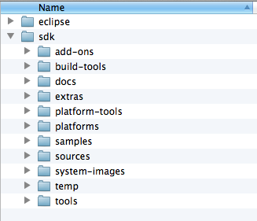
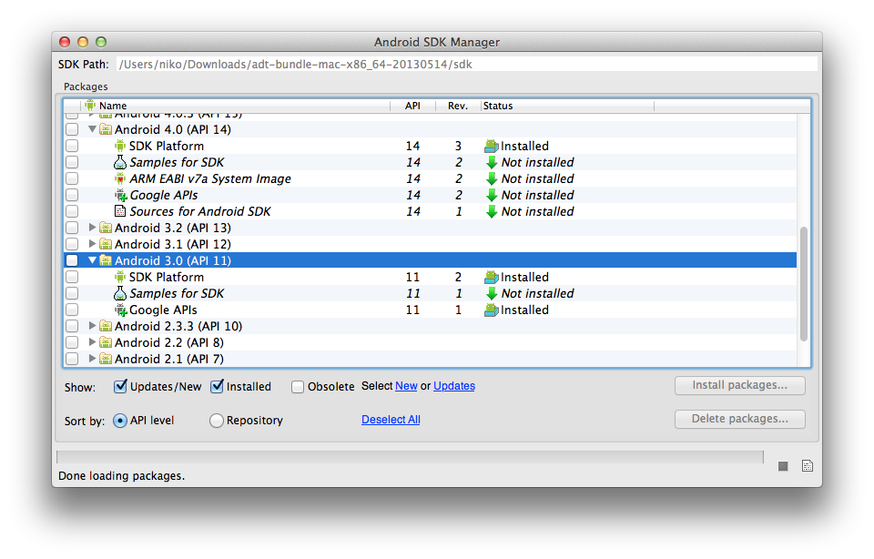

## Android drugged with Clojure

前の章ではOpenCVを使ってWebカメラというデバイスを使ってイメージ処理を行いました。 この章では、(ワインをすべて飲み干して何をやっているのかワケが分からなくなってしまう前に...)組み込みプログラミングについて見てみましょう。
最近はAndroidのデバイスも安くなってきたので、価格サイトとか中古のデバイスとか調べてもし良いものがあれば、おもちゃとして手に入れて遊んでみるのも良いかも知れません。

というわけで、この章ではAndroidデバイス上でClojureによるライブプログラミングを行います。 そうです、いつものREPLを使ってアプリケーションのユーザインターフェイスを変えるんです。

### はじめに

ClojureのAndroidサポートは、Google Summer of Code 2012で [Alex Yakushev](http://clojure-android.blogspot.jp/2012/04/proposal-gsoc-2012.html) によって紹介されました。

彼は、Clojureエコシステムに存在していたものを何とかAndroid上の[create and run UI](https://github.com/clojure-android/neko)に引き継ぎ、Androidデバイスでスムースに動くように[fork of Clojure](https://github.com/clojure-android)をパッケージし直し、Androidのタスクを実行出来るように[Leiningen plugin](https://github.com/clojure-android/lein-droid)を作成しました。 ちょっと前に、アプリケーションにREPLサーバを組み込んでおけば、他のClojureアプリケーションと同じようにリモートでデバッグやプログラムが出来るって紹介しましたよね？

この章では、あなたの手を取ってAndroidで楽しむためのいくつかのステップを紹介します。

### 始めよう

ここで使用するコードとモジュールはgithubのリポジトリの新しくてクリーンな [clojure-android](https://github.com/clojure-android) のものです。

### SDKのインストール

もしAndroidの開発をしたことがあれば既にご存知だと思いますが、[http://developer.android.com/sdk/index.html](http://developer.android.com/sdk/index.html)から最新のSDKのダウンロードとインストールをします。

SDKをインストールすると、以下のフォルダ階層が作成されます:

上記のフォルダに、別途必要なものをインストールします。 以下のコマンドを実行して *SDK Manager* を起動します:

    tools/android

下の図の表示にあるように、バージョン11をインストールします:

SDKのインストールは以上です。 いよいよ、AndroidでClojureを動かしましょう。

### Lein Droid

Android SDKにあるツールを使ってAndroidでClojureの何かを動かそうと思ったら、それは色々な知識が必要になります。

そこで、Droidプラグインをインストールします。 profiles.cljファイルのプラグイン設定を編集します:

    {:user {:plugins [
                  [lein-droid/lein-droid "0.1.0-SNAPSHOT"]
                  ; ...
                  ]}}

これで、プラグインを使う準備が出来ました。 以下のコマンドを実行します:

    lein help droid

ヘルプメッセージが表示されます。

    Subtasks available:
    new                   指定された名前とパッケージ名で新しいAndroidプロジェクトを作成する
    help                  `lein droid`のサブタスクを表示する.
    crunch-resources      前処理されたPNGキャッシュをアップデートする
    create-dex            コンパイル済の.classファイルからDEXファイルを作成する
    release               メタタスク： プロジェクトのリリースバージョンをビルド、パック、デプロイする
    deploy                メタタスク： `install`、`run`、`forward-port`を実行する
    forward-port          ローカルマシンのポートとデバイスのポートをバインドする
    create-apk            デプロイ可能なAPKファイルを作成する
    run                   接続されたデバイスにインストールされたAPKファイルを実行する
    sign-apk              キーストアから取得したキーでAPKファイルにサインする
    build                 メタタスク： (もしライブラリでなければ)依存関係をビルドし、コンパイル、DEXの作成
    repl                  REPLyを使用しているデバイス上のリモートnREPLサーバに接続する
    init                  Androidプロジェクトフォルダ内に project.clj ファイルを作成する
    code-gen              リソースからR.javaファイルを生成する
    zipalign-apk          APKファイル中のリソースの位置を4バイト境界に合わせる
    compile               JavaとClojure両方のソースファイルをコンパイル
    doall                 メタタスク： コンパイルからデプロイまですべてのAndroidタスクを実行する
    install               APKをデバイスまたはエミュレータにインストールする
    gather-dependencies   互換タスク： libs/フォルダに依存ライブラリをコピーする
    apk                   メタタスク： リソースをパッケージし、APKを生成、sign、alignする
    package-resources     アプリケーションのリソースをパッケージする

アプリケーションのビルドに関連することはほぼできそうですね。

### ビルドプロセス
ビルドの流れは以下の通りです:

基本的なステップ:

* パッケージするリソースを用意
* コードを通常のJavaバイトコードにコンパイル
* 上記バイトコードを組込ソフトウェアに相性バッチリなDalvikバイトコードに変換
* リソースとdalvikバイトコードをアセンブルしてapkという名前の未署名パッケージを作成
* 配布する場合には署名する

ステップとしてはシンプルですね。

上記のステップを詳細に理解していなくても、Lein droidがやってくれます。

### Androidプロジェクトを作成して動かす

まず、[tutorial](https://github.com/clojure-android/lein-droid/wiki/Tutorial)を使ってAndroidプロジェクトのベースを作ってみましょう。

コマンド自体は先ほどインストールしたプラグインのnewコマンドです:

    lein droid new clojuroid org.stuff.clojuroid :activity MyActivity :target-sdk 11 :app-name ClojureMeetsAndroid

さて、上記のコマンドを説明すると:

* lein: いつものやつ
* droid: Androidプラグイン
* new: droidプラグインのサブコマンド。 新しいプロジェクト "a la newnew" を作成する
* clojuroid: Clojureプロジェクト名
* org.stuff.clojuroid: Clojureコードに使用するネームスペース
* :activity MyActivity:  アプリケーション開始時にスタートするメインのアクティビティ名
* :target-sdk 11: 多くの組み合わせを試したわけではありませんが、ここではAndroid 3.0 (=11) をターゲットにする
* :app-name ClojureMeetsAndroid: Androidのアプリケーション名

生成されたコードはこの本のサンプルに含まれています。

生成された *project.clj*で、いくつか確認があります:

*neko's version*:
neko はAndroidアプリケーションのUIをビルドする手助けをしてくれるネコみたいな動物です。
今回は、少なくとも[neko/neko "2.0.0-snapshot"]より新しいバージョンであることを確認しましょう。

*:sdk-path*: Android SDKをインストールしたパス
以下にコメントしてある通り、別々のプロジェクトで管理しやすいように *profiles.clj* の中で設定することができます。

        :android {;; Specify the path to the Android SDK directory either
        ;; here or in your ~/.lein/profiles.clj file.
            ;; :sdk-path "/home/user/path/to/android-sdk/"
            :sdk-path "/Users/niko/Downloads/adt-bundle-mac-x86_64-20130514/sdk"

設定については以上です。 pathの設定に */platform-tools* フォルダが含まれているのであれば、Androidフォンが正しくコンピュータに接続されているかを以下のコマンドで確認しましょう:

    adb devices

Androidデバイスが正しく接続されていれば、次のような表示が出力されます:

    List of devices attached
    CB5A1N28SL  device

表示されましたか？

    lein droid doall

どうでしょう？

初めてのClojureによるAndroidアプリケーションがスクリーンに表示されたでしょうか？

*Hello from Clojure!*

### ClojureでもっとAndroid UI

生成されたアプリケーションのコードは *main.clj* です:

@@@ ruby chapter08/clojuroid/src/clojure/org/stuff/clojuroid/main.clj @@@

コードは4つのパートに分かれています:

* ネームスペース定義: これは後ほど出てきます
* (declare ^android.app.Activity a): Androidアプリケーションのforward宣言
* (defapplication org.stuff.clojuroid.Application): メインのコードの在処を指定する
* (defactivity org.stuff.clojuroid.MyActivity ...: Androidのアクティビティを定義する。 Androidの [original documentation](http://developer.android.com/reference/android/app/Activity.html)に記述されていますが、UIに表示するコンテンツをここに配置します。

アクティビティ自体は名前とライフサイクルによって定義されます。

* a: アクティビティの名前。 *declare*でforwardしているので、後で現在のネームスペースからアクセス出来る
* :on-create: アクティビティのライフサイクル。 アクティビティ自体が生成されるときにUIコンポーネントを定義する
* make-ui: ウィジェットを一つ一つビューに追加する
* (on-ui (set-content-view!: UIのスレッドで、現在のブイーの中身をmake-uiにより作成されたものと置き換える

ここまでがこの章の基本となる導入部です。 ここから楽しくなります。

### ClojureでAndroidのUIをライブプログラムする

この前のサンプルにはちょっとしたトリックがありました。 *doall*コマンドを実行した時の出力をよく見ると:

    Binding device port 9999 to local port 9999 ...

という表示が出ると思います。 デバイスにインストールしたapkにはREPLサーバが含まれています。 ということは、それに接続してコマンドを送れば ...
やってみましょう。

    lein droid repl

すると:

    Unable to set signal handlers.
    REPL-y 0.1.10
    Clojure 1.4.0
    reply.eval-modes.nrepl=>

上記のように表示されたでしょうか？

コマンドでプロジェクトを作成したときに、以下のネームスペースを使いました:

    org.stuff.clojuroid

では、*main*のコードを通常のClojureのnsコマンドに切り替えてみましょう:

    (ns org.stuff.clojuroid.main)

まず、これでアクティビティにアクセス出来るかどうかを確認します:

    org.stuff.clojuroid.main=> a
    #<MyActivity org.stuff.clojuroid.MyActivity@41deab30>

出来ましたか？ これでハックできるようになりました。

#### 初めてのライブプログラムセッション

まずはコマンドをいくつか実行して、リアルタイムにAndroid端末のUIを変えてみましょう。

@@@ ruby chapter08/clojuroid/live/first_en.clj @@@

コードの最後まで実行すると、次のような表示になります。:

また、ステータスバーには新しい通知が表示されます。

#### Androidアダプタとリストの更新

次のセッションでは、リストアダプタを作成し、アダプタがサポートしている値を更新してリアルタイムにUIに反映されることを確認しましょう。

@@@ ruby chapter08/clojuroid/live/list_en.clj @@@

これもコードを最後まで実行すると、以下のような表示になります:

#### intentで電話をかける！

ライブプログラムの最後は、[intent](http://developer.android.com/reference/android/content/Intent.html)を使ってみます。

@@@ ruby chapter08/clojuroid/live/intent_en.clj @@@

このコードを実行すると:

発信ボタンを押せば指定した電話番号に電話をかけることが出来ますね！

### この先に進むには

Nekoライブラリの作者Alexander Yakushevによる[namespaces](https://github.com/alexander-yakushev/neko/wiki/Namespaces)を読むと良いでしょう。

また、アプリケーションをリリースするためのパッケージについて詳しい [lein droid tutorial](https://github.com/clojure-android/lein-droid/wiki/Tutorial) もお勧めです。

この章でやったこと:
* Android SDKをインストールして必要なツールとライブラリを手に入れる
* LeiningenのAndroidプラグインのインストール
* AndroidのClojureアプリケーションの作成
* AndroidデバイスにREPLを接続する
* リアルタイムにUIを変更する
* IntentをREPLから使う
