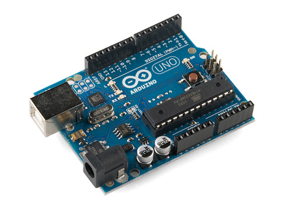

## Arduino

私は元々[Nurullah Akkaya](https://github.com/nakkaya)がやっているようなことがやりたくてしようがなかったんです。 彼は新しいことを人が興味を持つようにプロジェクトとして作り上げるのが本当にうまいんです。

I have been passionated about [Arduino](http://ja.wikipedia.org/wiki/Arduino) for quite a while now and have a few of those babies at home connected to each others.

But there has always been one thing that annoying me a little bit while playing with the hardware was the time needed to compile code and send it to the Arduino board.

Now this is yet again one of the great theme in this book, we can now do live programming of the board itself using Clojure.

If you think this section is not for you, because you're not into hardware programming (yet!), do [buy a board on Amazon](http://www.amazon.co.jp/dp/B0044X2E5S) by the end of today in your house and join the live programming session.

Let's see how.

## 工作の時間ですよー 今日はArduinoですよ！
###### デセール（Les dessert）: デザート

### Clojure で物理
### Cloduino
### やっぱり動くものは楽しい： Roomba
### ネイティブで行こう