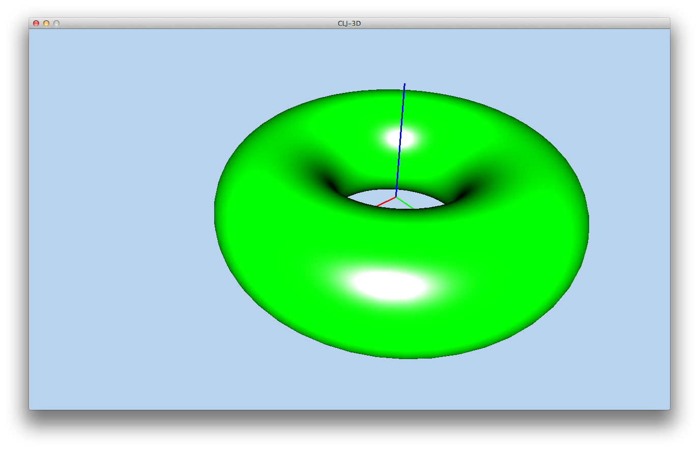
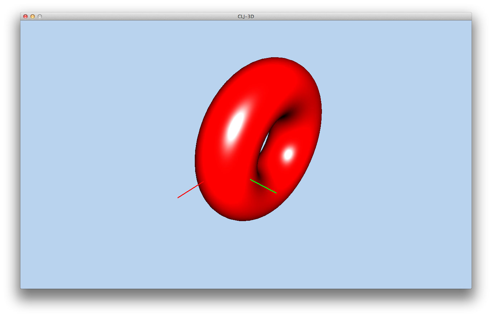
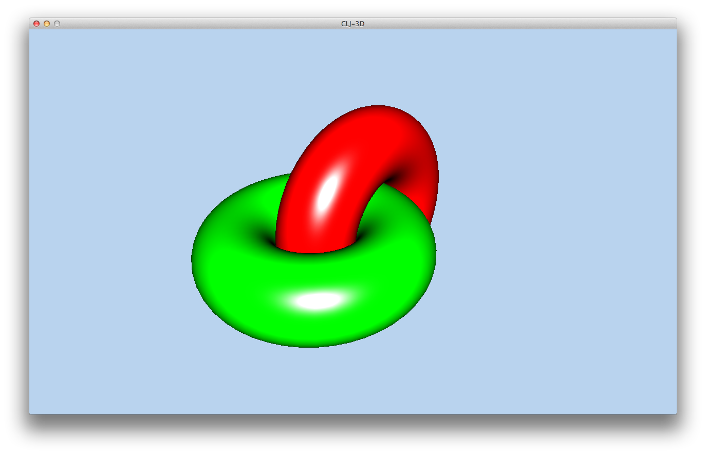
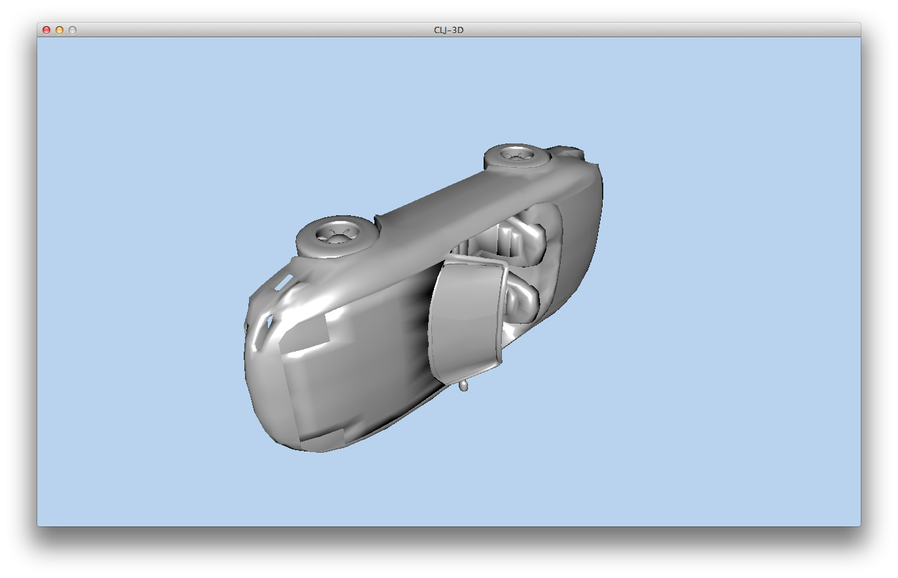
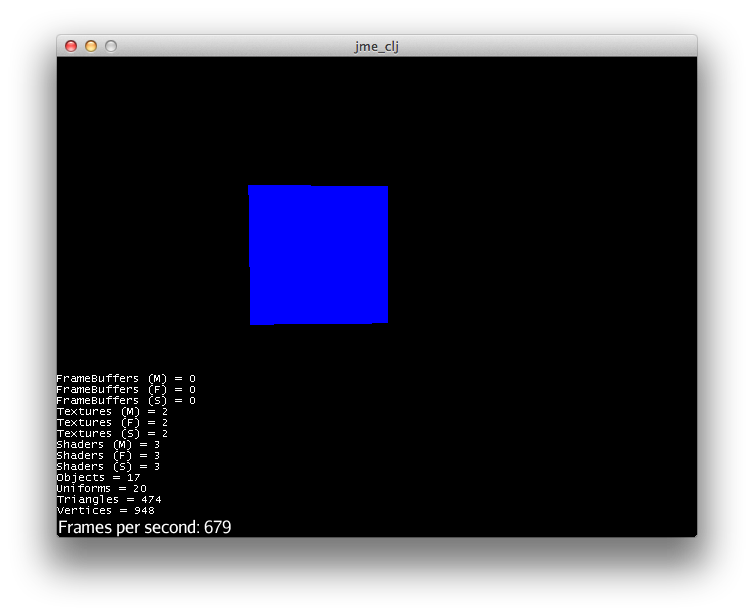
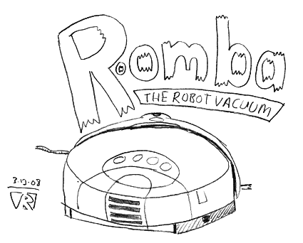

## Arduino

私は元々[Nurullah Akkaya](https://github.com/nakkaya)がやっているようなことがやりたくてしようがなかったんです。 彼は新しいことを人が興味を持つようにプロジェクトとして作り上げるのが本当にうまいんです。

で、私はここしばらくの間、[Arduino](http://ja.wikipedia.org/wiki/Arduino)に興味があって、いくつかのパーツをお互いにつないだりして遊んでいます。

で、いつも何とかならないかと思っていたことの一つは、コードをコンパイルしてArduinoのボードに送るのが煩わしいってことなんです。

そうです。 前の章ではAndroidでライブプログラミングが出来たわけですから、Arduinoでも同様のことが出来そうですね！

もし、ハードウェアのプログラミングなんて(まだ)やったことがないけど面白そう！って人は、そんなに高価なものではありませんし、[buy a board on Amazon](http://www.amazon.co.jp/dp/B0044X2E5S)でも購入出来ますのでぜひこの機会にArduinoを始めてみてはいかがでしょう？

### Cloduino: ArduinoのClojure

Clojureを使ってArduinoで遊ぶには[Clodiuno](https://github.com/nakkaya/clodiuno)を使います。 が、まずは必要なものがすべて揃っているか確認しましょう。

#### 必要なもの

この章の最初にお話しした通り、Arduinoそのものが必要です。 インターネットで調べるとArduinoを扱っているお店はたくさんあって、[cooking hacks](http://www.cooking-hacks.com/)とかは色々な情報が載っていて見るだけでも飽きないのですが、実際に購入するにはアマゾンが最も手軽かも知れません。

もし、Arduinoがまったく初めてなのであれば、[starter kits](http://www.amazon.co.jp/dp/B0025Y6C5G)という選択もアリだと思います。

Arduinoを手に入れたら、お使いのプラットフォームに合わせてソフトウェア[download the Arduino](http://arduino.cc/en/main/software)をダウンロードし、セットアップしましょう。

ボードとコンピュータのUSBポートをケーブルで接続した状態です。

サンプルのblinkを開きます:

Arduinoにアップロードします。

すると、LED 13が1秒ごとに点滅します。

とりあえずの確認は以上です。 インターネット上には至る所に様々なArduinoのチュートリアルがあるので、ぜひ時間を作って色々と見て試してみてください。

#### Firmataをアップロード

Cloduinoは[Firmata protocol](http://arduino.cc/en/reference/firmata)を使っていて、Firmataを使うとホストコンピュータとの通信が出来るようになります。

blinkサンプルをアップロードしたのと同じようにFirmataをArduinoにアップロードします。

    File -> Examples -> Firmata -> StandartFirmata

Firmataのアップロードが完了すれば、遊ぶ準備が出来ました。

#### ブリンクをエンドレスに

Leiningenで新しいプロジェクトを作成します。

    lein new cloduino_sample

Cloduinoを追加します:

    [clodiuno "0.0.4-SNAPSHOT"]

ブリンクのコードはサンプルに含まれています:

@@@ ruby chapter09/cloduino/src/cloduino/sample.clj @@@

この中でClojure固有でない部分はどこでしょう？

コードではCloduinoの*arduino*メソッドを使ってboardを定義しています。

    board (arduino :firmata "/dev/tty.usbmodemfa131")

※ ArduinoボードがつながっているポートはArduinoのソフトで見ることが出来ます。

2つ目は、これから使うPINのモードをpin-modeファンクションを使って設定しています:

    (pin-mode board 13 OUTPUT)

上記は、PIN 13に _出力する_ という意味です。

最後の3番目は、そう、実際の出力メソッドです:

    (digital-write board 13 HIGH)

Arduinoに関する説明は以上です。 REPLを開始してcloduino/sample.cljをロードし、sosメソッドを呼び出してみましょう:

     (cloduino.sample/sos)

これで、SOSを報せるLEDが点滅します。 まー、誰も助けに来てはくれないと思いますが...

でも、電子工作って感じで面白いでしょ？

#### ライブでやる

Arduinoでライブプログラミングするって話でしたね。

えぇ、出来ますとも。 以下のコードの中身を一行ずつ打ち込めば、その場ですぐにLEDが点灯したり消えたりするんです:

@@@ ruby chapter09/cloduino/src/cloduino/live.clj @@@

タイピングが間に合えば、SOSメッセージだって出来ます。

※ ブレッドボードを使うのは全然難しくありません。 例えば、PIN 12をブレッドボードにつないで、先ほどと同じように設定すれば:

    (pin-mode board 12 OUTPUT)

別のライトを光らせることができます。

#### 広がるアイディア

Nakkayaのブログ[samples](http://nakkaya.com/clodiuno.html)にはここで紹介したもの以外にも楽しいサンプルがいくつもあります。 実際に自分でサンプルを動かしてみると、きっとしばらくは退屈しないと思います。 ぜひ我々にも試してみた感想を送って下さいね。

個人的なベスト・ハックはRoombaを操作[REPL to your Roomba](http://gigasquidsoftware.com/wordpress/?p=450)するやつです。

QuilやOvertoneの演奏するルンバに合わせてRoombaが踊るってのもアリですね。

### ネイティブで行こう： Cでインターフェイス

前の章のOpenCVやOpenGLのサンプルには、それぞれのネイティブコードが出てきましたね。
ここでは[Clojure Native](https://github.com/bagucode/clj-native)を使って、ClojureとCのコードをインターフェイスさせてみましょう。

今回使うCのライブラリは非常にシンプルなものです:

@@@ ruby clj-native/src/examples/simple.c @@@

1つ目のCのファンクションは文字列を返します:

    const char* returnsConstantString()

2つ目は、2つのパラメータを受け取って値を返します:

    int add(int x, int y)

サンプルのフォルダで、gccを使ってコンパイルします:

@@@ ruby clj-native/src/examples/build_simple @@@

これで、プラットフォームごとのライブラリが生成されます。

前の章でJNA(Java Native Access)を使うためにproject.cljファイルにした設定をします:

    :jvm-opts ["-Djna.library.path=src/examples"]

Clojure側では、使用するファンクションを*defclib*マクロの中で列挙します。

そして、*loadlib*でコンパイルしたライブラリをロードし、上記で列挙したファンクションを直接呼び出します。

実際のコードは以下の通りです:

@@@ ruby clj-native/src/examples/simple.clj @@@

次のコマンドで実行すると:

    lein run -m examples.simple

以下の出力が表示されるはずです:

    This string should be safe to read as const char*
    3

簡単ですね！

clj-nativeフォルダには、構造体や共用体、コールバック等のサンプルがありますので参考にして下さい。

## ゲーム

このセクションでは、Clojureの世界におけるゲームについて簡単に紹介します。

最初に3Dのモデリングについてさらっとやった後、jmonkeyengineをベースにした実際のゲームの可能性を見ていきたいと思います。

### おサルさんも喜ぶ、Clojureでゲーム

ずっと前に、10年くらい前だと思いますが、私は[Game theory](http://en.wikipedia.org/wiki/Game_theory)という1冊の本と出会いました。 私はその頃ロールプレイングゲームにハマっていて、きっとこの本はロールプレイングゲームをデザインするのに役立つに違いないと思いました。 少し経って、そうではないことに気がついたのですが、その時にはこの本の本来のトピックである「意思決定」のプロセスについてハマっていたのでした。

ということで、ゲームに関してClojureの世界には何があるのでしょうか？

#### clj3D

Clj3DはjMonkeyEngineをベースにしているものの内、おそらく最高のものでしょう。 PLaSMはLa SapienzaとRoma Tre 大学のCADグループによって開発された幾何学模様と立体のパラメータ設計用デザイン言語です。

Clj3dが私のClojureにおける初めての3Dでした。 ここしばらくは放っとかれた感がありますが、ちょっと試してみましょう。

オリジナルのリポジトリは https://github.com/adinapoli/clj3D にありますが、Springのクリーンアップが必要だったりしたので、変更を加えたものを以下の場所に置きました:

    https://github.com/hellonico/clj3D

これをプロジェクトに設定します:

    [hellonico/clj3d "0.0.6"]

1つ注意しなければ行けないのは、当面は前のバージョンのClojureを使わなければいけないということです:

    [org.clojure/clojure "1.2.0"]

REPLをスタートし、 ...

##### ライブ 3D

ネームスペースをインポートします:

    (use '(clj3D math fl fenvs viewer) :reload)

1x1x1 立方体を表示します。

    (view (cube 1))

緑色のドーナツみたいな環状体？

    (def green-torus (color :green (torus 0.5 1.0)))
    (view green-torus)

赤いドーナツをX軸で回転させて、平行移動

    (def red-torus
        (struct2
            (t 1 -1.0)
            (r 1 (/ PI 2.0))
            (color :red)
            (torus 0.5 1.0)))

     (view red-torus)

2つのドーナツを合体:

     (view (struct2 green-torus red-torus))

テクスチャとかモデルをロードすることも可能です。 モデルはmodelsフォルダにWavefrontのOBJファイルを入れてあります。

REPLから:

    (view (load-obj "car.obj"))

とすると、以下の画像が表示されます。

#### Orbit

2013年に[jmonkey engine](http://jmonkeyengine.com/)関連の新しいプロジェクト[orbit](https://github.com/odyssomay/orbit)がスタートしました。

必要なライブラリはすべてパッケージされているので、早速[hello jmonkey from Clojure](
http://www.thejach.com/view/2012/05/getting_started_with_jmonkeyengine_and_clojure)を始めることが出来ます。

最初のコードは:

@@@ ruby chapter09/orbit/test/orbit/test/monkey.clj @@@

では、順番に説明していきましょう。

* 最初に、jME3アプリケーションのデータ管理インターフェイスを提供するassetManagerを定義する

* 次に、Javaのクラス *AppSettings*を使ってアプリケーション設定を定義

* そして、*Box*メソッドを使い、*Geometry*オブジェクトとして立方体を作ります。 色を青にセットし、さっき定義したassetManagerを通してテクスチャをロードし、Geometryにセットします。

上記の3番目のコードは以下の通りです:

    (let [b (Box. Vector3f/ZERO 1 1 1)
          geom (Geometry. "Box" b)
          mat (Material. assetManager
                         "Common/MatDefs/Misc/Unshaded.j3md")]
      (.setColor mat "Color" ColorRGBA/Blue)
      (.setMaterial geom mat)

コードの残りの部分でアプリケーションをスタートしています。

うまく動けば、青い立方体が表示されます:

jmonkey engineをClojureで動かすことが出来ました。

この先へ進むには、[blog](http://aurellem.org/)の特に以下のエントリがお勧めです:

* [Creating a virtual world](http://aurellem.org/cortex/html/world.html)
* [jMonkeyEngine from Clojure](http://aurellem.org/cortex/html/games.html)
* センサーとエフェクター ([Building a Body](http://aurellem.org/cortex/html/body.html) ...)
* [Gabor Filters](http://aurellem.org/cortex/html/gabor.html)*

### 次のゲームはどこに？

このセクションは興味を持ってもらえそうなトピックの触りで終わりです。 Arduino、3D、Cのインターフェイスなどなど。 特にArduinoはセンサーを使えば実世界とインターフェイス出来ますし、色々なアイディアが膨らみそうですね。 帰宅したら、[Roomba](http://napkinfactory.net/blog/?cat=8)が出迎えてくれるとか。

